# stocktrader-resiliency

**LATEST ENV:** https://172.16.40.176:32370/trader/summary

Namepsace: stocktrader

---

1.  [Introduction](#introduction)
2.  [IBM StockTrader application](#ibm-stocktrader-application)
3.  [Installation](#installation)
    - [Get The Code](#get-the-code)
    - [Platform](#platform)
    - [Middleware](#middleware)
      - [IBM DB2](#ibm-db2)
      - [IBM MQ](#ibm-mq)
      - [IBM ODM](#ibm-odm)
      - [Redis](#redis)
    - [Application](#application)
4.  [Verification](#verification)
5.  [Uninstallation](#uninstallation)
6.  [Test](#test)
    - [Load Test](#load-test)
    - [Load Test Throughput](#load-test-throughput)
    - [Monkey Chaos](#monkey-chaos)
    - [Test Execution](#test-execution)
7.  [Files](#files)
8.  [Links](#links)

## Introduction

The main goal of the work here presented in this GitHub repository is to explore new cloud native microservices based application resiliency on the IBM Cloud Private (ICP) platform. The desired outcome for this work would be a list of some recommendations and things to watch out as far as how to build resilient cloud native microservices based applications on the IBM Cloud Private (ICP) platform.

The work methodology we have chosen consists of using a representative application for each of the different scenarios application resiliency on IBM Cloud Private (ICP)  extensive field might involve, execute some load test on it while simulating platform failures and observe the resiliency of the application while writing down not only its behaviour but the reasons behind it, what is wrong/failing, what can be enhanced, etc. It is important to note that **we consider the middleware the application might use totally resilient** and therefore taking it out of the equation by not simulating platform failures for them.

Different application resiliency on IBM Cloud Private scenarios could be any combination of the following application type and IBM Cloud Private (ICP) topology:

1. Application:
   1. Cloud native stateless microservices based application.
   2. Cloud native stateful microservices based application.
   3. Legacy stateless monolithic application.
   4. Legacy stateful monolithic application.

2. IBM Cloud Private (ICP) topology:
   1. Simple ICP cluster on a datacenter.
   2. Federated/Stretched ICP cluster.

**Does the above make sense?? Frame it otherwise.**

In order to get us started, we have picked what we consider as the easiest scenario: a stateless microservices based application on a simple IBM Cloud Private (ICP) cluster.

The stateless microservices based application we are going to use for this first application resiliency on IBM Cloud Private (ICP) effort is called the [IBM StockTrader application](https://github.com/IBMStockTrader).

## IBM StockTrader application

The IBM StockTrader application main goal is to showcase how IBM middleware can fit into the new hybrid cloud era where most of the uses cases will have a private cloud (on-premise resources) that needs to interact with services/resources on a public cloud (or more).

As a result, the IBM StockTrader application is a microservices application based on Java MicroProfile which tries to leverage IBM middleware such as IBM MQ, IBM DB2 and IBM DB2 in IBM Cloud Private (ICP) and integrate with IBM Cloud Public services and some notification applications like Slack and Twitter.

The overall architecture looks like the following diagram:

<p align="center">
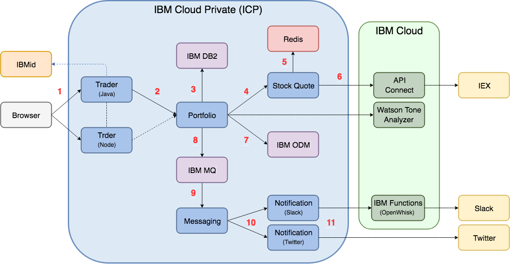
</p>

Where you can find StockTrader specific microservices in blue and IBM middleware in purple all running on IBM Cloud Private (ICP), IBM Cloud Public services in green and other third party applications in other different colours.

### Application flow

There are mainly 4 actions you can execute against the IBM StockTrader application once you are logged in:

1. Create a portfolio, where
    1. A `GET addPortfolio` request is sent to the `trader microservice (BFF)` from the browser by the user which returns a form to be filled with the new portfolio name **(1)**.
    2. `trader microservice (BFF)` sends a `POST addPortfolio` request to the `portfolio microservice` with the new portfolio's data from the previous form to get the portfolio created **(2)**.
    3. `portfolio microservice` interacts with the DB2 database through a JDBC Datasource to create the appropriate records and structure in the DB for the new portfolio **(3)**.
    4. Once the `portfolio microservice` returns a successful message for the `POST addPortfolio` request to the `trader microservice BFF`, this requests a `GET summary` to the `portfolio microservice` to display a summary of the application to the end user **(2)**.
2. Delete a portfolio.
    1. A `POST summary` request is sent to the `trader microservice (BFF)` from the browser by the user  with the action `delete` and owner `portfolio name` as parameters **(1)**.
    2. `trader microservice (BFF)` creates and sends another `POST` request to the `portfolio microservice`**(2)**.
    3. `portfolio microservice` interacts with the DB2 database through a JDBC Datasource to delete the appropriate records and structure in the DB for the portfolio indicated **(3)**.
    4. Once the `portfolio microservice` returns a successful message for the `POST` request to the `trader microservice BFF`, this requests a `GET summary` to the `portfolio microservice` to display a summary of the application to the end user **(2)**.
3. Add stock to an existing portfolio.
    1. A `POST summary` request is sent to the `trader microservice (BFF)` from the browser by the user  with the action `update` and owner `portfolio name` as parameters **(1)**.
    2. `trader microservice (BFF)` redirects the request to itself by sending a `GET addStock` request in order to present the user with a form to input what shares (company) and how many shares to update a portfolio with.
    3. This `GET addStock` request makes the `trader microservice (BFF)` to send a `GET` request to the `portfolio microservice` in order to retrieve the portfolio's next commission to be shown in the form presented to the user. This form will be used by the user to input what shares (company) and how many they want to update the portfolio with **(2)**.
    4. The `trader microservice (BFF)` returns a new page to the user with the form to add stock to be filled up.
    5. The user inputs what shares and how many they want a particular portfolio to be updated with and that sends a `POST addStock` with the portfolio and what shares and how many shares to update it with from the `trader BFF microservice` to the `portfolio microservice`**(2)**.
    6. Now the `portfolio microservice` will interact with `IBM DB2` through a JDBC Datasource, `IBM MQ` through a JMS resource and `IBM ODM` and the `stock quote microservice` through rest calls as follows:
        1. Process the commission for the portfolio update. That is, add the total of commissions for this portfolio **(3)**.
        2. Increment the amount of shares of the share type (company) the user decided to update the portfolio with **(3)**.
        3. Recalculate the total balance of the portfolio with the new amount of shares already added. To do this, the `portfolio microservice` will send a `GET` to the `stock quote microservice` to retrieve the current value for that type of share **(4)** . The `stock quote microservice` will:
            1. Check if the `Redis` cache attached to the `stock quote microservice` contains an acceptable up-to-date value for the type of share requested **(5)**.
            2. If it does, it will return such value. Otherwise, the `stock quote microservice` will call the external `IEX` service through the `API Connect` service set up in IBM Cloud Public **(6)**.
        4. Now that a new total balance for the portfolio to be updated has been calculated, the `portfolio microservice` will process the loyalty level for this portfolio. This will make a `POST` request to the `IBM ODM` with the total balance for the portfolio. `IBM ODM` will return the associated loyalty level for such balance **(7)**.
        5. If the loyalty level has changed, the `portfolio microservice` will send a message to the `IBM MQ` with the portfolio name along with the old and new loyalty levels **(8)**.
    7. The `messaging microservice` will be listening to an specific queue on the `IBM MQ` for messages being dropped by the `portfolio microservice` **(9)**.
    8. If a message, with a portfolio name and old and new loyalty levels, has been dropped into `IBM MQ` the `messaging microservice` will send a `POST` request to the `Notification (Twitter) microservice` (we are not using the Slack flow for now) **(10)**.
    8. The `Notification (Twitter) microservice` will post a tweet with the portfolio name and the old and new loyalties to the twitter account configured for StockTrader **(11)**.
4. Retrieve a portfolio.
    1. A `POST summary` request is sent to the `trader microservice (BFF)` from the browser by the user  with the action `retrieve` and owner `portfolio name` as parameters **(1)**.
    2. `trader microservice (BFF)` sends a `GET viewPortfolio` request to the `portfolio microservice` with the portfolio name **(2)**.
    3. `portfolio microservice` interacts with the DB2 database through a JDBC Datasource to retrieve the appropriate records and data from the DB for the portfolio indicated **(3)**.
    4. `portfolio microservice` returns all the data for the portfolio specified by the user to the `trader microservice (BFF)`and this presents it to the end user on the browser **(2)**.

#### Loyalty Levels

The loyalty levels for the IBM StockTrader application are set as follows:

| Loyalty Level | Stock |
| --- | --- |
| BASIC | 0 - 10.000 |
| BRONZE | 10.001 - 50.000 |
| SILVER | 50.001 - 100.000 |
| GOLD | 100.001 - 1.000.000 |
| PLATINUM | > 1.000.001 |

## Installation

As shown in the IBM StockTrader application architecture diagram above, the IBM StockTrader application environment within IBM Cloud Private (ICP) is made up of IBM middleware such as **IBM DB2**, **IBM MQ** and **IBM ODM**, third party applications like **Redis** and the IBM StockTrader application microservices **Trader**, **Portfolio**, **Stock-quote**, **Messaging** and **Notification-Twitter** (**Tradr** and **Notification-Slack** are not part of this work).

In this section, we will outline the steps needed in order to get the aforementioned components installed into IBM Cloud Private (ICP) so that we have a complete functioning IBM StockTrader application to carry out our test on. We will try to use as much automation as possible as well as Helm charts for installing as many components as possible. Most of this components require a post-installation configuration and tuning too.

**IMPORTANT:** The below installation steps will create Kubernetes resources with names and configurations that the IBM StockTrader Helm chart will expect. Therefore, if any of these is changed, the IBM StockTrader Helm installation will need to be modified accordingly.

Finally, most of the installation process will be carried out by using the IBM Cloud Private (ICP) CLI. Follow this [link](https://www.ibm.com/support/knowledgecenter/en/SSBS6K_2.1.0.3/manage_cluster/icp_cli.html) for the installation instructions.

### Get The Code

Before anything else, we need to **clone this Github repository** onto our workstations in order to be able to use the scripts, files and tools mentioned throughout this readme. To do so, clone this GitHub repository to a convinient location for you:

```
$ git clone https://github.com/jesusmah/stocktrader-resiliency.git
Cloning into 'stocktrader-resiliency'...
remote: Counting objects: 163, done.
remote: Compressing objects: 100% (120/120), done.
remote: Total 163 (delta 73), reused 116 (delta 38), pack-reused 0
Receiving objects: 100% (163/163), 8.94 MiB | 1.06 MiB/s, done.
Resolving deltas: 100% (73/73), done.
```

Afterwards, change directory to `stocktrader-resiliency`.

### Platform

1. Create a namespace called **stocktrader**. If you don't know how to do so, follow this [link](https://www.ibm.com/support/knowledgecenter/en/SSBS6K_2.1.0.3/user_management/create_project.html).

2. Change your kubernetes CLI context to work against your **stocktrader** namespace:

```
$ kubectl config set-context cluster.local-context --user=admin --namespace=stocktrader
Context "cluster.local-context" modified.
```
_Use the appropriate user in the above command_

3. Give privileged permissions to your recently created namespace as some the IBM middleware need them to function:

```
$ kubectl create rolebinding -n stocktrader st-rolebinding --clusterrole=privileged  --serviceaccount=stocktrader:default
rolebinding "st-rolebinding" created
$ kubectl get rolebindings                 
NAME             KIND                                       SUBJECTS
st-rolebinding   RoleBinding.v1.rbac.authorization.k8s.io   1 item(s)
```

### Middleware

As previously said, IBM middleware will be installed using Helm charts as much as possible. Therefore, we need to add the IBM Helm chart repository to our local Helm chart repositories:

```
$ helm repo add ibm-charts https://raw.githubusercontent.com/IBM/charts/master/repo/stable/
"ibm-charts" has been added to your repositories
$ helm repo list
NAME                    	URL                                                                                                      
stable                  	https://kubernetes-charts.storage.googleapis.com                                                         
local                   	http://127.0.0.1:8879/charts                                                                             
ibm-charts              	https://raw.githubusercontent.com/IBM/charts/master/repo/stable/
```

(\*) If you don't have a **stable** Helm repo pointing to https://kubernetes-charts.storage.googleapis.com, please add it too using:

```
$ helm repo add stable https://kubernetes-charts.storage.googleapis.com
```

#### IBM DB2

User must be subscribed to [Db2 Developer-C Edition on Docker Store](https://store.docker.com/images/db2-developer-c-edition) so they can generate a key to access the image. After subscription, visit [Docker Cloud](https://cloud.docker.com/) and in the upper right corner, click on your user ID drop-down menu and select Account Settings. Scroll down and Add API key.

This way, the IBM Db2 Developer-C Edition Helm chart will be able to pull down the IBM Db2 Developer-C Edition Docker image by using your Docker Cloud credentials and the access key associated to it. We just finally need to store your Docker Cloud credentials into a Kubernetes secret which the IBM Db2 Developer-C Edition Helm chart will read at installation time.

1. Crete a secret that holds your Docker Cloud credentials & Db2 Developer-C Edition API key to retrieve the Db2 Developer-C Edition docker image:

```
$ kubectl create secret docker-registry st-docker-registry --docker-username=<userid> --docker-password=<API key> --docker-email=<email> --namespace=stocktrader
secret "st-docker-registry" created
$ kubectl get secrets   
NAME                  TYPE                                  DATA      AGE
default-token-t92bq   kubernetes.io/service-account-token   3         51d
st-docker-registry    kubernetes.io/dockercfg               1         28s
```

2. Install IBM Db2 Developer-C Edition using the [db2_values.yaml](installation/middleware/db2_values.yaml) file:

```
$ helm install -n st-db2 --namespace stocktrader --tls ibm-charts/ibm-db2oltp-dev -f db2_values.yaml
NAME:   st-db2
LAST DEPLOYED: Wed Jun 27 18:49:04 2018
NAMESPACE: stocktrader
STATUS: DEPLOYED

RESOURCES:
==> v1/Secret
NAME                    TYPE    DATA  AGE
st-db2-ibm-db2oltp-dev  Opaque  1     5s

==> v1/PersistentVolumeClaim
NAME               STATUS   VOLUME     CAPACITY  ACCESS MODES  STORAGECLASS  AGE
st-db2-st-db2-pvc  Pending  glusterfs  5s

==> v1/Service
NAME                        TYPE       CLUSTER-IP   EXTERNAL-IP  PORT(S)                                  AGE
st-db2-ibm-db2oltp-dev-db2  NodePort   10.10.10.83  <none>       50000:32329/TCP,55000:31565/TCP          5s
st-db2-ibm-db2oltp-dev      ClusterIP  None         <none>       50000/TCP,55000/TCP,60006/TCP,60007/TCP  5s

==> v1beta2/StatefulSet
NAME                    DESIRED  CURRENT  AGE
st-db2-ibm-db2oltp-dev  1        1        5s

==> v1/Pod(related)
NAME                      READY  STATUS   RESTARTS  AGE
st-db2-ibm-db2oltp-dev-0  0/1    Pending  0         4s


NOTES:
1. Get the database URL by running these commands:
  export NODE_PORT=$(kubectl get --namespace stocktrader -o jsonpath="{.spec.ports[0].nodePort}" services st-db2-ibm-db2oltp-dev)
  export NODE_IP=$(kubectl get nodes --namespace stocktrader -o jsonpath="{.items[0].status.addresses[0].address}")
  echo jdbc:db2://$NODE_IP:$NODE_PORT/sample
```

**Important:** This will install the non HA version of IBM Db2 Developer-C Edition with persistent storage using glusterfs.

The command above will take few minutes at least. Monitor the recently created Db2 Developer-C Edition pod, which in our case is called `st-db2-ibm-db2oltp-dev-0`, until you see the following messages:

```
(*) All databases are now active.
(*) Setup has completed.
```
At this point we can be sure the IBM Db2 Developer-C Edition and the **STOCKTRD** database have successfully been installed and created respectively.

3. Now, we need to create the appropriate structure in the **STOCKTRD** database that the IBM StockTrader application needs. We do so by initialising the database with the [initialise_stocktrader_db_v2.yaml](installation/middleware/initialise_stocktrader_db_v2.yaml) file:

```
$ kubectl apply -f initialise_stocktrader_db_v2.yaml
job "initialise-stocktrader-db" created
```

the command above created a Kubernetes job which spun up a simple db2express-c container that contains the IBM DB2 tools to execute an sql file against a DB2 database on a remote host. The sql file that gets executed against a DB2 database on a remote host is actually the one that initialises the database with appropriate structures the IBM StockTrader application needs. The sql file is [initialise_stocktrader_db_v2.sql](installation/middleware/initialise_stocktrader_db_v2.sql).

Check the Kubernetes job to make sure it has finished before moving on:

```
$ kubectl get jobs
NAME                        DESIRED   SUCCESSFUL   AGE
initialise-stocktrader-db   1         1            4m
```

4. Finally, we are going to download few util scripts into the IBM Db2 Developer-C recently created container that our test scripts will make use of as explained in the [test section](#test):

```
$ kubectl exec `kubectl get pods | grep ibm-db2oltp-dev | awk '{print $1}'` \
        -- bash -c "yum -y install wget && cd /tmp && wget https://raw.githubusercontent.com/jesusmah/stocktrader-resiliency/master/test/export.sh \
        && wget https://raw.githubusercontent.com/jesusmah/stocktrader-resiliency/master/test/users.sh && chmod 777 export.sh users.sh"
```

Make sure the scripts have been successfully download:

```
$ kubectl exec `kubectl get pods | grep ibm-db2oltp-dev | awk '{print $1}'` -- bash -c "ls -all /tmp | grep sh"
-rwxrwxrwx. 1 root     root         139 Jun 27 17:48 export.sh
-rwxrwxrwx. 1 root     root          98 Jun 27 17:48 users.sh
```

#### IBM MQ

1. Install MQ using the [mq_values.yaml](installation/middleware/mq_values.yaml) file:

```
$ helm install -n st-mq --namespace stocktrader --tls ibm-charts/ibm-mqadvanced-server-dev -f mq_values.yaml
NAME:   st-mq
LAST DEPLOYED: Thu Jun 28 16:38:22 2018
NAMESPACE: stocktrader
STATUS: DEPLOYED

RESOURCES:
==> v1/Secret
NAME          TYPE    DATA  AGE
st-mq-ibm-mq  Opaque  1     4s

==> v1/Service
NAME          TYPE      CLUSTER-IP    EXTERNAL-IP  PORT(S)                        AGE
st-mq-ibm-mq  NodePort  10.10.10.133  <none>       9443:31184/TCP,1414:32366/TCP  4s

==> v1beta2/StatefulSet
NAME          DESIRED  CURRENT  AGE
st-mq-ibm-mq  1        1        4s

==> v1/Pod(related)
NAME            READY  STATUS   RESTARTS  AGE
st-mq-ibm-mq-0  0/1    Running  0         4s


NOTES:
MQ can be accessed via port 1414 on the following DNS name from within your cluster:
st-mq-ibm-mq.stocktrader.svc.cluster.local

To get your admin password run:

    MQ_ADMIN_PASSWORD=$(kubectl get secret --namespace stocktrader st-mq-ibm-mq -o jsonpath="{.data.adminPassword}" | base64 --decode; echo)

If you set an app password, you can retrieve it by running the following:

    MQ_APP_PASSWORD=$(kubectl get secret --namespace stocktrader st-mq-ibm-mq -o jsonpath="{.data.appPassword}" | base64 --decode; echo)
```

**IMPORTANT:** The `mq_values.yaml` file used to install the IBM Message Queue Helm chart into our IBM Cloud Private (ICP) cluster is configured to install a non-persistent IBM Message Queue due to some problems between IBM MQ and GlusterFS.

2. We now need to create the **NotificationQ** message queue and the **app** message queue user (with the appropriate permissions). For doing so we need to interact with our IBM Message Queue instance we just deployed above through its web console.

For accessing the IBM MQ web console, we need to

- Grab our IBM Cloud Private (ICP) proxy's IP:

```
$ kubectl get nodes -l proxy=true             
NAME            STATUS    AGE       VERSION
172.16.40.176   Ready     57d       v1.9.1+icp-ee
172.16.40.177   Ready     57d       v1.9.1+icp-ee
172.16.40.178   Ready     57d       v1.9.1+icp-ee
```
In this case, we have three proxy nodes in our IBM Cloud Private (ICP) highly available cluster. We are going to use the first proxy node with IP `172.16.40.176` to access any resource we need within our ICP cluster (bearing in mind we could use any of the others and the result would be the same).

- Grab the NodePort for our recently installed IBM Message Queue instance. We can see that NodePort from the output we obtain when we executed the Helm install command under the services section and right beside the internal **9443** port:

```
==> v1/Service
NAME          TYPE      CLUSTER-IP    EXTERNAL-IP  PORT(S)                        AGE
st-mq-ibm-mq  NodePort  10.10.10.133  <none>       9443:31184/TCP,1414:32366/TCP  4s
```

That is, the NodePort for accessing our IBM MQ deployment from the outside is **31184**

- Access the IBM MQ web console pointing your browser to https://<proxy_ip>:<mq_nodeport>/ibmmq/console

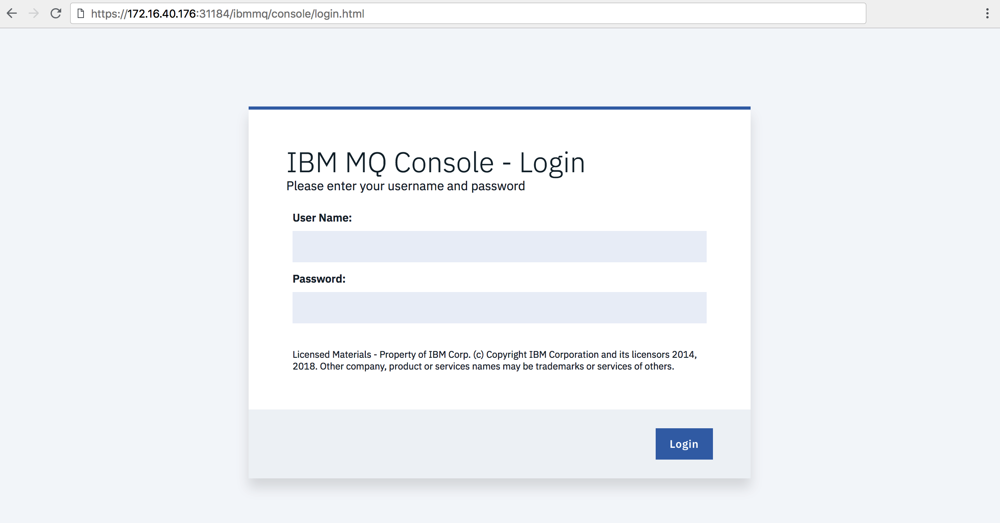

and using `admin` as the user and `passw0rd` as its password (Anyway, you could also find out what the password is by following the instructions the Helm install command for IBM MQ displayed).

- Once you log into the IBM MQ web console, find out the **Queues on trader** widget/portlet and clieck on `Create` on the top right corner:

<p align="center">
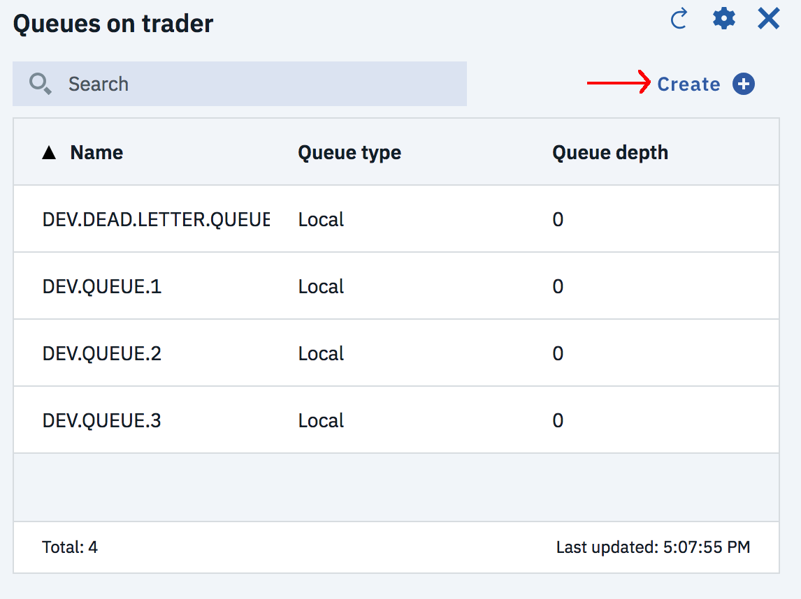
</p>

- Enter **NotificationQ** on the dialog that pops up and click create:

<p align="center">
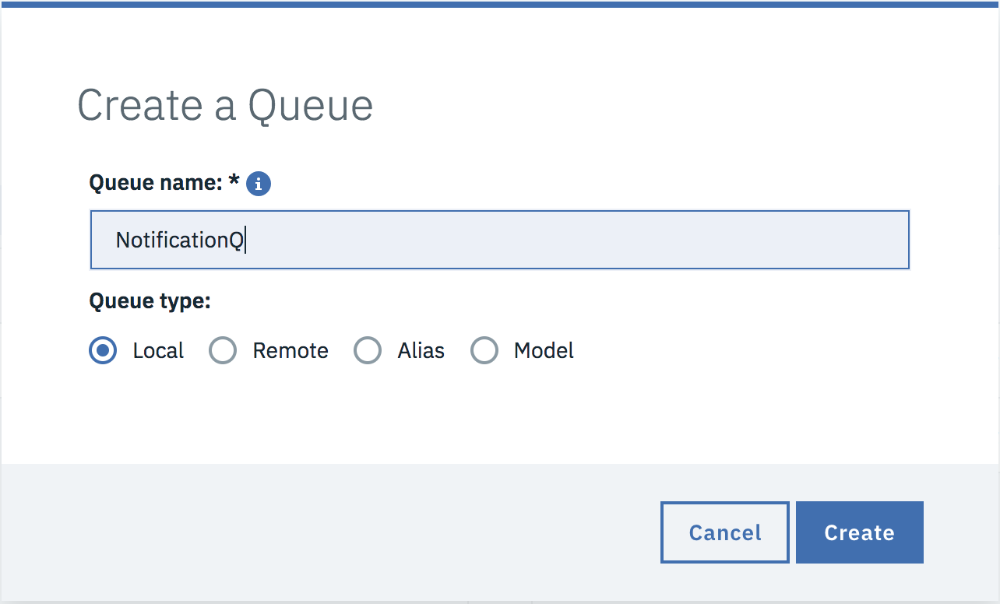
</p>

- On the Queues on trader widget/portlet again, click on the dashes icon and then on the **Manage authority records...** option within the dropdown menu:

<p align="center">
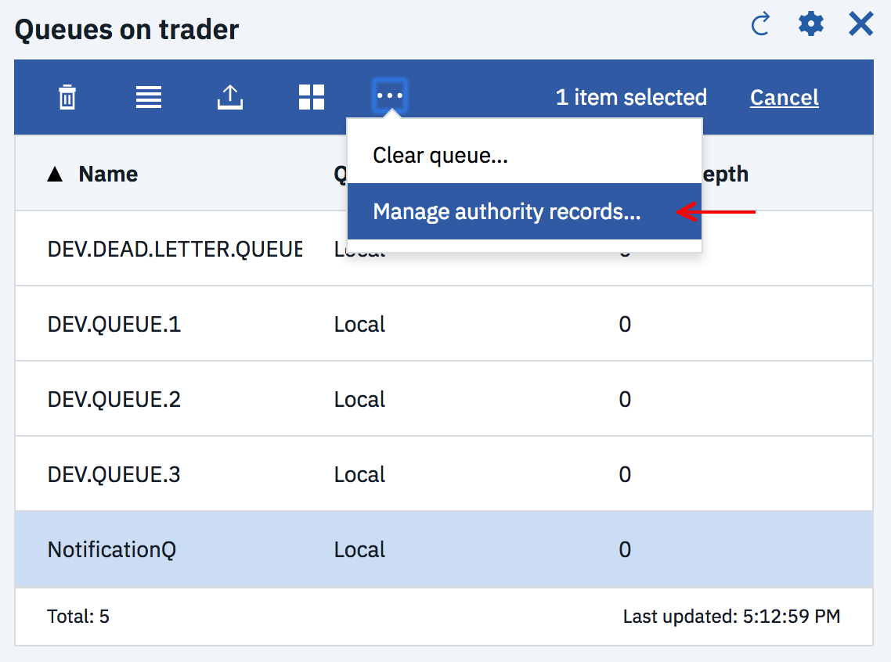
</p>

- On the new dialog that opens up, click on **Create** on the top right corner. This will also open up a new dialog to introduce the **Entity name**. Enter **app** as the Entity name and click on create

<p align="center">
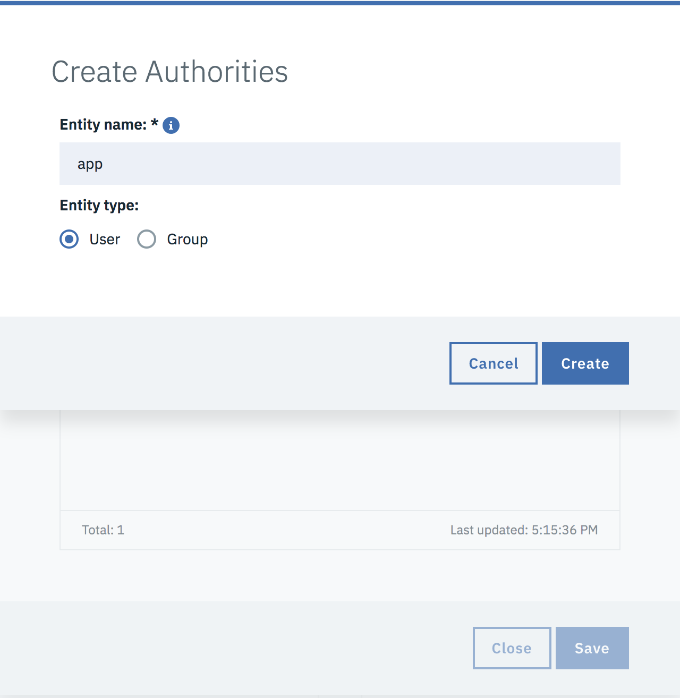
</p>

- Back to the first dialog that opened up, verify the new app entity appears listed, click on it and select **Browse, Inquire, Get and Put** on the right bottom corner as the MQI permissions for the app entity and click on Save:

<p align="center">
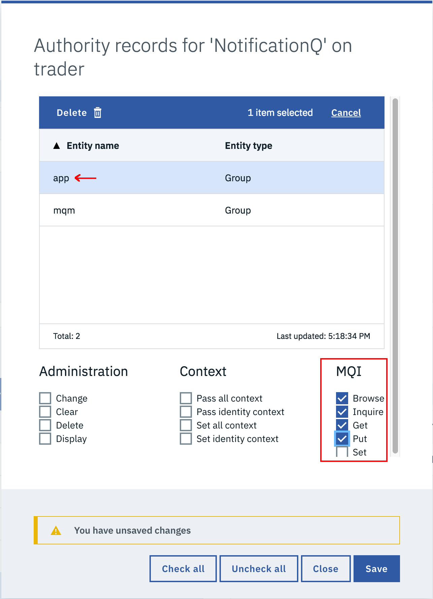
</p>

#### Redis

1. Install Redis using the [redis_values.yaml](installation/middleware/redis_values.yaml) file:

```
$ helm install -n st-redis --namespace stocktrader --tls stable/redis -f redis_values.yaml
NAME:   st-redis
E0628 18:14:21.431010   11573 portforward.go:303] error copying from remote stream to local connection: readfrom tcp4 127.0.0.1:55225->127.0.0.1:55228: write tcp4 127.0.0.1:55225->127.0.0.1:55228: write: broken pipe
LAST DEPLOYED: Thu Jun 28 18:14:19 2018
NAMESPACE: stocktrader
STATUS: DEPLOYED

RESOURCES:
==> v1/Secret
NAME      TYPE    DATA  AGE
st-redis  Opaque  1     3s

==> v1/Service
NAME             TYPE       CLUSTER-IP    EXTERNAL-IP  PORT(S)   AGE
st-redis-master  ClusterIP  10.10.10.4    <none>       6379/TCP  3s
st-redis-slave   ClusterIP  10.10.10.191  <none>       6379/TCP  3s

==> v1beta1/Deployment
NAME            DESIRED  CURRENT  UP-TO-DATE  AVAILABLE  AGE
st-redis-slave  1        1        1           0          3s

==> v1beta2/StatefulSet
NAME             DESIRED  CURRENT  AGE
st-redis-master  1        1        3s

==> v1/Pod(related)
NAME                             READY  STATUS             RESTARTS  AGE
st-redis-slave-5866f6f889-5c2cc  0/1    ContainerCreating  0         3s
st-redis-master-0                0/1    Pending            0         3s


NOTES:
** Please be patient while the chart is being deployed **
Redis can be accessed via port 6379 on the following DNS names from within your cluster:

st-redis-master.stocktrader.svc.cluster.local for read/write operations
st-redis-slave.stocktrader.svc.cluster.local for read-only operations


To get your password run:

    export REDIS_PASSWORD=$(kubectl get secret --namespace stocktrader st-redis -o jsonpath="{.data.redis-password}" | base64 --decode)

To connect to your Redis server:

1. Run a Redis pod that you can use as a client:

   kubectl run --namespace stocktrader st-redis-client --rm --tty -i \
    --env REDIS_PASSWORD=$REDIS_PASSWORD \
   --image docker.io/bitnami/redis:4.0.10 -- bash

2. Connect using the Redis CLI:
   redis-cli -h st-redis-master -a $REDIS_PASSWORD
   redis-cli -h st-redis-slave -a $REDIS_PASSWORD

To connect to your database from outside the cluster execute the following commands:

    export POD_NAME=$(kubectl get pods --namespace stocktrader -l "app=redis" -o jsonpath="{.items[0].metadata.name}")
    kubectl port-forward --namespace stocktrader $POD_NAME 6379:6379
    redis-cli -h 127.0.0.1 -p 6379 -a $REDIS_PASSWORD
```

**IMPORTANT:** The Redis instance installed is a non-persistent non-HA Redis Redis deployment

#### IBM ODM

1. Install IBM Operational Decision Manager (ODM) using the [odm_values.yaml](installation/middleware/odm_values.yaml) file:

```
$ helm install -n st-odm --namespace stocktrader --tls ibm-charts/ibm-odm-dev -f odm_values.yaml
NAME:   st-odm
LAST DEPLOYED: Thu Jun 28 18:53:45 2018
NAMESPACE: stocktrader
STATUS: DEPLOYED

RESOURCES:
==> v1/ConfigMap
NAME                       DATA  AGE
st-odm-odm-test-configmap  2     3s

==> v1/Service
NAME                TYPE      CLUSTER-IP   EXTERNAL-IP  PORT(S)         AGE
st-odm-ibm-odm-dev  NodePort  10.10.10.39  <none>       9060:31101/TCP  3s

==> v1beta1/Deployment
NAME                DESIRED  CURRENT  UP-TO-DATE  AVAILABLE  AGE
st-odm-ibm-odm-dev  1        1        1           1          3s

==> v1/Pod(related)
NAME                                 READY  STATUS   RESTARTS  AGE
st-odm-ibm-odm-dev-6699d55df5-fv9lv  1/1    Running  0         3s


NOTES:
st-odm is ready to use. st-odm is an instance of the ibm-odm-dev chart.

st-odm uses version 8.9.2 of the IBM® Operational Decision Manager (ODM) components.

ODM Information
----------------

Username/Password :
  - For Decision Center : odmAdmin/odmAdmin
  - For Decision Server Console: odmAdmin/odmAdmin
  - For Decision Server Runtime: odmAdmin/odmAdmin
  - For Decision Runner: odmAdmin/odmAdmin

Get the application URLs by running these commands:

  export NODE_PORT=$(kubectl get --namespace stocktrader -o jsonpath="{.spec.ports[0].nodePort}" services st-odm-ibm-odm-dev)
  export NODE_IP=$(kubectl get nodes --namespace stocktrader -o jsonpath="{.items[0].status.addresses[0].address}")

  -- Decision Center Business Console
  echo http://$NODE_IP:$NODE_PORT/decisioncenter

  -- Decision Center Enterprise Server
  echo http://$NODE_IP:$NODE_PORT/teamserver

  -- Decision Server Console
  echo http://$NODE_IP:$NODE_PORT/res

  -- Decision Server Runtime
  echo http://$NODE_IP:$NODE_PORT/DecisionService

  -- Decision Runner
  echo http://$NODE_IP:$NODE_PORT/DecisionRunner

To learn more about the st-odm release, try:

  $ helm status st-odm
  $ helm get st-odm
```

**IMPORTANT:** The IBM Operational Decision Manager (ODM) installed is a non-persistent IBM ODM deployment.

2. We now need to import the already developed loyalty level IBM ODM project which our IBM StockTrader application will use. To import the such project:

- Download the project from this [link](https://github.com/IBMStockTrader/portfolio/blob/master/stock-trader-loyalty-decision-service.zip)

- Open the IBM Operational Decision Manager by pointing your browser to http://<proxy_ip>:<odm_nodeport> where the `<proxy_ip>` can be obtained as explained in the [IBM MQ installation](#ibm-mq) previous section above and the `<odm_nodeport>` can be obtained under the service section from the output of the Helm install command for IBM ODM above in this section. More precisely, we can see above that in our case `<odm_nodeport>` is **31101**.

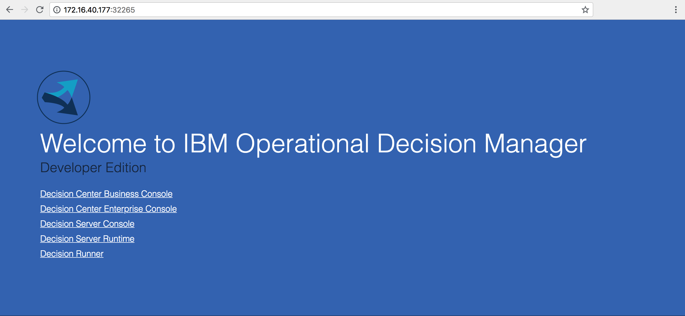

- Click on **Decision Center Business Console** and log into it using the credentials from the Helm install command output above (`odmAdmin/odmAdmin`).

- Once you are logged in, click on the arrow on the left top corner to import a new project.

<p align="center">
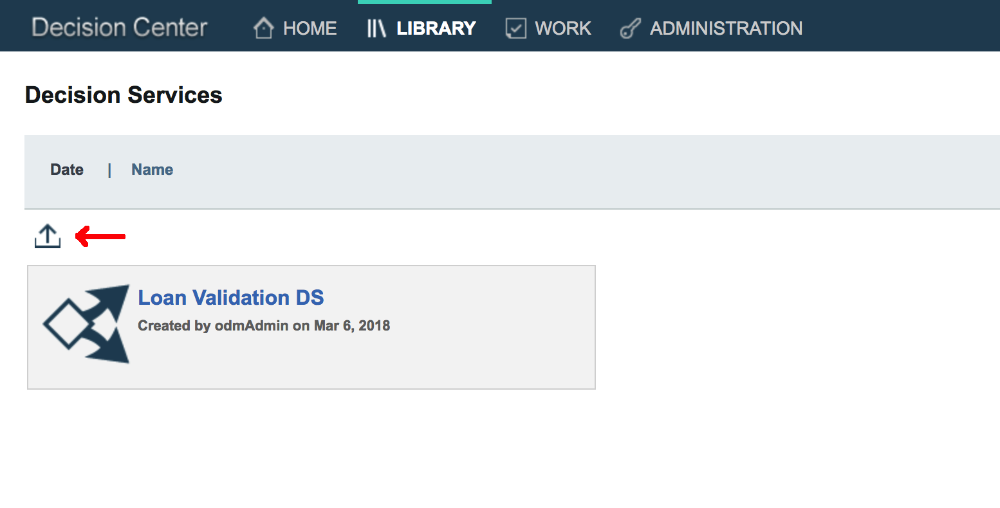
</p>

- On the dialog that pops up, click on `Choose...` and select the **stock-trader-loyalty-decision-service.zip** file you downloaded above. Click on Import.

<p align="center">
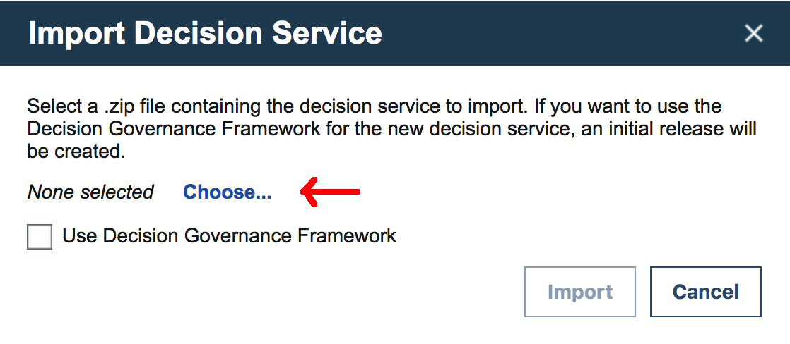
</p>

- Once the stock-trader-loyalty-decision-service project is imported, you should be redirected into that project within the **Library section** of the Decision Center Business Console. You should see there an icon that says **main**. Click on it.

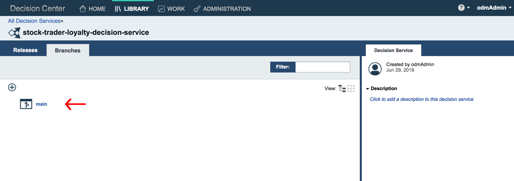

- The above should have opened the **main** workflow of the stock-trader-loyalty-decision-service project. Now, click on **Deploy** at the top to actually deploy the stock-trader-loyalty-decision-service into the IBM Operational Decision server.

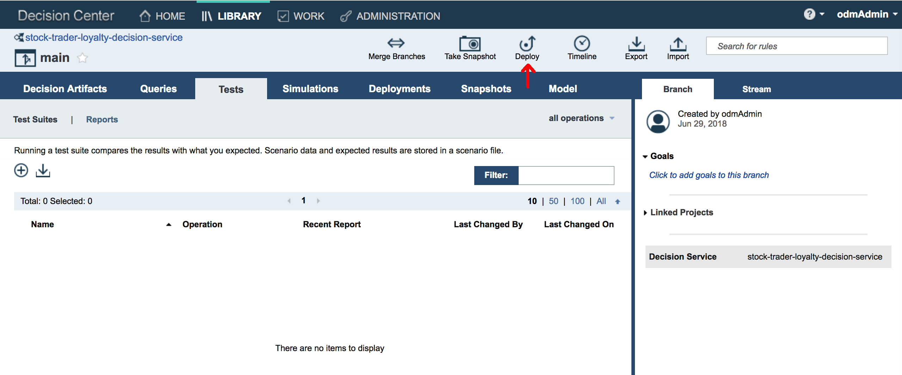

- A new dialog will pop up with the **specifics** on how to deploy the main branch for the stock-trader-loyalty-decision-service. Leave it as it is and click on Deploy.

<p align="center">
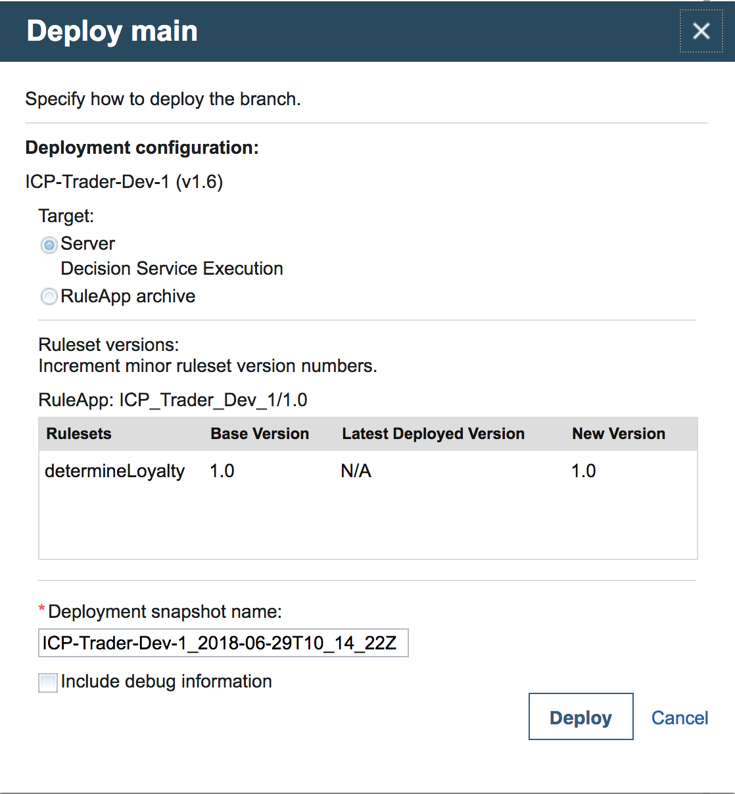
</p>

- Finally, you should see a **Deployment status** dialog confirming that the deployment of the stock-trader-loyalty-decision-service project (actually called ICP-Trader-Dev-1) has started. Click OK to close the dialog.

<p align="center">
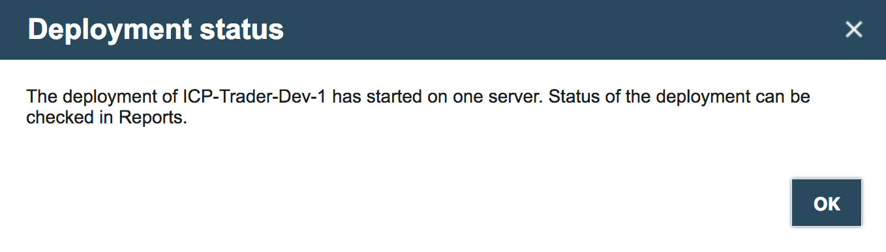
</p>

At this point we should have an instance of the IBM Operation Decision Manager deployed into out IBM Cloud Private (ICP) cluster, the stock-trader-loyalty-decision-service project (actually called ICP-Trader-Dev-1) imported into it and deployed to the Operation Decision server for the IBM StockTrader application to use it for calculating the loyalty of the portfolios.

In order to make sure of the aforementioned, we are going to poke the IBM ODM endpoint for our loyalty service to see what it returns. To poke the endpoint, execute

```
$ curl -X POST -d '{ "theLoyaltyDecision": { "tradeTotal": 75000 } }' -H "Content-Type: application/json" http://<proxy_ip>:<odm_nodeport>/DecisionService/rest/ICP_Trader_Dev_1/determineLoyalty
```
where we have already explained how to obtain `<proxy_ip>` and `<odm_nodepot>` few steps above.

The `curl` request should return a **SILVER** loyalty on a JSON obsect similar to the following:

```
{"__DecisionID__":"3d18f834-0095-4821-8e1b-157f41ee1ee80","theLoyaltyDecision":{"tradeTotal":75000,"loyalty":"SILVER","message":null}}
```

**We have finally installed all the middleware** the IBM StockTrader application depends on in order to function properly. Let's now move on to install the IBM StockTrader application.

### Application

The IBM StockTrader application can be deployed to IBM Cloud Private (ICP) using Helm charts. All the microservices that make up the application have been packaged into a Helm chart. They could be deployed individually using their Helm chart or they all can be deployed at once using the main umbrella IBM StockTrader application Helm chart.

The IBM StockTrade Helm chart repository can be found at https://github.com/jesusmah/stocktrader-helm-repo/

As we have done for the middleware pieces installed on the previous section, the IBM StockTrader application installation will be done by passing the desired values/configuration for some its components through a values file called [st_app_values_v2.yaml](installation/application/st_app_values_v2.yaml). This way the IBM StockTrader application Helm chart are the template/structure of the components that make up the application whereas the [st_app_values_v2.yaml](installation/application/st_app_values_v2.yaml) file allows us to tailor the application to our needs/configuration/environment.

We suggest you **carefully review this file** in order to make sure the configuration for the middleware matches the installation of it done in previous steps.

Also, there are some sections within this [st_app_values_v2.yaml](installation/application/st_app_values_v2.yaml) file that need to be completed as they depend on the specifics of the environment the IBM StockTrader application will be installed on as well as personal credentials.

**IMPORTANT:** The values for the following parameters in the [st_app_values_v2.yaml](installation/application/st_app_values_v2.yaml) file **must be base64 encoded**. As a result, whatever the value you want to set the following parameters with, they first need to be encoded using the this command:

```
echo -n "<the_value_you_want_to_encode>" | base64
```

The pieces you need to complete with your environment/credentials specifics are:

```
oidc:
  nodeport:
```

which specifies the **url callback** parameter the **Trader** microservice will send along with the Open ID Connect authentication requests against the **IBMid** service. As a result, this url to access the StockTrader application must be static. This means you must choose a `<proxy_ip>` from your IBM Cloud Private (ICP) proxies (in case you had several) where the access to your StockTrader application will be done through and your Trader microservice must always expose the same `<trader_microservice_nodeport>`. This is a limitation in the SSO strategy the IBMid service provides since in a Kubernetes plus microservices scenarios, things die and get born so that having hardcoded/reserved ports, urls, etc is not a good practice. The Open ID Connect mechanism, which needs this `oidc` config, is only used when the **Trader** and **Tradr** microservices are deployed on their `latest` versions rather than their `basicregistry` versions (see below). For the resiliency effort carried out in this exercise we are using the `basicregistry` due to some Liberty SSO problems.

```
twitter:
  consumerKey:
  consumerSecret:
  accessToken:
  accessTokenSecret:
```

which specifies the credentials for the IBM StockTrader application to tweet portfolio loyalty level changes notifications to your Twitter account. In order to get the IBM StockTrader notification-twitter microservice to do so, you must have a [Twitter account](https://help.twitter.com/en/create-twitter-account) and register/create a [Twitter application](https://developer.twitter.com/en/docs/basics/getting-started) on it which is the one that will tweet on your behalf and the one that the IBM StockTrader application will talk to. In case you don't have a Twitter account or don't want to create one, The IBM StockTrader application **already comes configured with a default Twitter account** which is https://twitter.com/ibmstocktrader

```
watson:
  id:
  pwd:
```

which are your IBM Watson Tone Analyzer credentials for the IBM StockTrader to be able to analyze your feedback in order to adjust the stock fees applied to a portfolio. You can obtain your IBM Watson credentials at https://console.bluemix.net/catalog/services/tone-analyzer

```
ingress_host:
  host:
```

which specifies to the new looking nodejs based **Tradr** (BFF) microservice where to serve the content and accept request from. This should be configured to `<proxy_ip>:<tradr_microservice_nodeport>`.

```
trader:
  image:
    tag:
  service:
    nodePort:
      http:
      https:
```

where

- `tag` specifies what version of the **Trader** microservice we want to deploy, being `latest` the version that uses SSO and `basicregistry` the version that does and uses user/password type of authentication and authorization. For the test carries out in this resiliency effort and explained below in this readme, we have used the `basicregistry` version due to some problems with the Liberty SSO which will be further explained in the test section.
- `http` and `https` specify the NodePorts the **Trader** microservice will be exposed through. As already said, we are hardcoding/reserving/forcing **Trader** to always use the same NodePorts since these need to be registered (along with the `<proxy_ip>`) at the IBMid service level for the SSO to work.

```
tradr:
  service:
    servicePort:
      port:
      nodePort:
```

similar to `trader` above, this will force the **Tradr** microservice to always be accessible through the same NodePorts so that we can register those on the IBMid service for the SSO to work.

Now that we are sure our [st_app_values_v2.yaml](installation/application/st_app_values_v2.yaml) file configuration for the middleware installed in the previous section looks good and have been completed with NodePorts, credentials, etc, **let's deploy the IBM StockTrader application!**

1. Add the IBM StockTrader Helm repository:

```
$ helm repo add stocktrader https://raw.githubusercontent.com/jesusmah/stocktrader-helm-repo/master/docs/charts
$ helm repo list
NAME                    	URL                                                                                                      
stable                  	https://kubernetes-charts.storage.googleapis.com                                                         
local                   	http://127.0.0.1:8879/charts                                                                             
st                      	https://raw.githubusercontent.com/jesusmah/stocktrader-helm-repo/master/docs/charts                      
ibm-charts              	https://raw.githubusercontent.com/IBM/charts/master/repo/stable/  
```

2. Deploy the IBM StockTrader application using the [st_app_values_v2.yaml](installation/application/st_app_values_v2.yaml) file:

```
$ helm install -n test --tls --namespace stocktrader -f st_app_values_v2.yaml stocktrader/stocktrader-app --version "0.2.0"
NAME:   test
LAST DEPLOYED: Mon Jul  2 13:39:28 2018
NAMESPACE: stocktrader
STATUS: DEPLOYED

RESOURCES:
==> v1/Secret
NAME                       TYPE    DATA  AGE
stocktrader-db2            Opaque  5     4s
strocktrader-ingress-host  Opaque  1     4s
stocktrader-jwt            Opaque  2     4s
stocktrader-mq             Opaque  7     4s
stocktrader-odm            Opaque  1     4s
stocktrader-oidc           Opaque  8     4s
stocktrader-openwhisk      Opaque  3     4s
stocktrader-redis          Opaque  2     4s
stocktrader-twitter        Opaque  4     4s
stocktrader-watson         Opaque  3     4s

==> v1/ConfigMap
NAME            DATA  AGE
test-messaging  6     4s
test-portfolio  4     4s
test-trader     3     4s

==> v1/Service
NAME                  TYPE       CLUSTER-IP    EXTERNAL-IP  PORT(S)                        AGE
notification-service  ClusterIP  10.10.10.171  <none>       9080/TCP,9443/TCP              4s
portfolio-service     ClusterIP  10.10.10.105  <none>       9080/TCP,9443/TCP              4s
stock-quote-service   ClusterIP  10.10.10.210  <none>       9080/TCP,9443/TCP              4s
trader-service        NodePort   10.10.10.22   <none>       9080:31507/TCP,9443:32370/TCP  4s
tradr-service         NodePort   10.10.10.58   <none>       3000:31007/TCP                 4s

==> v1beta1/Deployment
NAME                       DESIRED  CURRENT  UP-TO-DATE  AVAILABLE  AGE
test-messaging             1        1        1           0          4s
test-notification-twitter  1        1        1           0          4s
test-portfolio             1        1        1           0          4s
test-stock-quote           1        1        1           0          4s
test-trader                1        1        1           1          4s
test-tradr                 1        1        1           1          4s

==> v1beta1/Ingress
NAME                       HOSTS  ADDRESS  PORTS  AGE
test-notification-twitter  *      80       4s
test-portfolio             *      80       4s
test-stock-quote           *      80       4s
test-trader                *      80       4s

==> v1/Pod(related)
NAME                                        READY  STATUS             RESTARTS  AGE
test-messaging-644ccbcd95-mwkjh             0/1    ContainerCreating  0         4s
test-notification-twitter-6dd5f9d7dc-bsfs7  0/1    ContainerCreating  0         4s
test-portfolio-75b4dbd485-k6rq4             0/1    ContainerCreating  0         4s
test-stock-quote-7679899d76-rgkwr           0/1    ContainerCreating  0         4s
test-trader-5446499c5b-ldkjk                1/1    Running            0         4s
test-tradr-548b58bc55-jjr4c                 1/1    Running            0         4s
```

## Verification

Here we are going to explain how to quickly verify our IBM StockTrader application has successfully being deployed and it is working. This verification will not cover any potential issue occurred during the installation process above as we understand it is out of the scope of this work. We sort of assume the "happy path" applies.

1. Check your Helm releases are installed:

```
$ helm list --namespace stocktrader --tls
NAME    	REVISION	UPDATED                 	STATUS  	CHART                          	NAMESPACE  
st-db2  	1       	Wed Jun 27 18:49:04 2018	DEPLOYED	ibm-db2oltp-dev-3.0.0          	stocktrader
st-mq   	1       	Thu Jun 28 16:38:22 2018	DEPLOYED	ibm-mqadvanced-server-dev-1.3.0	stocktrader
st-odm  	1       	Thu Jun 28 18:53:45 2018	DEPLOYED	ibm-odm-dev-1.0.0              	stocktrader
st-redis	1       	Thu Jun 28 18:20:55 2018	DEPLOYED	redis-3.3.6                    	stocktrader
test    	1       	Mon Jul  2 13:39:28 2018	DEPLOYED	stocktrader-app-0.2.0          	stocktrader
```

2. Check all the Kubernetes resources created and deployed by the Helm charts from the Helm releases above, specially the Kubernetes pods, all are `Running` and looking good:

```
$ kubectl get all
NAME                                            READY     STATUS    RESTARTS   AGE
po/st-db2-ibm-db2oltp-dev-0                     1/1       Running   0          4d
po/st-mq-ibm-mq-0                               1/1       Running   0          3d
po/st-odm-ibm-odm-dev-6699d55df5-fv9lv          1/1       Running   0          3d
po/st-redis-master-0                            1/1       Running   0          3d
po/st-redis-slave-5866f6f889-fkstr              1/1       Running   0          3d
po/test-messaging-644ccbcd95-mwkjh              1/1       Running   0          10m
po/test-notification-twitter-6dd5f9d7dc-bsfs7   1/1       Running   0          10m
po/test-portfolio-75b4dbd485-k6rq4              1/1       Running   0          10m
po/test-stock-quote-7679899d76-rgkwr            1/1       Running   0          10m
po/test-trader-5446499c5b-ldkjk                 1/1       Running   0          10m
po/test-tradr-548b58bc55-jjr4c                  1/1       Running   0          10m

NAME                                      CLUSTER-IP     EXTERNAL-IP   PORT(S)                                   AGE
svc/glusterfs-dynamic-st-db2-st-db2-pvc   10.10.10.6     <none>        1/TCP                                     20d
svc/notification-service                  10.10.10.171   <none>        9080/TCP,9443/TCP                         10m
svc/portfolio-service                     10.10.10.105   <none>        9080/TCP,9443/TCP                         10m
svc/st-db2-ibm-db2oltp-dev                None           <none>        50000/TCP,55000/TCP,60006/TCP,60007/TCP   4d
svc/st-db2-ibm-db2oltp-dev-db2            10.10.10.83    <nodes>       50000:32329/TCP,55000:31565/TCP           4d
svc/st-mq-ibm-mq                          10.10.10.133   <nodes>       9443:31184/TCP,1414:32366/TCP             3d
svc/st-odm-ibm-odm-dev                    10.10.10.39    <nodes>       9060:31101/TCP                            3d
svc/st-redis-master                       10.10.10.208   <none>        6379/TCP                                  3d
svc/st-redis-slave                        10.10.10.195   <none>        6379/TCP                                  3d
svc/stock-quote-service                   10.10.10.210   <none>        9080/TCP,9443/TCP                         10m
svc/trader-service                        10.10.10.22    <nodes>       9080:31507/TCP,9443:32370/TCP             10m
svc/tradr-service                         10.10.10.58    <nodes>       3000:31007/TCP                            10m

NAME                                  KIND
statefulsets/st-db2-ibm-db2oltp-dev   StatefulSet.v1.apps
statefulsets/st-mq-ibm-mq             StatefulSet.v1.apps
statefulsets/st-redis-master          StatefulSet.v1.apps

NAME                             DESIRED   SUCCESSFUL   AGE
jobs/initialise-stocktrader-db   1         1            4d

NAME                               DESIRED   CURRENT   UP-TO-DATE   AVAILABLE   AGE
deploy/st-odm-ibm-odm-dev          1         1         1            1           3d
deploy/st-redis-slave              1         1         1            1           3d
deploy/test-messaging              1         1         1            1           10m
deploy/test-notification-twitter   1         1         1            1           10m
deploy/test-portfolio              1         1         1            1           10m
deploy/test-stock-quote            1         1         1            1           10m
deploy/test-trader                 1         1         1            1           10m
deploy/test-tradr                  1         1         1            1           10m

NAME                                      DESIRED   CURRENT   READY     AGE
rs/st-odm-ibm-odm-dev-6699d55df5          1         1         1         3d
rs/st-redis-slave-5866f6f889              1         1         1         3d
rs/test-messaging-644ccbcd95              1         1         1         10m
rs/test-notification-twitter-6dd5f9d7dc   1         1         1         10m
rs/test-portfolio-75b4dbd485              1         1         1         10m
rs/test-stock-quote-7679899d76            1         1         1         10m
rs/test-trader-5446499c5b                 1         1         1         10m
rs/test-tradr-548b58bc55                  1         1         1         10m
```

3. Open the IBM StockTrader application by pointing your browser to `https://<proxy_ip>:<trader_microservice_nodeport>/trader/login` (check the [installation](#installation) section to find out how to obtain those values):

<p align="center">
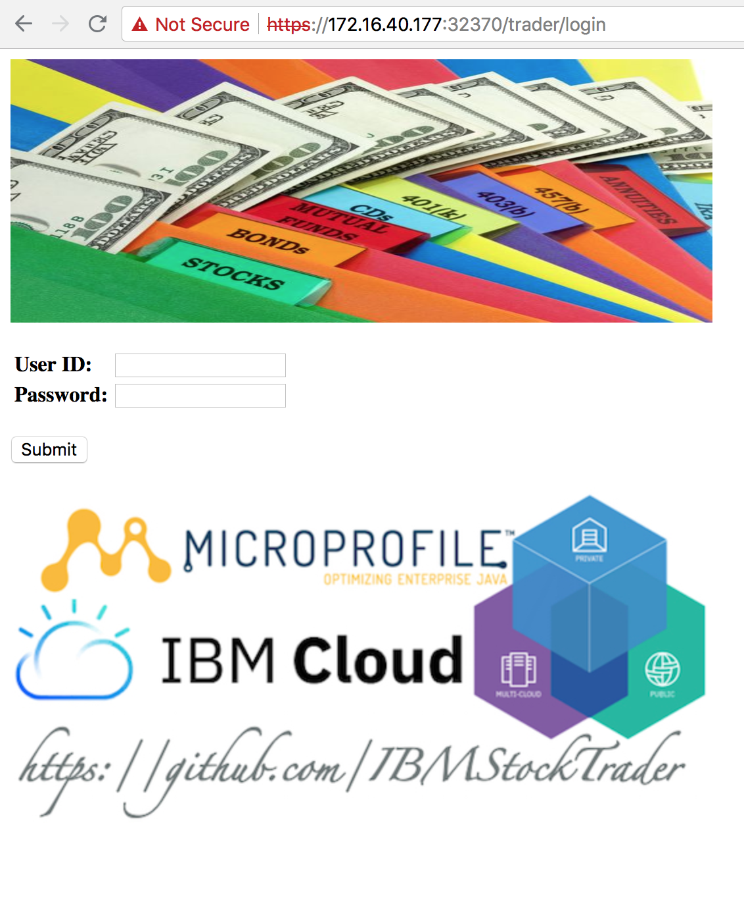
</p>

**IMPORTANT:** Depending on what version of the **Trader** microservice (`basicregistry` or `latest`) you have deployed, the login screen will look differently. In the image above, we are showing the "simplest" path which is using the `basicregistry` version.

4. Log into the IBM StockTrader application using User ID `stock` and Password `trader`:

<p align="center">
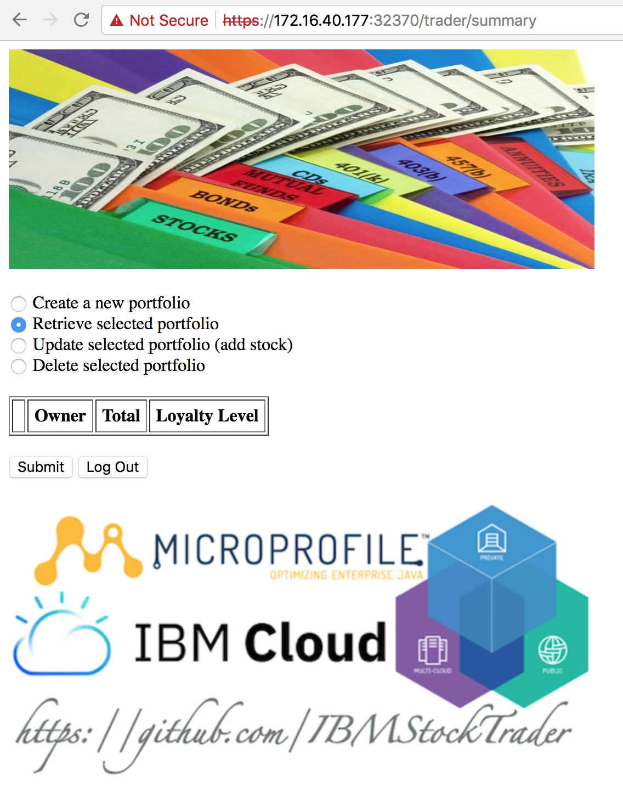
</p>

**IMPORTANT:** Again, based on the **Trader** microservice version you have deployed, you will use the aforementioned credentials or your IBMid credentials.

5. Click on Create a new portfolio and submit in order to create a test portfolio. Introduce the name for the portfolio you like the most and click on submit:

<p align="center">
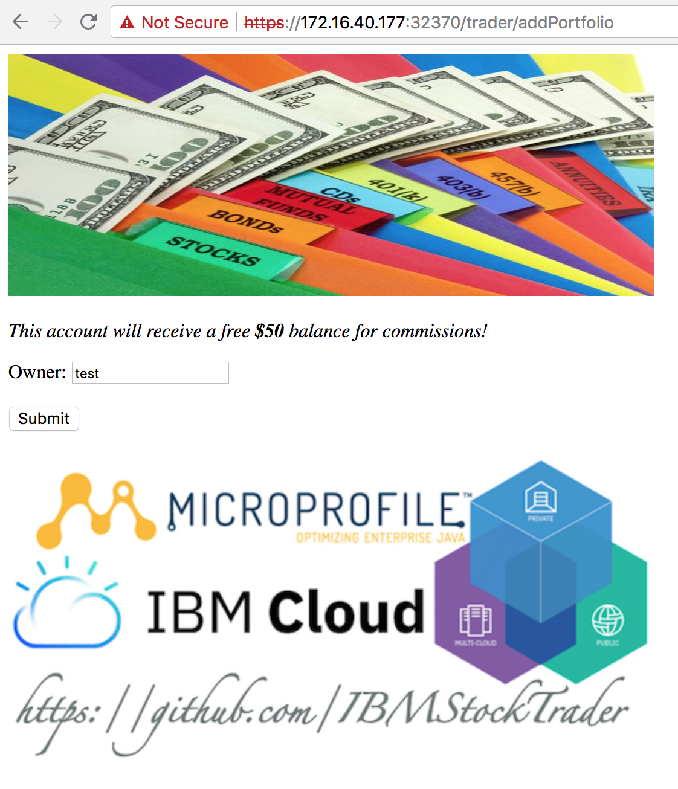
</p>

6. With your newly created portfolio selected, click on Update selected portfolio (add stock) and submit. Then, introduce `IBM` and `400` for the Stock Symbol and Number of Shares fields respectively and click submit:

<p align="center">
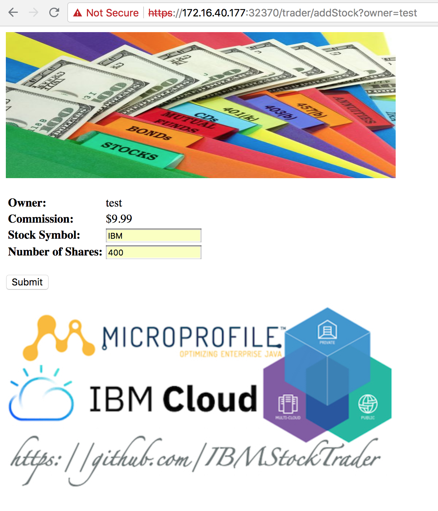
</p>

7. Your IBM StockTrader application should now have a portfolio with 400 IBM shares:

<p align="center">
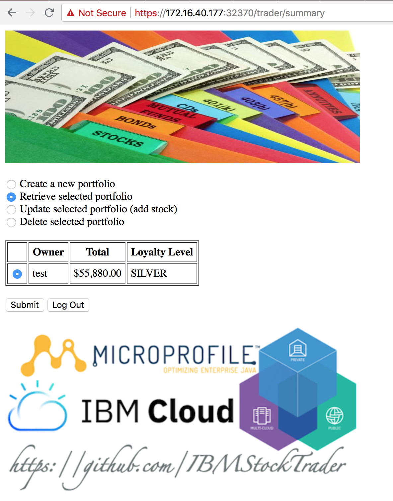
</p>

8. Since we have added enough stock to advance our portfolio to a higher Loyalty Level (SILVER), we should have got a new tweet on our twitter account to notify us of such a change:

<p align="center">
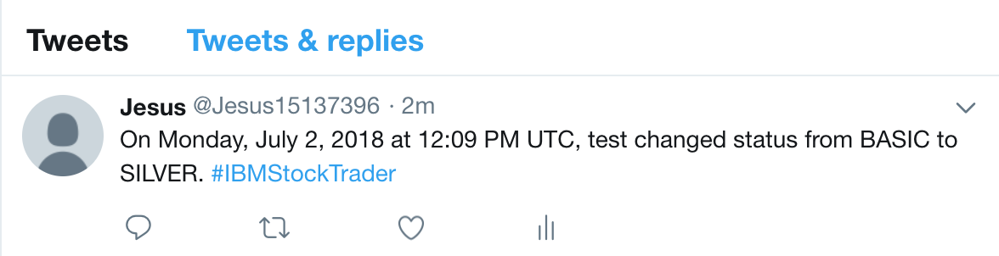
</p>

## Uninstallation

Since we have used `Helm` to install both the IBM StockTrader application and the IBM (and third party) middleware the application needs, we then only need to issue the `helm delete <release_name> --purge --tls ` command to get all the pieces installed by a Helm chart in the release `<release_name>` uninstalled:

As an example, in order to delete all the IBM StockTrader application pieces installed by its Helm chart when we install them as the `test` Helm release,

```
$ helm delete test --purge --tls
release "test" deleted
```

If we now look at what we have running on our `stocktrader` namespace within our IBM Cloud Private (ICP) cluster, we should not see any of the pieces installed by the IBM StockTrader application Helm chart:

```
$ kubectl get all
NAME                                     READY     STATUS    RESTARTS   AGE
po/st-db2-ibm-db2oltp-dev-0              1/1       Running   0          4d
po/st-mq-ibm-mq-0                        1/1       Running   0          3d
po/st-odm-ibm-odm-dev-6699d55df5-fv9lv   1/1       Running   0          3d
po/st-redis-master-0                     1/1       Running   0          3d
po/st-redis-slave-5866f6f889-fkstr       1/1       Running   0          3d

NAME                                      CLUSTER-IP     EXTERNAL-IP   PORT(S)                                   AGE
svc/glusterfs-dynamic-st-db2-st-db2-pvc   10.10.10.6     <none>        1/TCP                                     20d
svc/st-db2-ibm-db2oltp-dev                None           <none>        50000/TCP,55000/TCP,60006/TCP,60007/TCP   4d
svc/st-db2-ibm-db2oltp-dev-db2            10.10.10.83    <nodes>       50000:32329/TCP,55000:31565/TCP           4d
svc/st-mq-ibm-mq                          10.10.10.133   <nodes>       9443:31184/TCP,1414:32366/TCP             3d
svc/st-odm-ibm-odm-dev                    10.10.10.39    <nodes>       9060:31101/TCP                            3d
svc/st-redis-master                       10.10.10.208   <none>        6379/TCP                                  3d
svc/st-redis-slave                        10.10.10.195   <none>        6379/TCP                                  3d

NAME                                  KIND
statefulsets/st-db2-ibm-db2oltp-dev   StatefulSet.v1.apps
statefulsets/st-mq-ibm-mq             StatefulSet.v1.apps
statefulsets/st-redis-master          StatefulSet.v1.apps

NAME                             DESIRED   SUCCESSFUL   AGE
jobs/initialise-stocktrader-db   1         1            4d

NAME                        DESIRED   CURRENT   UP-TO-DATE   AVAILABLE   AGE
deploy/st-odm-ibm-odm-dev   1         1         1            1           3d
deploy/st-redis-slave       1         1         1            1           3d

NAME                               DESIRED   CURRENT   READY     AGE
rs/st-odm-ibm-odm-dev-6699d55df5   1         1         1         3d
rs/st-redis-slave-5866f6f889       1         1         1         3d
```

and, of course, the Helm release should not be listed either:

```
$ helm list --namespace stocktrader --tls
NAME          	REVISION	UPDATED                 	STATUS  	CHART                          	NAMESPACE     
st-db2        	1       	Wed Jun 27 18:49:04 2018	DEPLOYED	ibm-db2oltp-dev-3.0.0          	stocktrader
st-mq         	1       	Thu Jun 28 16:38:22 2018	DEPLOYED	ibm-mqadvanced-server-dev-1.3.0	stocktrader
st-odm        	1       	Thu Jun 28 18:53:45 2018	DEPLOYED	ibm-odm-dev-1.0.0              	stocktrader
st-redis      	1       	Thu Jun 28 18:20:55 2018	DEPLOYED	redis-3.3.6                    	stocktrader
```

If you wanted to clean your entire `stocktrader` namespace, you would need to do the same with the other Helm charts installed using their Helm release names: `st-mq`, `st-db2`, `st-odm` and `st-redis`.

## Test

In this section we provide plain shell scripts to

1. Perform basic load test on the IBM StockTrader application to simulate common user interaction with the application by executing end-to-end scenarios trying to exercise all IBM StockTrader application components as much as possible.
  - [main_looper_basic_registry.sh](test/main_looper_basic_registry.sh)
  - [main_looper_oidc.sh](test/main_looper_oidc.sh)
  - [threaded_main_looper_basic_registry.sh](test/threaded_main_looper_basic_registry.sh)
  - [threaded_main_looper_oidc.sh](test/threaded_main_looper_oidc.sh)

2. Simulate IBM Cloud Private (ICP) platform Kubernetes pod failures that compromises the IBM StockTrader application resiliency.
  [chaos.sh](test/chaos.sh)

The IBM StockTrader's backend for frontend (BFF) microservice used to carry out the test is the **Trader** microservice. As already mentioned in this readme, the Trader microservice is served in two versions as far as authentication and authorisation of the requests is concerned. One uses plain user and password (`basicregistry`) and the other integrates with the IBMid service as the Identity Provider (IP) for the Open ID Connect (OIDC) mechanism (`latest`).

### Load Test

The IBM StockTrader load test scripts will interact with the IBM StockTrader application through **REST calls** against the **Trader** backend for frontend (BFF) microservice. The load test scripts' workflow looks like:

1. Remove the output from previous executions (`output` directory).
2. Log into the StockTrader application (only on the `basic_registry` shell scripts).
3. Delete existing portfolios from previous executions.
4. For each iteration, it will for each portfolio
   1. Create the portfolio if it is iteration number 1.
   2. Add the amount of shares specified for each of the symbols (IBM, APPLE and GOOGLE) multiplied by a factor.
   3. Create a summary for the iteration into the `output` directory (`summary_iteration_#.html` or `summary_thread_#_iteration_#.html`).
5. Create a final summary (`summary_final.html`) and export the database (`portfolio_final.txt` and `stock_final.txt`) reports into the `output` directory so that we can make sure the application has function as expected.

There is a second version of the script above where the main body (point 4) has been threaded in order to get a better request per second throughput. Those scripts are preceded with `threaded_` on their file names.

Finally, both the sequential and threaded versions have got their login section tailored to the two already well mentioned **Trader** microservice authentication and authorisation mechanisms `basicregistry` and `latest`.

As a result, we count with 4 load test scripts which we explain in further detail below.

**IMPORTANT:** given the loyalty levels for the IBM StockTrader application you can check in the [loyalty level section](#loyalty-level) below in this this readme, use a **Multiplication factor for shares** of **2** in the following load test scripts if you want to exponentially increment the amount of shares to add to the portfolios per iteration and, as a result, reach higher levels of loyalty and better stress the messaging and notification pieces of the IBM StockTrader application architecture.

#### main_looper_basic_registry.sh

The [main_looper_basic_registry.sh](test/main_looper_basic_registry.sh) will execute the workflow described in the [Load Test](#load-test) section above in a **sequential manner** with the **login section automated** using stock and trader as user and password when the **Trader** microservice version deployed is `basicregistry`.

The [main_looper_basic_registry.sh](test/main_looper_basic_registry.sh) script expects the following parameters:

- $1: your `<proxy_ip>`.
- $2: your `<trader_microservice_nodeport>`.
- $3: Number of iterations.
- $4: Number of portfolios.
- $5: Number of shares to add of each symbol per portfolio and iteration.
- $6: Multiplication factor for shares.

Example: `sh main_looper_basic_registry.sh 172.16.40.176 32370 3 6 1 1`

#### main_looper_oidc.sh

The [main_looper_oidc.sh](test/main_looper_oidc.sh) script will do exactly the same as the previous `basicregistry` version but will not log into the application automatically. The reason for this is that we encountered some problems automating such task which did not make sense to invest more time investigating.

As a result, the logging into the IBM StockTrader application `latest` version has to be done manually and the appropriate associated cookies exported in order to get the load testing scripts executed against. To export the appropriate cookies associated with the manual logging into the IBM StockTrader application, we have used Firefox to log into the IBM StockTrader application and the [cookies.txt Firefox add-on](https://addons.mozilla.org/en-US/firefox/addon/cookies-txt/) for exporting the cookies.

The [main_looper_oidc.sh](test/main_looper_oidc.sh) script expects the following parameters:

- $1: your `<proxy_ip>`.
- $2: your `<trader_microservice_nodeport>`.
- $3: Number of iterations.
- $4: Number of portfolios.
- $5: Number of shares to add of each symbol per portfolio and iteration.
- $6: Multiplication factor for shares.
- $7: IBM StockTrader authorisation and authorisation cookies file.

Example: `sh main_looper_oidc.sh 172.16.40.176 32370 3 6 1 1 cookies.txt`

#### threaded_main_looper_basic_registry.sh and threaded_main_looper_oidc.sh

The [threaded_main_looper_basic_registry.sh](test/threaded_main_looper_basic_registry.sh) and [threaded_main_looper_oidc.sh](test/threaded_main_looper_oidc.sh) scripts will do work exactly the same as their non-threaded versions explained above but will execute the main stock adding workflow piece in parallel for a better request per second throughput.

That is, from these scripts we will execute the [user_loop.sh](test/user_loop.sh) script in parallel as many times as threads has the main load test scripts been specified with:

```Shell
for thread in $(seq $NUM_THREADS)
do
  echo "[`date '+%H:%M:%S'`] [MAIN] - Executing user_loop.sh script for [THREAD_${thread}]"
  sh user_loop.sh ${PROXY_IP} ${BFF_NODEPORT} ${thread} ${NUM_ITERATIONS} ${NUM_USERS} ${NUMBER_OF_SHARES} ${COOKIE_FILE} ${DIRECTORY} &
done
```

where [user_loop.sh](test/user_loop.sh), will, in turn and in parallel, execute the adding stock code from the non-threaded script versions.

The scripts expects the following parameters:

- $1: your `<proxy_ip>`.
- $2: your `<trader_microservice_nodeport>`.
- $3: Number of threads
- $4: Number of iterations
- $5: Number of users
- $6: Number of shares to add of each symbol per portfolio and iteration
- $7: Multiplication factor for shares.
- $8: IBM StockTrader authorisation and authorisation cookies file (`oidc` version only).

Example: `sh threaded_main_looper_basic_registry.sh 172.16.40.176 32370 2 3 6 1 1`

Example: `sh threaded_main_looper_oidc.sh 172.16.40.176 32370 2 3 6 1 1 cookies.txt` (`oidc` version)

#### Execution

Here we are going to demo the execution of the non-threaded `basicregistry` version of the load test scripts and what the output of it would be (the threaded version would create more users which would just generate higher requests per second):

```
$ sh main_looper_basic_registry.sh 172.16.40.176 32370 4 2 20 1
[2018-07-03 11:46:33]: Begin of script

[11:46:33] IBM Cloud Private (ICP) proxy IP: 172.16.40.176
[11:46:33] IBM StockTrader BFF NodePort: 32370

[11:46:33] Number of iterations: 4
[11:46:33] Number of users: 2
[11:46:33] Number of shares to add per iteration per symbol: 20
[11:46:33] Multiplication factor for shares: 1

[2018-07-03 11:46:33]: Logging into the IBM StockTrader application using stock and trader...
[2018-07-03 11:46:34]: Done

[2018-07-03 11:46:34]: Deleting all previous users...
[2018-07-03 11:46:56]: deleting user User_1
[2018-07-03 11:46:58]: deleting user User_2
[2018-07-03 11:47:00]: Done

[2018-07-03 11:47:00]: ----- Begin Iteration 1

[2018-07-03 11:47:00]: Creating user User_1...
[2018-07-03 11:47:02]: Done

[2018-07-03 11:47:09]: Creating user User_2...
[2018-07-03 11:47:10]: Done

[2018-07-03 11:47:20]: ----- End Iteration 1

[2018-07-03 11:47:20]: ----- Begin Iteration 2

[2018-07-03 11:47:37]: ----- End Iteration 2

[2018-07-03 11:47:37]: ----- Begin Iteration 3

[2018-07-03 11:47:54]: ----- End Iteration 3

[2018-07-03 11:47:54]: ----- Begin Iteration 4

[2018-07-03 11:48:11]: ----- End Iteration 4

[2018-07-03 11:48:11]: Getting final results
[2018-07-03 11:48:30]: Done

[2018-07-03 11:48:30]: End of script
```

As we can read above, the load test script has created two users (portfolios) to which has added 20 shares per symbol (IBM, GOOGLE, ORACLE) each iteration (4 iterations) making IBM StockTrader to look like this

<p align="center">
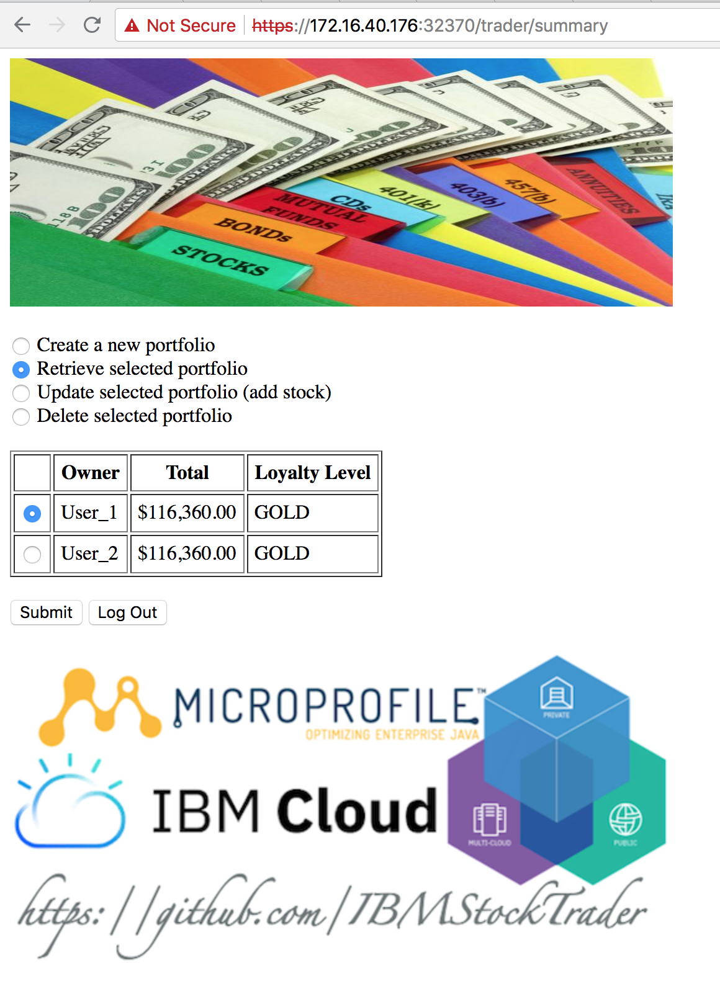
</p>

and our twitter account to look like this after having those two portfolios progressed few loyalty levels up:

<p align="center">
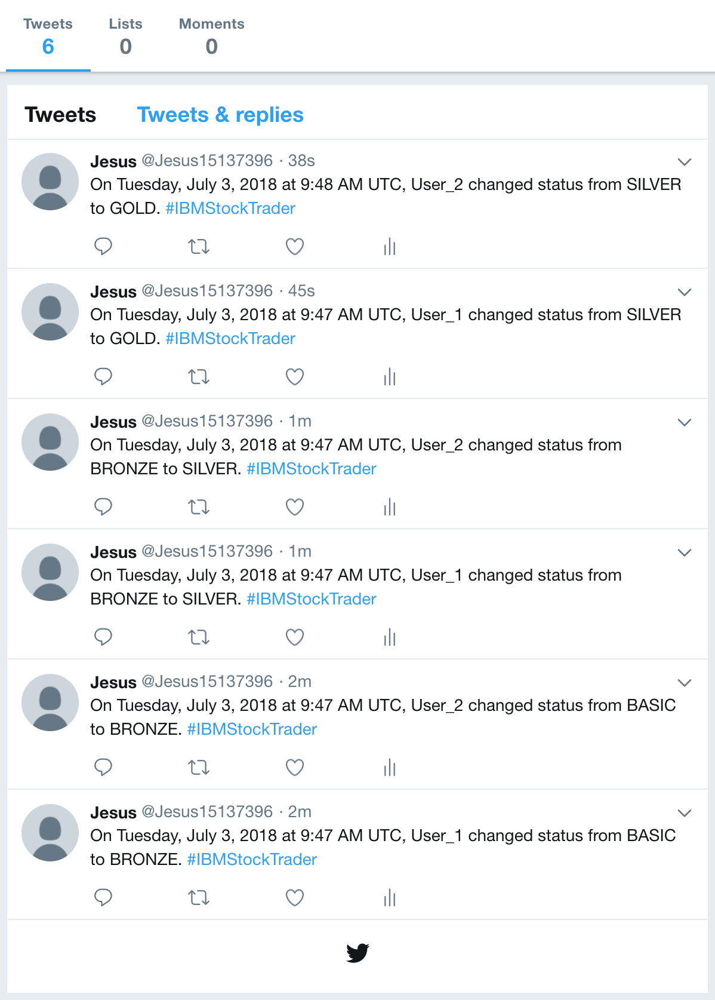
</p>

As explained in the [Load Test](#load-test) section, the load test scripts also produce some more detailed test results into the `output` directory:

```
$ ls output
portfolio_final.txt
stock_final.txt
summary_final.html
summary_iteration_1.html
summary_iteration_2.html
summary_iteration_3.html
summary_iteration_4.html
```
where the `summary html` files would be a graphical snapshot of who the IBM StockTrader application looks like after each iteration and at the end of the load test script execution and `portfolio.txt` and `stock_final.txt` an IBM StockTrader application database dump at the end of the load test script execution:

```
$ cat portfolio_final.txt

OWNER                            TOTAL                    LOYALTY  BALANCE                  COMMISSIONS              FREE        SENTIMENT       
-------------------------------- ------------------------ -------- ------------------------ ------------------------ ----------- ----------------
User_1                             +1.16360000000000E+005 GOLD       -5.18800000000000E+001   +1.01880000000000E+002           0 Unknown         
User_2                             +1.16360000000000E+005 GOLD       -5.18800000000000E+001   +1.01880000000000E+002           0 Unknown         

  2 record(s) selected.
```
```
$ cat stock_final.txt

OWNER                            SYMBOL   SHARES      PRICE                    TOTAL                    DATEQUOTED COMMISSION              
-------------------------------- -------- ----------- ------------------------ ------------------------ ---------- ------------------------
User_1                           IBM               80   +1.39860000000000E+002   +1.11888000000000E+004 07/02/2018   +3.49600000000000E+001
User_1                           GOOG              80   +1.12746000000000E+003   +9.01968000000000E+004 07/02/2018   +3.49600000000000E+001
User_1                           AAPL              80   +1.87180000000000E+002   +1.49744000000000E+004 07/02/2018   +3.19600000000000E+001
User_2                           IBM               80   +1.39860000000000E+002   +1.11888000000000E+004 07/02/2018   +3.49600000000000E+001
User_2                           GOOG              80   +1.12746000000000E+003   +9.01968000000000E+004 07/02/2018   +3.49600000000000E+001
User_2                           AAPL              80   +1.87180000000000E+002   +1.49744000000000E+004 07/02/2018   +3.19600000000000E+001

  6 record(s) selected.
```

### Load Test Throughput

The following table describes the load test scripts maximum throughput when executed against the IBM StockTrader application:

**Replica 1**

| | #Threads | #Iterations | #Users | #Requests | Duration (sec) | Throughput (req/sec) |
| --- | --- | --- | --- | --- | --- | --- |
| main_looper_basic_registry.sh | - | 10 | 4 | 135 | 241 | **0.56** |
| threaded_main_looper_basic_registry.sh | 4 | 10 | 4 | 540 | 230 | **2.34** |
| threaded_main_looper_basic_registry.sh | 6 | 10 | 4 | 810 | 471 | **1.71** |

where all IBM StockTrader application microservices have 1 replica only.

**Replica 3**

| | #Threads | #Iterations | #Users | #Requests | Duration (sec) | Throughput (req/sec) |
| --- | --- | --- | --- | --- | --- | --- |
| main_looper_basic_registry.sh | - | 10 | 4 | 135 | 272 | **0.49** |
| threaded_main_looper_basic_registry.sh | 4 | 10 | 4 | 540 | 231 | **2.33** |
| threaded_main_looper_basic_registry.sh | 6 | 10 | 4 | 810 | 312 | **2.59** |

where all IBM StockTrader application microservices are scaled up to 3 replicas (except from the Trader backend for frontend microservice which can not scale due to some WebSphere Liberty SSO credentials sharing limitation).

The number of requests the load test scripts make to the IBM StockTrader application Trader backend for frontend microservice is calculated considering main loops only and leaving out preparation or summary requests. The equations look like this:

```
main_looper_basic_registry.sh = #Users + ( #Iteration * #Users * #Symbols(=3) ) + #Iterations
threaded_main_looper_basic_registry.sh = #Threads * ( #Users + ( #Iterations * #Users * #Symbols(=3) ) + #Iterations )
```

### Monkey Chaos

This section covers the implementation of a Kubernetes pod failure shell script. The script is actually called [chaos.sh](test/chaos.sh) and it is a tailored piece of the work presented in this [GitHub repository by Eduardo Patrocinio](https://github.com/patrocinio/kubernetes-pod-chaos-monkey) to suit our needs.

Given a namespace (default namespace is default), the IBM StockTrader application Helm release name and a delay (default 10 seconds), the [chaos.sh](test/chaos.sh) script will then randomly choose a Running pod within that namespace which belongs to the specified IBM StockTrader application Helm release and terminate it:

```Shell
while true; do
  POD=`kubectl \
    --namespace "${NAMESPACE}" \
    -o 'jsonpath={.items[*].metadata.name}' \
    get pods | \
      tr " " "\n" | \
      grep ${UNIQUE_ID} | \
      grep Running | \
      grep -v trad | \
      gshuf | \
      head -n 1`
  echo Deleting Pod ${POD}...
  kubectl --namespace "${NAMESPACE}" delete pod ${POD}
  sleep "${DELAY}"
done
```

this way we simulate failures on the IBM Cloud Private (ICP) platform that will allow us to study the IBM StockTrader application resiliency as the cloud native stateless microservices based reference application for the IBM Cloud Private (ICP) resiliency at the application level initial scenario.

Example:

```
$ sh chaos.sh 10 stocktrader test
[2018-07-03 16:14:15]: Begin of script

Delay: 10
Namespace: stocktrader
Unique ID (Helm release): test

Deleting Pod test-notification-twitter-6dd5f9d7dc-bsfs7...
pod "test-notification-twitter-6dd5f9d7dc-bsfs7" deleted

Deleting Pod test-portfolio-75b4dbd485-k6rq4...
pod "test-portfolio-75b4dbd485-k6rq4" deleted

Deleting Pod test-notification-twitter-6dd5f9d7dc-5rmh4...
pod "test-notification-twitter-6dd5f9d7dc-5rmh4" deleted
^C
```

As you can see, the [chaos.sh](test/chaos.sh) script will run until a kill signal is sent to it (ctrl+c).

### Test Execution

As already said in this readme, in order to test what we consider the easiest and therefore first step on testing cloud native microservices based applications on the IBM Cloud Private (ICP) platform (that is stateless microservices based applications), we are going to test the IBM StockTrader application resiliency.

For doing so, we have [deployed the IBM StockTrader application](#installation) and developed [load test scripts](#load-test) for it and a [Kubernetes pod failure shell script](#monkey-chaos) for the IBM Cloud Private (ICP) platform.

Then, we have scaled our stateless microservices to 3 replicas (except from the backend for frontend **Trader** microservice(1)) so that we create high availability, increase our application resiliency and minimise Kubernetes pod failures to break our application. There is no point in testing with only one replica as any pod failure will bring our application down.

(1) The reason the backend for frontend (BFF) Trader microservice has not been scaled is due to a WebSphere Liberty SSO limitation which does not allow to share the SSO credentials/cookies amongst several WebSphere Liberty instances. Hence, requests will get redirected several times to the login mechanism. Since the Trader microservice `latest` version is not able to scale and therefore we are going to have only 1 replica of our backend for frontend (BFF), we have decided to run our tests with the `basicregistry` version instead as the load test scripts for such version automates the login into the IBM StockTrader application.

This is how our testing environment looks like in terms of pods:

```
$ kubectl get pods
NAME                                         READY     STATUS    RESTARTS   AGE
st-db2-ibm-db2oltp-dev-0                     1/1       Running   0          6d
st-mq-ibm-mq-0                               1/1       Running   0          6d
st-odm-ibm-odm-dev-6699d55df5-fv9lv          1/1       Running   0          5d
st-redis-master-0                            1/1       Running   0          5d
st-redis-slave-5866f6f889-fkstr              1/1       Running   0          5d
test-messaging-644ccbcd95-h9pxv              1/1       Running   0          16m
test-messaging-644ccbcd95-mwkjh              1/1       Running   0          2d
test-messaging-644ccbcd95-q58z4              1/1       Running   0          16m
test-notification-twitter-6dd5f9d7dc-8d2ch   1/1       Running   0          16m
test-notification-twitter-6dd5f9d7dc-d474c   1/1       Running   0          16m
test-notification-twitter-6dd5f9d7dc-g47ql   1/1       Running   0          1d
test-portfolio-75b4dbd485-8vjst              1/1       Running   0          16m
test-portfolio-75b4dbd485-k9mxm              1/1       Running   0          1d
test-portfolio-75b4dbd485-ppqd7              1/1       Running   0          16m
test-stock-quote-7679899d76-8q5lc            1/1       Running   0          16m
test-stock-quote-7679899d76-hwndr            1/1       Running   0          16m
test-stock-quote-7679899d76-rgkwr            1/1       Running   0          2d
test-trader-5446499c5b-98x2r                 1/1       Running   0          21m
test-tradr-548b58bc55-kms2z                  1/1       Running   0          3h
```

that is,

- 1 replica of our middleware pieces: `IBM DB2`, `IBM MQ`, `IBM ODM` and `Redis`
- 1 replica of our backend for frontend: `trader` (`tradr` is not used even though it gets installed with the IBM StockTrader application Helm chart)
- 3 replicas of the core IBM StockTrader application microservices: `Portfolio`, `Stock-quote`, `Messaging` and `Notificatio-Twitter`

Now, the only thing that is left is to execute the load test scripts and the Kubernetes pod failure script at the same time over the IBM StockTrader application installation you can see above which we have on our IBM Cloud Private (ICP) instance hosted on our lab.

The results of these executions can be found in the [test execution readme file](test_execution.md).

## Files

This section will describe each of the files presented in this repository. In here we have files that refer to two different versions of StockTrader. A simpler one we initiated our resiliency work with (version 1 or v1) and the sort of complete StockTrader version which we have finally used for the resiliency test (version 2 or v2)

#### Installation - Middleware

- [db2_values.yaml](installation/middleware/db2_values.yaml): tailored IBM DB2 Helm chart values file with the default values that the IBM StockTrader Helm chart expects.
- [initialise_stocktrader_db_v2.sql](installation/middleware/initialise_stocktrader_db_v2.sql): initialises the IBM StockTrader version 2 database with the appropriate structure for the application to work properly.
- [initialise_stocktrader_db_v2.yaml](installation/middleware/initialise_stocktrader_db_v2.yaml): Kubernetes job that pulls [initialise_stocktrader_db_v2.sql](installation/middleware/initialise_stocktrader_db_v2.sql) to initialise the IBM StockTrader version 2 database.
- [initialise_stocktrader_db_v1.sql](installation/middleware/initialise_stocktrader_db_v1.sql): initialises the IBM StockTrader version 1 database with the appropriate structure for the application to work properly.
- [initialise_stocktrader_db_v1.yaml](installation/middleware/initialise_stocktrader_db_v1.yaml): Kubernetes job that pulls [initialise_stocktrader_db_v1.sql](installation/middleware/initialise_stocktrader_db_v1.sql) to initialise the IBM StockTrader version 1 database.
- [mq_values.yaml](installation/middleware/mq_values.yaml): tailored IBM MQ Helm chart values file with the default values that the IBM StockTrader Helm chart expects.
- [redis_values.yaml](installation/middleware/master/redis_values.yaml): tailored Redis Helm chart values file with the default values that the IBM StockTrader Helm chart expects.
- [odm_values.yaml](installation/middleware/odm_values.yaml): tailored IBM Operation Decision Manager (ODM) Helm chart values file with the default values that the IBM StockTrader Helm chart expects.

#### Installation - Application

- [st_app_values_v1.yaml](installation/application/st_app_values_v1.yaml): Default IBM StockTrader version 1 Helm chart values file.
- [st_app_values_v2.yaml](installation/application/st_app_values_v2.yaml): Default IBM StockTrader version 2 Helm chart values file.

#### Test

- [chaos.sh](test/chaos.sh): Shell script that simulates Kubernetes pod failures.
- [delete_all_tweets.py](test/delete_all_tweets.py): Python script to delete all tweets from a given twitter account.
- [export.sh](test/export.sh): Shell script to export the IBM StockTrader application database to a text file.
- [main_looper_basic_registry.sh](test/main_looper_basic_registry.sh): Single-threaded IBM StockTrader load test script to be used when `basicregistry` Trader microservice version.
- [main_looper_oidc.sh](test/main_looper_oidc.sh): Single-threaded IBM StockTrader load test script to be used when `latest` Trader microservice version.
- [threaded_main_looper_basic_registry.sh](test/threaded_main_looper_basic_registry.sh): Multi-threaded IBM StockTrader load test script to be used when `basicregistry` Trader microservice version.
- [threaded_main_looper_oidc.sh](test/threaded_main_looper_oidc.sh): Multi-threaded IBM StockTrader test script to be used when `latest` Trader microservice version.
- [user_loop.sh](test/user_loop.sh): Simulated user behavior load test script to be called by the multi-threaded IBM StockTrader test scripts to carry out the adding stock workflow piece.
- [users.sh](test/users.sh): Shell script to export the IBM StockTrader portfolios to a text file.
- [get_logs.sh](test/get_logs.sh): Shell script to get all the logs from a Helm release since a period of time (if specified).

## Links

This section gathers all links to IBM StockTrader application sort of documentation.

- [Building Stock Trader in IBM Cloud Private 2.1 using Production Services](https://www.ibm.com/developerworks/community/blogs/5092bd93-e659-4f89-8de2-a7ac980487f0/entry/Building_Stock_Trader_in_IBM_Cloud_Private_2_1_using_Production_Services?lang=en)

- [IBM StockTrader GitHub repository](https://github.com/IBMStockTrader)

- [IBM Cloud private: Continuously Deliver Java Apps with IBM Cloud private and Middleware Services (video)](https://www.youtube.com/watch?v=ctuUTDIClms&feature=youtu.be)

- [Introducing IBM Cloud Private](https://www.ibm.com/developerworks/community/blogs/5092bd93-e659-4f89-8de2-a7ac980487f0/entry/Introducing_IBM_Cloud_private?lang=en)

- [Build and Continuously Deliver a Java Microservices App in IBM Cloud private](https://www.ibm.com/developerworks/community/blogs/5092bd93-e659-4f89-8de2-a7ac980487f0/entry/Build_and_Continuously_Deliver_a_Java_Microservices_App_in_IBM_Cloud_private?lang=en)

- [Developing Microservices for IBM Cloud Private](https://www.ibm.com/developerworks/community/blogs/5092bd93-e659-4f89-8de2-a7ac980487f0/entry/Developing_microservices_for_IBM_Cloud_private?lang=en)

- [Use Kubernetes Secrets to Make Your App Portable Across Clouds](https://developer.ibm.com/recipes/tutorials/use-kubernetes-secrets-to-make-your-app-portable-across-clouds/)

- [Deploy MQ-Dev into IBM Cloud Private 2.1](https://developer.ibm.com/recipes/tutorials/deploy-mq-into-ibm-cloud-private/)

- [Db2 Integration into IBM Cloud Private](https://developer.ibm.com/recipes/tutorials/db2-integration-into-ibm-cloud-private/)
