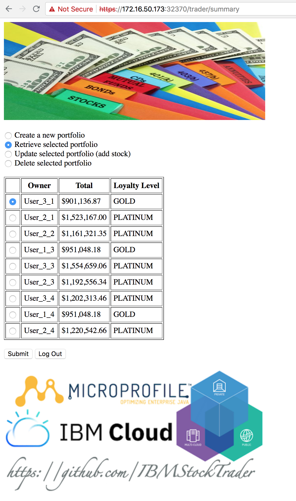
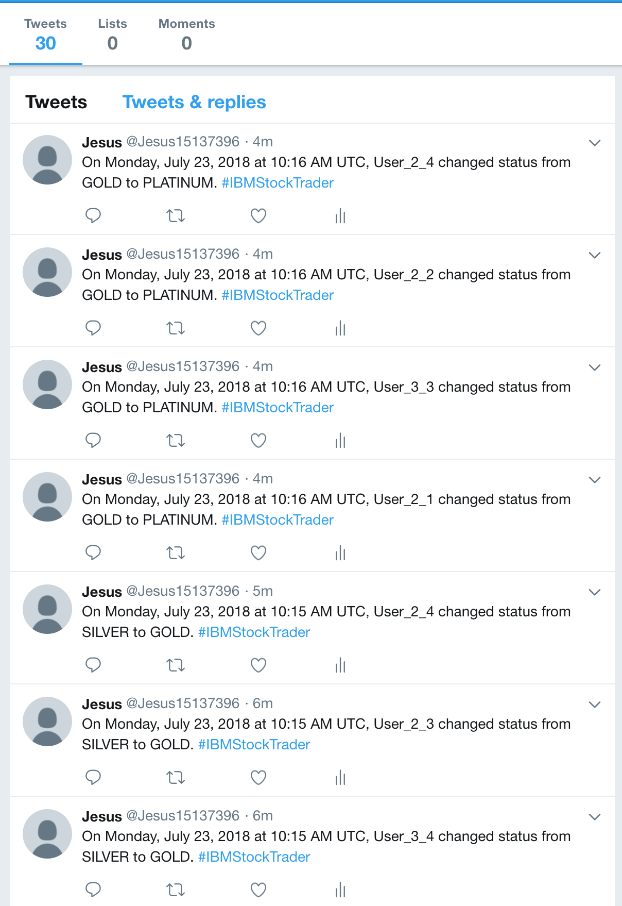
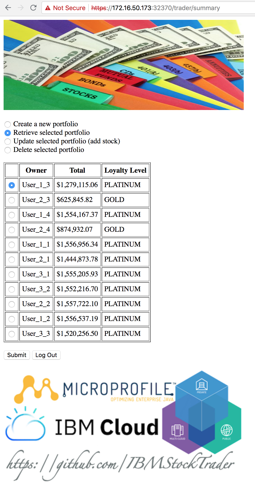
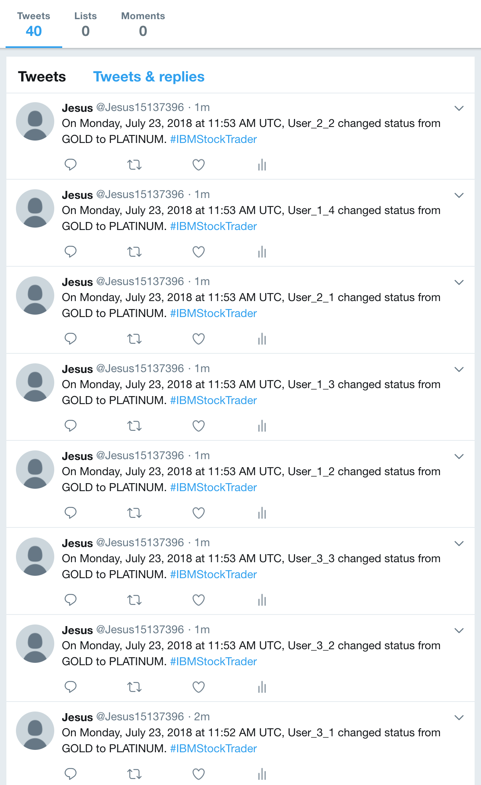
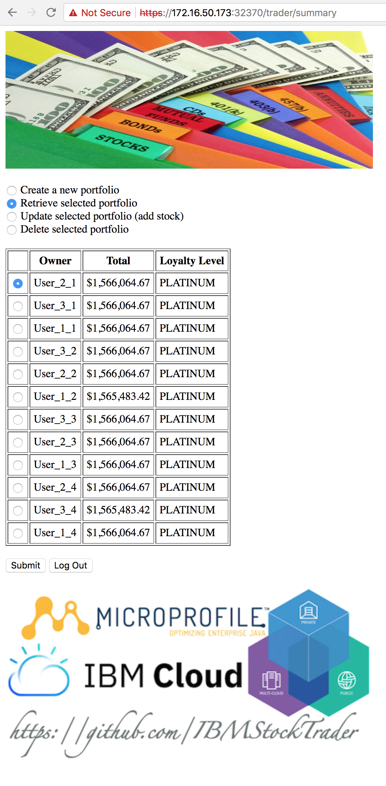
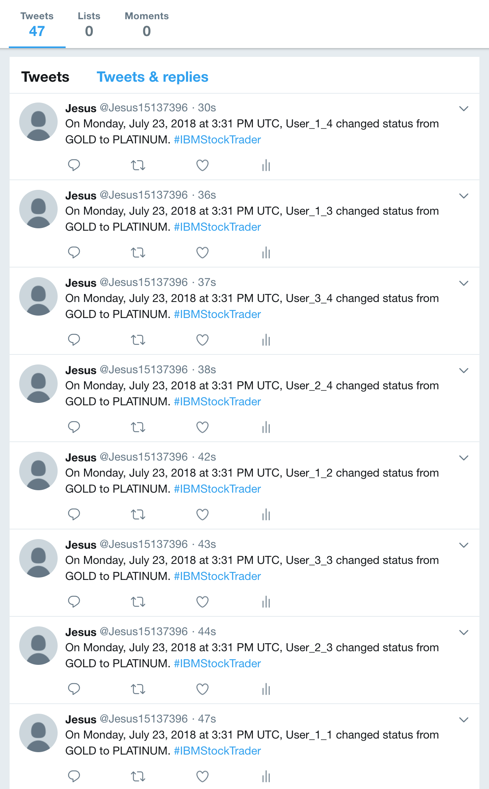
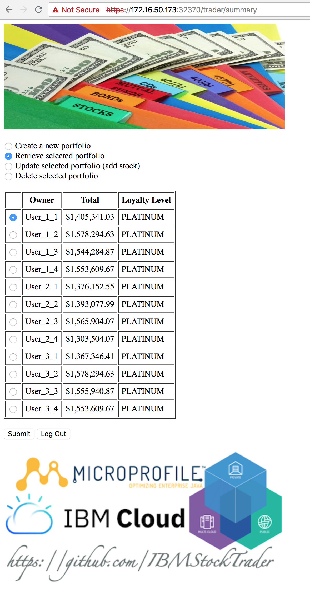
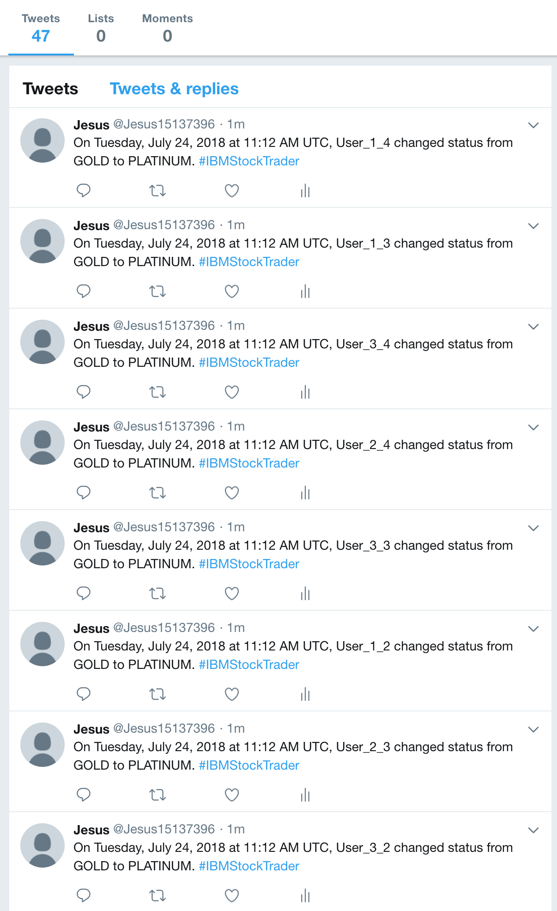

# Test Execution

This readme contains the results of the resiliency tests executed against the IBM StockTrader application. For further info, please refer to the [main readme](README.md) in the actual repository.

Files for each of the executions can be found in this repository under the [**test/execution/test_#**](test/execution) folder.

1.  [Test 1](#test-1)
2.  [Test 2](#test-2)
3.  [Test 3](#test-3)
4.  [Test 4](#test-4)
5.  [Main Conclusions](#main-conclusions)

## Test 1

This is the configuration we have run [threaded_main_looper_basic_registry.sh](test/threaded_main_looper_basic_registry.sh) and [chaos.sh](test/chaos.sh) scripts with:

| Config | Value |
| --- | --- |
| IBM StockTrader installation | 172.16.50.173:32370 |
| Backend for frontend (BFF) | Trader microservice |
| Load test script | threaded_main_looper_basic_registry.sh |
| Number of threads | 3 |
| Number of iterations | 10 |
| Number of users | 4 |
| Number of shares | 1 |
| Multiplication factor for shares | 2 |
| Chaos test delay | 5 sec |

### Results

IBM StockTrader application:

<p align="center">

</p>

Twitter account:

<p align="center">

</p>

Portfolio table:

```
OWNER                            TOTAL                    LOYALTY  BALANCE                  COMMISSIONS              FREE        SENTIMENT       
-------------------------------- ------------------------ -------- ------------------------ ------------------------ ----------- ----------------
User_3_1                           +9.01136870000000E+005 GOLD       -1.64750000000000E+002   +2.14750000000000E+002           0 Unknown         
User_2_1                           +1.52316700000000E+006 PLATINUM   -1.39770000000000E+002   +1.89770000000000E+002           0 Unknown         
User_2_2                           +1.16132135000000E+006 PLATINUM   -1.56760000000000E+002   +2.06760000000000E+002           0 Unknown         
User_1_3                           +9.51048180000000E+005 GOLD       -1.96710000000000E+002   +2.46710000000000E+002           0 Unknown         
User_3_3                           +1.55465906000000E+006 PLATINUM   -1.94710000000000E+002   +2.44710000000000E+002           0 Unknown         
User_2_3                           +1.19255634000000E+006 PLATINUM   -1.63750000000000E+002   +2.13750000000000E+002           0 Unknown         
User_3_4                           +1.20231346000000E+006 PLATINUM   -1.80730000000000E+002   +2.30730000000000E+002           0 Unknown         
User_1_4                           +9.51048180000000E+005 GOLD       -1.96710000000000E+002   +2.46710000000000E+002           0 Unknown         
User_2_4                           +1.22054266000000E+006 PLATINUM   -1.61750000000000E+002   +2.11750000000000E+002           0 Unknown         

  9 record(s) selected.

```

Stock table:

```
OWNER                            SYMBOL   SHARES      PRICE                    TOTAL                    DATEQUOTED COMMISSION              
-------------------------------- -------- ----------- ------------------------ ------------------------ ---------- ------------------------
User_1_3                         AAPL            1023   +1.91440000000000E+002   +1.95843120000000E+005 07/20/2018   +8.39000000000000E+001
User_1_3                         GOOG             511   +1.18491000000000E+003   +6.05489010000000E+005 07/20/2018   +7.69100000000000E+001
User_1_3                         IBM             1023   +1.46350000000000E+002   +1.49716050000000E+005 07/20/2018   +8.59000000000000E+001
User_1_4                         AAPL            1023   +1.91440000000000E+002   +1.95843120000000E+005 07/20/2018   +8.39000000000000E+001
User_1_4                         GOOG             511   +1.18491000000000E+003   +6.05489010000000E+005 07/20/2018   +7.69100000000000E+001
User_1_4                         IBM             1023   +1.46350000000000E+002   +1.49716050000000E+005 07/20/2018   +8.59000000000000E+001
User_2_1                         AAPL             998   +1.91440000000000E+002   +1.91057120000000E+005 07/20/2018   +5.49300000000000E+001
User_2_1                         GOOG             998   +1.18491000000000E+003   +1.18254018000000E+006 07/20/2018   +5.79300000000000E+001
User_2_1                         IBM             1022   +1.46350000000000E+002   +1.49569700000000E+005 07/20/2018   +7.69100000000000E+001
User_2_2                         AAPL             751   +1.91440000000000E+002   +1.43771440000000E+005 07/20/2018   +6.69200000000000E+001
User_2_2                         GOOG             766   +1.18491000000000E+003   +9.07641060000000E+005 07/20/2018   +6.89200000000000E+001
User_2_2                         IBM              751   +1.46350000000000E+002   +1.09908850000000E+005 07/20/2018   +7.09200000000000E+001
User_2_3                         AAPL            1007   +1.91440000000000E+002   +1.92780080000000E+005 07/20/2018   +7.39100000000000E+001
User_2_3                         GOOG             751   +1.18491000000000E+003   +8.89867410000000E+005 07/20/2018   +6.99200000000000E+001
User_2_3                         IBM              751   +1.46350000000000E+002   +1.09908850000000E+005 07/20/2018   +6.99200000000000E+001
User_2_4                         AAPL            1007   +1.91440000000000E+002   +1.92780080000000E+005 07/20/2018   +7.39100000000000E+001
User_2_4                         GOOG             743   +1.18491000000000E+003   +8.80388130000000E+005 07/20/2018   +6.09300000000000E+001
User_2_4                         IBM             1007   +1.46350000000000E+002   +1.47374450000000E+005 07/20/2018   +7.69100000000000E+001
User_3_1                         AAPL             991   +1.91440000000000E+002   +1.89717040000000E+005 07/20/2018   +7.59100000000000E+001
User_3_1                         GOOG             478   +1.18491000000000E+003   +5.66386980000000E+005 07/20/2018   +5.99300000000000E+001
User_3_1                         IBM              991   +1.46350000000000E+002   +1.45032850000000E+005 07/20/2018   +7.89100000000000E+001
User_3_3                         AAPL            1007   +1.91440000000000E+002   +1.92780080000000E+005 07/20/2018   +7.39100000000000E+001
User_3_3                         GOOG            1023   +1.18491000000000E+003   +1.21216293000000E+006 07/20/2018   +8.49000000000000E+001
User_3_3                         IBM             1023   +1.46350000000000E+002   +1.49716050000000E+005 07/20/2018   +8.59000000000000E+001
User_3_4                         AAPL             751   +1.91440000000000E+002   +1.43771440000000E+005 07/20/2018   +6.69200000000000E+001
User_3_4                         GOOG             767   +1.18491000000000E+003   +9.08825970000000E+005 07/20/2018   +7.79100000000000E+001
User_3_4                         IBM             1023   +1.46350000000000E+002   +1.49716050000000E+005 07/20/2018   +8.59000000000000E+001

  27 record(s) selected.
```

Deleted pods:

| Name | Number of pods |
| --- | --- |
| Portfolio | 6 |
| Stock-Quote | 7 |
| Messaging | 11 |
| Notification-twitter | 8 |
| Total | **32** |

More info on what pods [here](test/execution/test_1/chaos.txt).

Execution time: 307 seconds
Total number of rest calls: 536

### Conclusion

Given the results above, we can conclude the following for Test 1:

1. Not all the users were created as the result of the portfolio microservice pod failures. Expected number of users: 12.
2. Not all the update stock actions succeeded as the result of the portfolio microservice pod failures. Expected number of shares per symbol for each user: 1023.
3. Not all the users got to the PLATINUM loyalty level as the result of the previous point (2). Expected loyalty level for each user: PLATINUM.
4. Not all the loyalty level notifications were successfully tweeted as a result of previous point (3) and the notification-twitter microservice pod failures. Expected number of tweets per user: 4 (Total: 48).
6. Application kept working regardless of pod failures as these got recreated automatically by Kubernetes.

## Test 2

This is the configuration we have run [threaded_main_looper_basic_registry.sh](test/threaded_main_looper_basic_registry.sh) and [chaos.sh](test/chaos.sh) scripts with:

| Config | Value |
| --- | --- |
| IBM StockTrader installation | 172.16.50.173:32370 |
| Backend for frontend (BFF) | Trader microservice |
| Load test script | threaded_main_looper_basic_registry.sh |
| Number of threads | 3 |
| Number of iterations | 10 |
| Number of users | 4 |
| Number of shares | 1 |
| Multiplication factor for shares | 2 |
| Chaos test delay | 5 sec |

### Results

IBM StockTrader application:

<p align="center">

</p>

Twitter account:

<p align="center">

</p>

Portfolio table:

```
OWNER                            TOTAL                    LOYALTY  BALANCE                  COMMISSIONS              FREE        SENTIMENT       
-------------------------------- ------------------------ -------- ------------------------ ------------------------ ----------- ----------------
User_1_3                           +1.27911506000000E+006 PLATINUM   -1.68750000000000E+002   +2.18750000000000E+002           0 Unknown         
User_2_3                           +6.25845820000000E+005 GOLD       -1.65750000000000E+002   +2.15750000000000E+002           0 Unknown         
User_1_4                           +1.55416737000000E+006 PLATINUM   -1.85720000000000E+002   +2.35720000000000E+002           0 Unknown         
User_2_4                           +8.74932070000000E+005 GOLD       -1.80730000000000E+002   +2.30730000000000E+002           0 Unknown         
User_1_1                           +1.55695634000000E+006 PLATINUM   -1.93710000000000E+002   +2.43710000000000E+002           0 Unknown         
User_2_1                           +1.44487378000000E+006 PLATINUM   -1.88720000000000E+002   +2.38720000000000E+002           0 Unknown         
User_3_1                           +1.55520593000000E+006 PLATINUM   -1.85720000000000E+002   +2.35720000000000E+002           0 Unknown         
User_3_2                           +1.55221670000000E+006 PLATINUM   -1.86720000000000E+002   +2.36720000000000E+002           0 Unknown         
User_2_2                           +1.55772210000000E+006 PLATINUM   -2.02700000000000E+002   +2.52700000000000E+002           0 Unknown         
User_1_2                           +1.55653719000000E+006 PLATINUM   -1.93710000000000E+002   +2.43710000000000E+002           0 Unknown         
User_3_3                           +1.52025650000000E+006 PLATINUM   -1.95710000000000E+002   +2.45710000000000E+002           0 Unknown         

  11 record(s) selected.

```

Stock table:

```
OWNER                            SYMBOL   SHARES      PRICE                    TOTAL                    DATEQUOTED COMMISSION              
-------------------------------- -------- ----------- ------------------------ ------------------------ ---------- ------------------------
User_1_1                         AAPL            1019   +1.91440000000000E+002   +1.95077360000000E+005 07/20/2018   +7.29100000000000E+001
User_1_1                         GOOG            1023   +1.18491000000000E+003   +1.21216293000000E+006 07/20/2018   +8.39000000000000E+001
User_1_1                         IBM             1023   +1.46350000000000E+002   +1.49716050000000E+005 07/20/2018   +8.69000000000000E+001
User_1_2                         AAPL            1023   +1.91440000000000E+002   +1.95843120000000E+005 07/20/2018   +8.29000000000000E+001
User_1_2                         GOOG            1022   +1.18491000000000E+003   +1.21097802000000E+006 07/20/2018   +7.39100000000000E+001
User_1_2                         IBM             1023   +1.46350000000000E+002   +1.49716050000000E+005 07/20/2018   +8.69000000000000E+001
User_1_3                         AAPL             255   +1.91440000000000E+002   +4.88172000000000E+004 07/20/2018   +6.99200000000000E+001
User_1_3                         GOOG             991   +1.18491000000000E+003   +1.17424581000000E+006 07/20/2018   +7.69100000000000E+001
User_1_3                         IBM              383   +1.46350000000000E+002   +5.60520500000000E+004 07/20/2018   +7.19200000000000E+001
User_1_4                         AAPL            1023   +1.91440000000000E+002   +1.95843120000000E+005 07/20/2018   +8.29000000000000E+001
User_1_4                         GOOG            1020   +1.18491000000000E+003   +1.20860820000000E+006 07/20/2018   +6.59200000000000E+001
User_1_4                         IBM             1023   +1.46350000000000E+002   +1.49716050000000E+005 07/20/2018   +8.69000000000000E+001
User_2_1                         AAPL            1023   +1.91440000000000E+002   +1.95843120000000E+005 07/20/2018   +8.29000000000000E+001
User_2_1                         GOOG             991   +1.18491000000000E+003   +1.17424581000000E+006 07/20/2018   +7.69100000000000E+001
User_2_1                         IBM              511   +1.46350000000000E+002   +7.47848500000000E+004 07/20/2018   +7.89100000000000E+001
User_2_2                         AAPL            1023   +1.91440000000000E+002   +1.95843120000000E+005 07/20/2018   +8.29000000000000E+001
User_2_2                         GOOG            1023   +1.18491000000000E+003   +1.21216293000000E+006 07/20/2018   +8.39000000000000E+001
User_2_2                         IBM             1023   +1.46350000000000E+002   +1.49716050000000E+005 07/20/2018   +8.59000000000000E+001
User_2_3                         AAPL             511   +1.91440000000000E+002   +9.78258400000000E+004 07/20/2018   +7.69100000000000E+001
User_2_3                         GOOG             383   +1.18491000000000E+003   +4.53820530000000E+005 07/20/2018   +6.99200000000000E+001
User_2_3                         IBM              507   +1.46350000000000E+002   +7.41994500000000E+004 07/20/2018   +6.89200000000000E+001
User_2_4                         AAPL            1023   +1.91440000000000E+002   +1.95843120000000E+005 07/20/2018   +8.39000000000000E+001
User_2_4                         GOOG             510   +1.18491000000000E+003   +6.04304100000000E+005 07/20/2018   +6.69200000000000E+001
User_2_4                         IBM              511   +1.46350000000000E+002   +7.47848500000000E+004 07/20/2018   +7.99100000000000E+001
User_3_1                         AAPL            1023   +1.91440000000000E+002   +1.95843120000000E+005 07/20/2018   +8.29000000000000E+001
User_3_1                         GOOG            1021   +1.18491000000000E+003   +1.20979311000000E+006 07/20/2018   +7.59100000000000E+001
User_3_1                         IBM             1022   +1.46350000000000E+002   +1.49569700000000E+005 07/20/2018   +7.69100000000000E+001
User_3_2                         AAPL            1019   +1.91440000000000E+002   +1.95077360000000E+005 07/20/2018   +7.29100000000000E+001
User_3_2                         GOOG            1019   +1.18491000000000E+003   +1.20742329000000E+006 07/20/2018   +7.69100000000000E+001
User_3_2                         IBM             1023   +1.46350000000000E+002   +1.49716050000000E+005 07/20/2018   +8.69000000000000E+001
User_3_3                         AAPL            1023   +1.91440000000000E+002   +1.95843120000000E+005 07/20/2018   +8.29000000000000E+001
User_3_3                         GOOG            1023   +1.18491000000000E+003   +1.21216293000000E+006 07/20/2018   +8.39000000000000E+001
User_3_3                         IBM              767   +1.46350000000000E+002   +1.12250450000000E+005 07/20/2018   +7.89100000000000E+001

  33 record(s) selected.
```

Deleted pods:

| Name | Number of pods |
| --- | --- |
| Portfolio | 14 |
| Stock-Quote | 10 |
| Messaging | 5 |
| Notification-twitter | 6 |
| Total | **35** |

More info on what pods [here](test/execution/test_2/chaos.txt).

Execution time: 340 seconds
Total number of rest calls: 536

### Conclusion

Given the results above, we can conclude the following for Test 2:

1. Not all the users were created as the result of the portfolio microservice pod failures. Expected number of users: 12.
2. Not all the update stock actions succeeded as the result of the portfolio microservice pod failures. Expected number of shares per symbol for each user: 1023.
3. Not all the users got to the PLATINUM loyalty level as the result of the previous point (2). Expected loyalty level for each user: PLATINUM.
4. Not all the loyalty level notifications were successfully tweeted as a result of previous point (3) and the notification-twitter microservice pod failures. Expected number of tweets per user: 4 (Total: 48).
6. Application kept working regardless of pod failures as these got recreated automatically by Kubernetes.

## Test 3

This is the configuration we have run [threaded_main_looper_basic_registry.sh](test/threaded_main_looper_basic_registry.sh) and [chaos.sh](test/chaos.sh) scripts with:

| Config | Value |
| --- | --- |
| IBM StockTrader installation | 172.16.50.173:32370 |
| Backend for frontend (BFF) | Trader microservice |
| Load test script | threaded_main_looper_basic_registry.sh |
| Number of threads | 3 |
| Number of iterations | 10 |
| Number of users | 4 |
| Number of shares | 1 |
| Multiplication factor for shares | 2 |
| Chaos test delay | 5 sec |

### Results

IBM StockTrader application:

<p align="center">

</p>

Twitter account:

<p align="center">

</p>

Portfolio table:

```
OWNER                            TOTAL                    LOYALTY  BALANCE                  COMMISSIONS              FREE        SENTIMENT       
-------------------------------- ------------------------ -------- ------------------------ ------------------------ ----------- ----------------
User_2_1                           +1.56606466500000E+006 PLATINUM   -2.02700000000000E+002   +2.52700000000000E+002           0 Unknown         
User_3_1                           +1.56606466500000E+006 PLATINUM   -2.02700000000000E+002   +2.52700000000000E+002           0 Unknown         
User_1_1                           +1.56606466500000E+006 PLATINUM   -2.02700000000000E+002   +2.52700000000000E+002           0 Unknown         
User_3_2                           +1.56606466500000E+006 PLATINUM   -2.02700000000000E+002   +2.52700000000000E+002           0 Unknown         
User_2_2                           +1.56606466500000E+006 PLATINUM   -2.02700000000000E+002   +2.52700000000000E+002           0 Unknown         
User_1_2                           +1.56548342500000E+006 PLATINUM   -1.92710000000000E+002   +2.42710000000000E+002           0 Unknown         
User_3_3                           +1.56606466500000E+006 PLATINUM   -2.02700000000000E+002   +2.52700000000000E+002           0 Unknown         
User_2_3                           +1.56606466500000E+006 PLATINUM   -2.02700000000000E+002   +2.52700000000000E+002           0 Unknown         
User_1_3                           +1.56606466500000E+006 PLATINUM   -2.02700000000000E+002   +2.52700000000000E+002           0 Unknown         
User_2_4                           +1.56606466500000E+006 PLATINUM   -2.02700000000000E+002   +2.52700000000000E+002           0 Unknown         
User_3_4                           +1.56548342500000E+006 PLATINUM   -1.92710000000000E+002   +2.42710000000000E+002           0 Unknown         
User_1_4                           +1.56606466500000E+006 PLATINUM   -2.02700000000000E+002   +2.52700000000000E+002           0 Unknown         

  12 record(s) selected.

```

Stock table:

```
OWNER                            SYMBOL   SHARES      PRICE                    TOTAL                    DATEQUOTED COMMISSION              
-------------------------------- -------- ----------- ------------------------ ------------------------ ---------- ------------------------
User_2_1                         IBM             1023   +1.45310000000000E+002   +1.48652130000000E+005 07/23/2018   +8.59000000000000E+001
User_3_1                         IBM             1023   +1.45310000000000E+002   +1.48652130000000E+005 07/23/2018   +8.59000000000000E+001
User_1_1                         IBM             1023   +1.45310000000000E+002   +1.48652130000000E+005 07/23/2018   +8.59000000000000E+001
User_2_1                         GOOG            1023   +1.19520500000000E+003   +1.22269471500000E+006 07/23/2018   +8.39000000000000E+001
User_3_1                         GOOG            1023   +1.19520500000000E+003   +1.22269471500000E+006 07/23/2018   +8.39000000000000E+001
User_2_1                         AAPL            1023   +1.90340000000000E+002   +1.94717820000000E+005 07/23/2018   +8.29000000000000E+001
User_3_1                         AAPL            1023   +1.90340000000000E+002   +1.94717820000000E+005 07/23/2018   +8.29000000000000E+001
User_1_1                         GOOG            1023   +1.19520500000000E+003   +1.22269471500000E+006 07/23/2018   +8.39000000000000E+001
User_1_1                         AAPL            1023   +1.90340000000000E+002   +1.94717820000000E+005 07/23/2018   +8.29000000000000E+001
User_3_2                         IBM             1023   +1.45310000000000E+002   +1.48652130000000E+005 07/23/2018   +8.59000000000000E+001
User_2_2                         IBM             1023   +1.45310000000000E+002   +1.48652130000000E+005 07/23/2018   +8.59000000000000E+001
User_1_2                         IBM             1019   +1.45310000000000E+002   +1.48070890000000E+005 07/23/2018   +7.59100000000000E+001
User_3_2                         GOOG            1023   +1.19520500000000E+003   +1.22269471500000E+006 07/23/2018   +8.39000000000000E+001
User_2_2                         GOOG            1023   +1.19520500000000E+003   +1.22269471500000E+006 07/23/2018   +8.39000000000000E+001
User_1_2                         GOOG            1023   +1.19520500000000E+003   +1.22269471500000E+006 07/23/2018   +8.39000000000000E+001
User_3_2                         AAPL            1023   +1.90340000000000E+002   +1.94717820000000E+005 07/23/2018   +8.29000000000000E+001
User_2_2                         AAPL            1023   +1.90340000000000E+002   +1.94717820000000E+005 07/23/2018   +8.29000000000000E+001
User_1_2                         AAPL            1023   +1.90340000000000E+002   +1.94717820000000E+005 07/23/2018   +8.29000000000000E+001
User_3_3                         IBM             1023   +1.45310000000000E+002   +1.48652130000000E+005 07/23/2018   +8.59000000000000E+001
User_2_3                         IBM             1023   +1.45310000000000E+002   +1.48652130000000E+005 07/23/2018   +8.59000000000000E+001
User_1_3                         IBM             1023   +1.45310000000000E+002   +1.48652130000000E+005 07/23/2018   +8.59000000000000E+001
User_2_3                         GOOG            1023   +1.19520500000000E+003   +1.22269471500000E+006 07/23/2018   +8.39000000000000E+001
User_3_3                         GOOG            1023   +1.19520500000000E+003   +1.22269471500000E+006 07/23/2018   +8.39000000000000E+001
User_2_3                         AAPL            1023   +1.90340000000000E+002   +1.94717820000000E+005 07/23/2018   +8.29000000000000E+001
User_1_3                         GOOG            1023   +1.19520500000000E+003   +1.22269471500000E+006 07/23/2018   +8.39000000000000E+001
User_3_3                         AAPL            1023   +1.90340000000000E+002   +1.94717820000000E+005 07/23/2018   +8.29000000000000E+001
User_1_3                         AAPL            1023   +1.90340000000000E+002   +1.94717820000000E+005 07/23/2018   +8.29000000000000E+001
User_2_4                         IBM             1023   +1.45310000000000E+002   +1.48652130000000E+005 07/23/2018   +8.59000000000000E+001
User_3_4                         IBM             1019   +1.45310000000000E+002   +1.48070890000000E+005 07/23/2018   +7.59100000000000E+001
User_1_4                         IBM             1023   +1.45310000000000E+002   +1.48652130000000E+005 07/23/2018   +8.59000000000000E+001
User_2_4                         GOOG            1023   +1.19520500000000E+003   +1.22269471500000E+006 07/23/2018   +8.39000000000000E+001
User_3_4                         GOOG            1023   +1.19520500000000E+003   +1.22269471500000E+006 07/23/2018   +8.39000000000000E+001
User_1_4                         GOOG            1023   +1.19520500000000E+003   +1.22269471500000E+006 07/23/2018   +8.39000000000000E+001
User_2_4                         AAPL            1023   +1.90340000000000E+002   +1.94717820000000E+005 07/23/2018   +8.29000000000000E+001
User_3_4                         AAPL            1023   +1.90340000000000E+002   +1.94717820000000E+005 07/23/2018   +8.29000000000000E+001
User_1_4                         AAPL            1023   +1.90340000000000E+002   +1.94717820000000E+005 07/23/2018   +8.29000000000000E+001

  36 record(s) selected.
```

Deleted pods:

| Name | Number of pods |
| --- | --- |
| Portfolio | 3 |
| Stock-Quote | 11 |
| Messaging | 8 |
| Notification-twitter | 6 |
| Total | **28** |

More info on what pods [here](test/execution/test_2/chaos.txt).

Execution time: 280 seconds
Total number of rest calls: 536

### Conclusion

Given the results above, we can conclude the following for Test 3:

1. **All the users were created** despite the portfolio microservice pod failures. Expected number of users: 12.
2. Not all the update stock actions succeeded as the result of the portfolio microservice pod failures. Expected number of shares per symbol for each user: 1023.
3. **All the users got to the PLATINUM loyalty level**. Expected loyalty level for each user: PLATINUM.
4. Not all the loyalty level notifications were successfully tweeted as a result of the notification-twitter microservice pod failures. Expected number of tweets per user: 4 (Total: 48).
6. Application kept working regardless of pod failures as these got recreated automatically by Kubernetes.

## Test 4

This is the configuration we have run [threaded_main_looper_basic_registry.sh](test/threaded_main_looper_basic_registry.sh) and [chaos.sh](test/chaos.sh) scripts with:

| Config | Value |
| --- | --- |
| IBM StockTrader installation | 172.16.50.173:32370 |
| Backend for frontend (BFF) | Trader microservice |
| Load test script | threaded_main_looper_basic_registry.sh |
| Number of threads | 3 |
| Number of iterations | 10 |
| Number of users | 4 |
| Number of shares | 1 |
| Multiplication factor for shares | 2 |
| Chaos test delay | 5 sec |

### Results

IBM StockTrader application:

<p align="center">

</p>

Twitter account:

<p align="center">

</p>

Portfolio table:

```
OWNER                            TOTAL                    LOYALTY  BALANCE                  COMMISSIONS              FREE        SENTIMENT       
-------------------------------- ------------------------ -------- ------------------------ ------------------------ ----------- ----------------
User_1_1                           +1.40534103000000E+006 PLATINUM   -1.87720000000000E+002   +2.37720000000000E+002           0 Unknown         
User_1_2                           +1.57829463000000E+006 PLATINUM   -2.01700000000000E+002   +2.51700000000000E+002           0 Unknown         
User_1_3                           +1.54428487000000E+006 PLATINUM   -1.68740000000000E+002   +2.18740000000000E+002           0 Unknown         
User_1_4                           +1.55360967000000E+006 PLATINUM   -1.76730000000000E+002   +2.26730000000000E+002           0 Unknown         
User_2_1                           +1.37615255000000E+006 PLATINUM   -1.72740000000000E+002   +2.22740000000000E+002           0 Unknown         
User_2_2                           +1.39307799000000E+006 PLATINUM   -1.80730000000000E+002   +2.30730000000000E+002           0 Unknown         
User_2_3                           +1.56590407000000E+006 PLATINUM   -1.86720000000000E+002   +2.36720000000000E+002           0 Unknown         
User_2_4                           +1.30350407000000E+006 PLATINUM   -1.56760000000000E+002   +2.06760000000000E+002           0 Unknown         
User_3_1                           +1.36734641000000E+006 PLATINUM   -1.65750000000000E+002   +2.15750000000000E+002           0 Unknown         
User_3_2                           +1.57829463000000E+006 PLATINUM   -2.01700000000000E+002   +2.51700000000000E+002           0 Unknown         
User_3_3                           +1.55594087000000E+006 PLATINUM   -1.85720000000000E+002   +2.35720000000000E+002           0 Unknown         
User_3_4                           +1.55360967000000E+006 PLATINUM   -1.76730000000000E+002   +2.26730000000000E+002           0 Unknown         

  12 record(s) selected.

```

Stock table:

```
OWNER                            SYMBOL   SHARES      PRICE                    TOTAL                    DATEQUOTED COMMISSION              
-------------------------------- -------- ----------- ------------------------ ------------------------ ---------- ------------------------
User_1_1                         IBM              895   +1.45700000000000E+002   +1.30401500000000E+005 07/23/2018   +7.89100000000000E+001
User_2_1                         IBM              863   +1.45700000000000E+002   +1.25739100000000E+005 07/23/2018   +6.99200000000000E+001
User_3_1                         IBM              895   +1.45700000000000E+002   +1.30401500000000E+005 07/23/2018   +7.99100000000000E+001
User_1_1                         GOOG             895   +1.20550000000000E+003   +1.07892250000000E+006 07/23/2018   +7.69100000000000E+001
User_2_1                         GOOG             895   +1.20550000000000E+003   +1.07892250000000E+006 07/23/2018   +7.79100000000000E+001
User_1_4                         AAPL            1007   +1.91610000000000E+002   +1.92951270000000E+005 07/23/2018   +7.29100000000000E+001
User_3_1                         AAPL             831   +1.91610000000000E+002   +1.59227910000000E+005 07/23/2018   +6.89200000000000E+001
User_1_1                         AAPL            1023   +1.91610000000000E+002   +1.96017030000000E+005 07/23/2018   +8.19000000000000E+001
User_2_1                         AAPL             895   +1.91610000000000E+002   +1.71490950000000E+005 07/23/2018   +7.49100000000000E+001
User_3_2                         IBM             1023   +1.45700000000000E+002   +1.49051100000000E+005 07/23/2018   +8.59000000000000E+001
User_1_2                         IBM             1023   +1.45700000000000E+002   +1.49051100000000E+005 07/23/2018   +8.59000000000000E+001
User_2_2                         IBM              895   +1.45700000000000E+002   +1.30401500000000E+005 07/23/2018   +7.89100000000000E+001
User_3_2                         GOOG            1023   +1.20550000000000E+003   +1.23322650000000E+006 07/23/2018   +8.39000000000000E+001
User_1_2                         GOOG            1023   +1.20550000000000E+003   +1.23322650000000E+006 07/23/2018   +8.39000000000000E+001
User_2_2                         GOOG             895   +1.20550000000000E+003   +1.07892250000000E+006 07/23/2018   +7.69100000000000E+001
User_3_2                         AAPL            1023   +1.91610000000000E+002   +1.96017030000000E+005 07/23/2018   +8.19000000000000E+001
User_1_2                         AAPL            1023   +1.91610000000000E+002   +1.96017030000000E+005 07/23/2018   +8.19000000000000E+001
User_2_2                         AAPL             959   +1.91610000000000E+002   +1.83753990000000E+005 07/23/2018   +7.49100000000000E+001
User_3_3                         IBM             1023   +1.45700000000000E+002   +1.49051100000000E+005 07/23/2018   +8.59000000000000E+001
User_1_3                         IBM              943   +1.45700000000000E+002   +1.37395100000000E+005 07/23/2018   +6.89200000000000E+001
User_2_3                         IBM              959   +1.45700000000000E+002   +1.39726300000000E+005 07/23/2018   +7.79100000000000E+001
User_1_3                         GOOG            1007   +1.20550000000000E+003   +1.21393850000000E+006 07/23/2018   +7.69100000000000E+001
User_3_3                         GOOG            1007   +1.20550000000000E+003   +1.21393850000000E+006 07/23/2018   +7.69100000000000E+001
User_2_3                         GOOG            1023   +1.20550000000000E+003   +1.23322650000000E+006 07/23/2018   +8.59000000000000E+001
User_1_3                         AAPL            1007   +1.91610000000000E+002   +1.92951270000000E+005 07/23/2018   +7.29100000000000E+001
User_3_3                         AAPL            1007   +1.91610000000000E+002   +1.92951270000000E+005 07/23/2018   +7.29100000000000E+001
User_2_3                         AAPL            1007   +1.91610000000000E+002   +1.92951270000000E+005 07/23/2018   +7.29100000000000E+001
User_1_4                         IBM             1007   +1.45700000000000E+002   +1.46719900000000E+005 07/23/2018   +7.69100000000000E+001
User_3_4                         IBM             1007   +1.45700000000000E+002   +1.46719900000000E+005 07/23/2018   +7.69100000000000E+001
User_2_4                         IBM              879   +1.45700000000000E+002   +1.28070300000000E+005 07/23/2018   +6.99200000000000E+001
User_1_4                         GOOG            1007   +1.20550000000000E+003   +1.21393850000000E+006 07/23/2018   +7.69100000000000E+001
User_3_4                         GOOG            1007   +1.20550000000000E+003   +1.21393850000000E+006 07/23/2018   +7.69100000000000E+001
User_2_4                         GOOG             815   +1.20550000000000E+003   +9.82482500000000E+005 07/23/2018   +6.19300000000000E+001
User_3_4                         AAPL            1007   +1.91610000000000E+002   +1.92951270000000E+005 07/23/2018   +7.29100000000000E+001
User_2_4                         AAPL            1007   +1.91610000000000E+002   +1.92951270000000E+005 07/23/2018   +7.49100000000000E+001
User_3_1                         GOOG             894   +1.20550000000000E+003   +1.07771700000000E+006 07/23/2018   +6.69200000000000E+001

  36 record(s) selected.

```

Deleted pods:

| Name | Number of pods |
| --- | --- |
| Portfolio | 10 |
| Stock-Quote | 9 |
| Messaging | 10 |
| Notification-twitter | 4 |
| Total | **33** |

More info on what pods [here](test/execution/test_4/chaos.txt).

Execution time: 328 seconds
Total number of rest calls: 536

### Conclusion

Given the results above, we can conclude the following for Test 4:

1. **All the users were created** despite the portfolio microservice pod failures. Expected number of users: 12.
2. Not all the update stock actions succeeded as the result of the portfolio microservice pod failures. Expected number of shares per symbol for each user: 1023.
3. **All the users got to the PLATINUM loyalty level**. Expected loyalty level for each user: PLATINUM.
4. Not all the loyalty level notifications were successfully tweeted as a result of previous point (3) and the notification-twitter microservice pod failures. Expected number of tweets per user: 4 (Total: 48).
6. Application kept working regardless of pod failures as these got recreated automatically by Kubernetes.

## Main Conclusions

As we could see in the tests executions and their results above, the application keeps running despite pod failures which means Kubernetes is doing its job by spinning up new pods to keep the replica number for each of the microservices as specified. We can also say, given results in [Test 3](#test-3) and the way the IBM StockTrader application works, that the less pod failures we have for the portfolio microservice the better the application will behave both as far as expected results and application speed performance. The reason for this is obviously that the portfolio microservice is the most used microservice in the IBM StockTrader end-to-end test scenario. As a result, this test exercise might be useful to identify what pieces of your cloud native microservices based architectures need to be taken care of more carefully and perhaps scaled more times to reduce the chance of pod failure.
