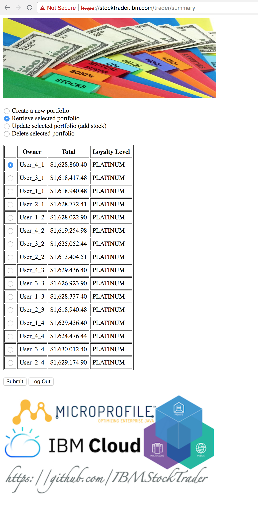
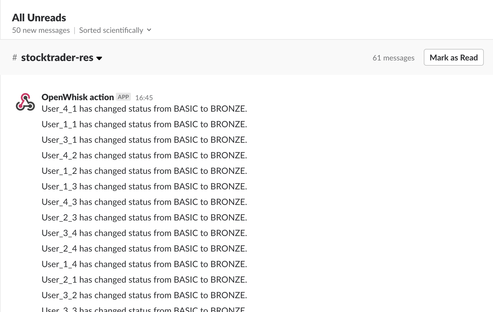
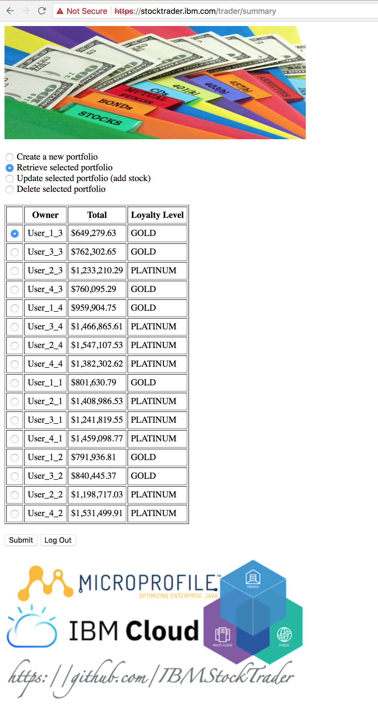
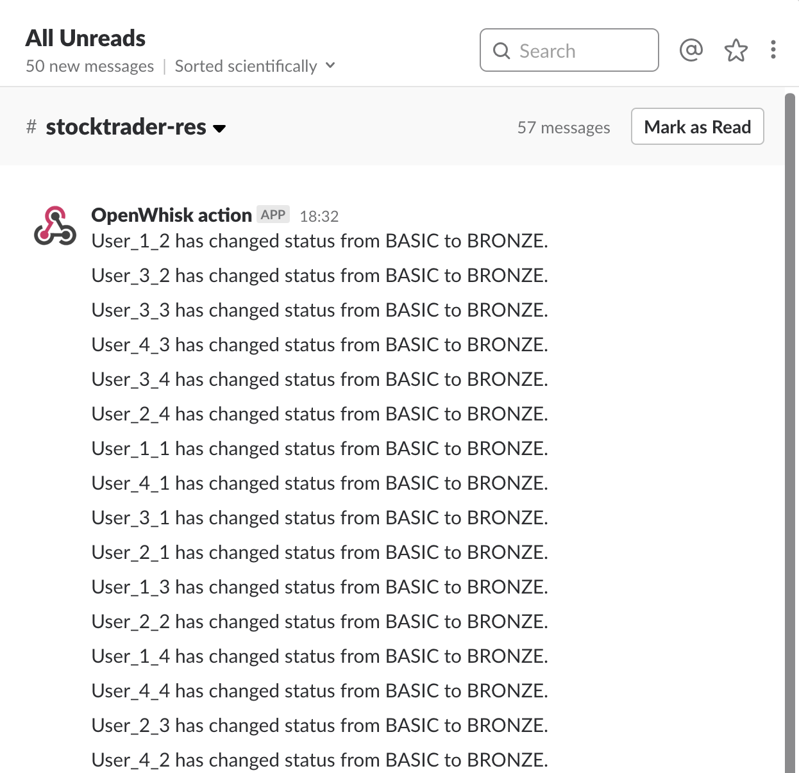
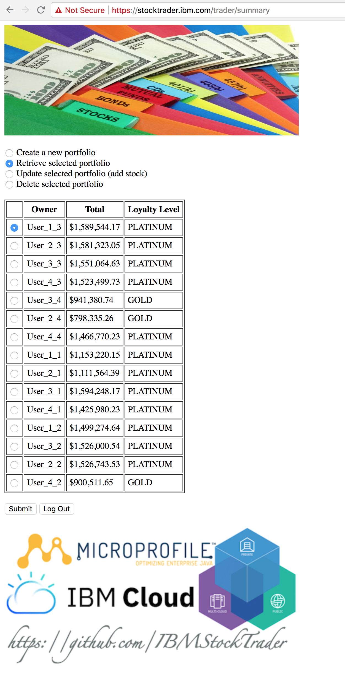
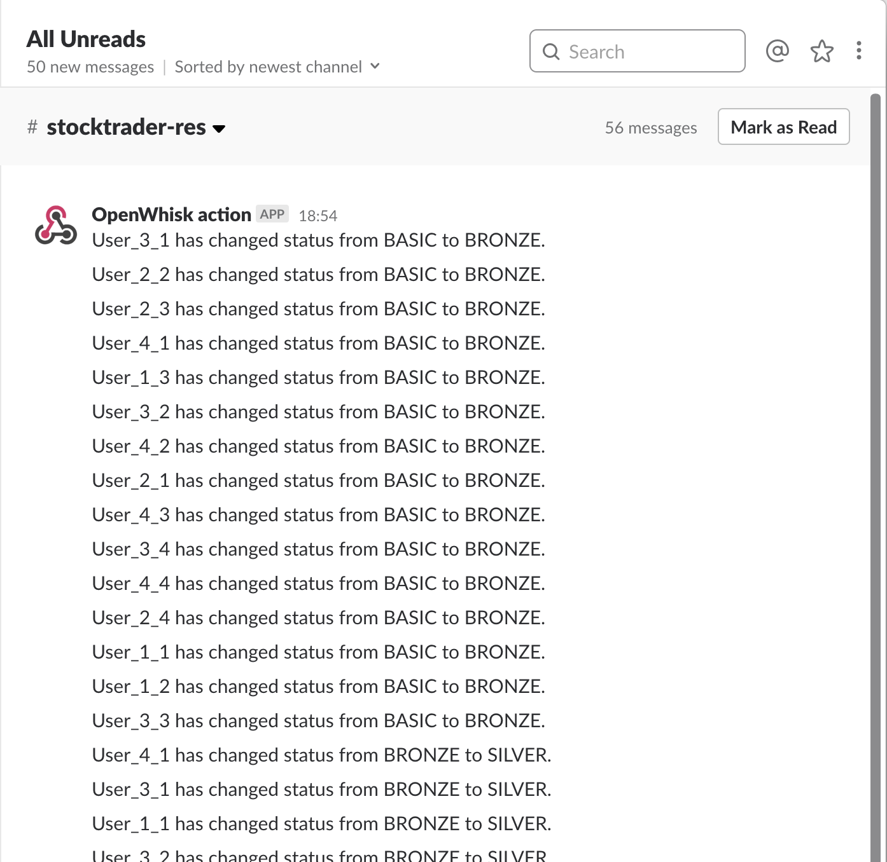
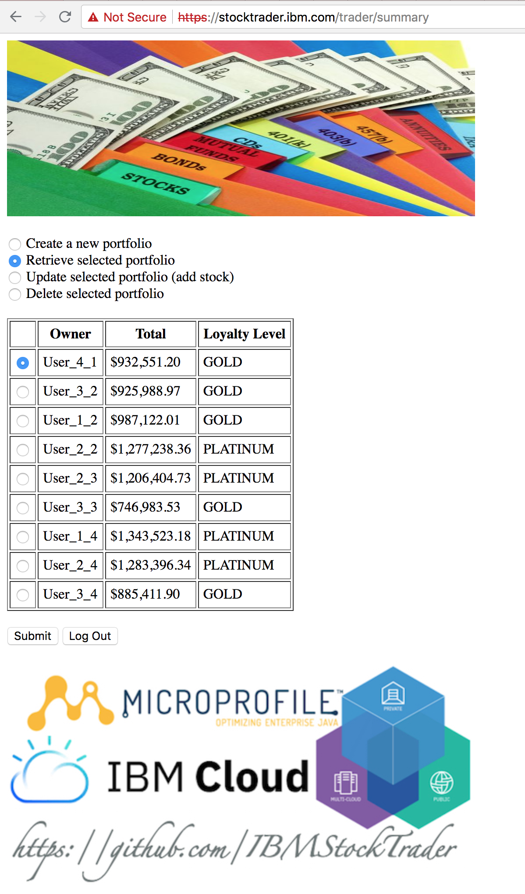
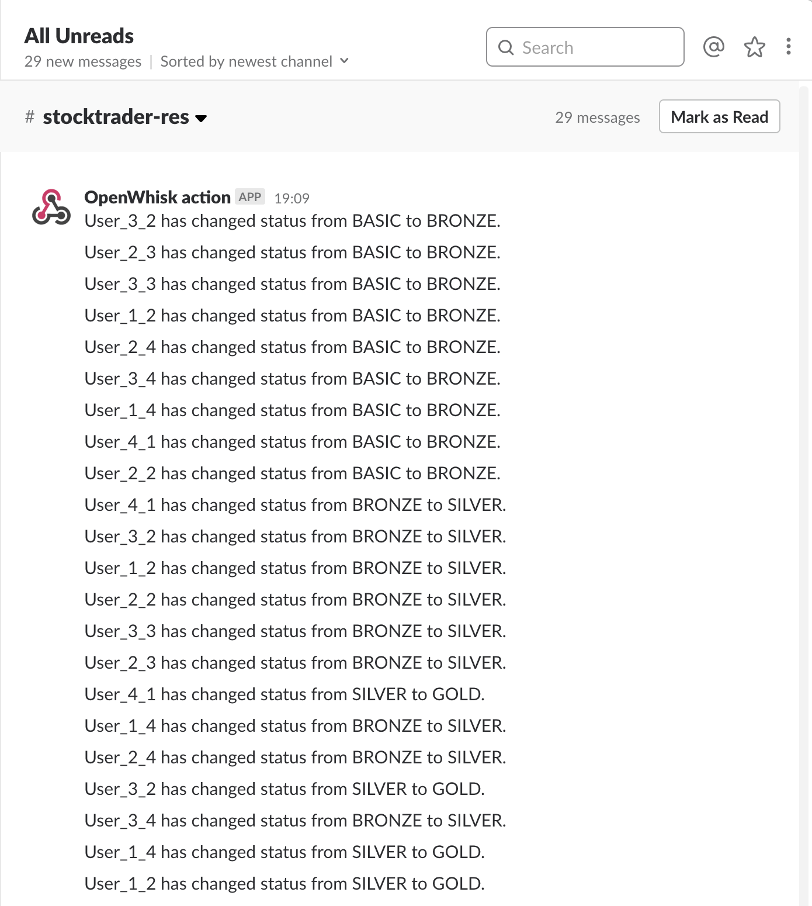

# Test Execution

This readme contains the results of the resiliency tests executed against the IBM StockTrader application. For further info, please refer to the [main readme](README.md) in the actual repository.

Files for each of the executions can be found in this repository under the [**test/execution/test_#**](test/execution) folder.

1.  [Test 1 - Twitter](#test-1)
2.  [Test 2 - Twitter](#test-2)
3.  [Test 3 - Twitter](#test-3)
4.  [Test 4 - Twitter](#test-4)
5.  [Test 5 - Slack](#test-5)
6.  [Test 6 - Slack](#test-6)
7.  [Test 7 - Slack](#test-7)
8.  [Test 8 - Slack](#test-8)
9.  [Main Conclusions](#main-conclusions)

**IMPORTANT:** Test executions against the slack notification route version of the IBM StockTrader Application have been carried out on a different IBM Cloud Private (ICP) cluster. Hence, their potential different performance.

## Test 1

This is the configuration we have run [trader_threaded_main_looper_basic_registry.sh](test/trader_threaded_main_looper_basic_registry.sh) and [chaos.sh](test/chaos.sh) scripts with:

| Config | Value |
| --- | --- |
| Load test script | trader_threaded_main_looper_basic_registry.sh |
| Number of threads | 3 |
| Number of iterations | 10 |
| Number of users | 4 |
| Number of shares | 1 |
| Multiplication factor for shares | 2 |
| Chaos test delay | 5 sec |
| Notification Route | Twitter |

### Results

IBM StockTrader application:

<p align="center">

</p>

Twitter account:

<p align="center">

</p>

Portfolio table:

```
OWNER                            TOTAL                    LOYALTY  BALANCE                  COMMISSIONS              FREE        SENTIMENT       
-------------------------------- ------------------------ -------- ------------------------ ------------------------ ----------- ----------------
User_3_1                           +9.01136870000000E+005 GOLD       -1.64750000000000E+002   +2.14750000000000E+002           0 Unknown         
User_2_1                           +1.52316700000000E+006 PLATINUM   -1.39770000000000E+002   +1.89770000000000E+002           0 Unknown         
User_2_2                           +1.16132135000000E+006 PLATINUM   -1.56760000000000E+002   +2.06760000000000E+002           0 Unknown         
User_1_3                           +9.51048180000000E+005 GOLD       -1.96710000000000E+002   +2.46710000000000E+002           0 Unknown         
User_3_3                           +1.55465906000000E+006 PLATINUM   -1.94710000000000E+002   +2.44710000000000E+002           0 Unknown         
User_2_3                           +1.19255634000000E+006 PLATINUM   -1.63750000000000E+002   +2.13750000000000E+002           0 Unknown         
User_3_4                           +1.20231346000000E+006 PLATINUM   -1.80730000000000E+002   +2.30730000000000E+002           0 Unknown         
User_1_4                           +9.51048180000000E+005 GOLD       -1.96710000000000E+002   +2.46710000000000E+002           0 Unknown         
User_2_4                           +1.22054266000000E+006 PLATINUM   -1.61750000000000E+002   +2.11750000000000E+002           0 Unknown         

  9 record(s) selected.

```

Stock table:

```
OWNER                            SYMBOL   SHARES      PRICE                    TOTAL                    DATEQUOTED COMMISSION              
-------------------------------- -------- ----------- ------------------------ ------------------------ ---------- ------------------------
User_1_3                         AAPL            1023   +1.91440000000000E+002   +1.95843120000000E+005 07/20/2018   +8.39000000000000E+001
User_1_3                         GOOG             511   +1.18491000000000E+003   +6.05489010000000E+005 07/20/2018   +7.69100000000000E+001
User_1_3                         IBM             1023   +1.46350000000000E+002   +1.49716050000000E+005 07/20/2018   +8.59000000000000E+001
User_1_4                         AAPL            1023   +1.91440000000000E+002   +1.95843120000000E+005 07/20/2018   +8.39000000000000E+001
User_1_4                         GOOG             511   +1.18491000000000E+003   +6.05489010000000E+005 07/20/2018   +7.69100000000000E+001
User_1_4                         IBM             1023   +1.46350000000000E+002   +1.49716050000000E+005 07/20/2018   +8.59000000000000E+001
User_2_1                         AAPL             998   +1.91440000000000E+002   +1.91057120000000E+005 07/20/2018   +5.49300000000000E+001
User_2_1                         GOOG             998   +1.18491000000000E+003   +1.18254018000000E+006 07/20/2018   +5.79300000000000E+001
User_2_1                         IBM             1022   +1.46350000000000E+002   +1.49569700000000E+005 07/20/2018   +7.69100000000000E+001
User_2_2                         AAPL             751   +1.91440000000000E+002   +1.43771440000000E+005 07/20/2018   +6.69200000000000E+001
User_2_2                         GOOG             766   +1.18491000000000E+003   +9.07641060000000E+005 07/20/2018   +6.89200000000000E+001
User_2_2                         IBM              751   +1.46350000000000E+002   +1.09908850000000E+005 07/20/2018   +7.09200000000000E+001
User_2_3                         AAPL            1007   +1.91440000000000E+002   +1.92780080000000E+005 07/20/2018   +7.39100000000000E+001
User_2_3                         GOOG             751   +1.18491000000000E+003   +8.89867410000000E+005 07/20/2018   +6.99200000000000E+001
User_2_3                         IBM              751   +1.46350000000000E+002   +1.09908850000000E+005 07/20/2018   +6.99200000000000E+001
User_2_4                         AAPL            1007   +1.91440000000000E+002   +1.92780080000000E+005 07/20/2018   +7.39100000000000E+001
User_2_4                         GOOG             743   +1.18491000000000E+003   +8.80388130000000E+005 07/20/2018   +6.09300000000000E+001
User_2_4                         IBM             1007   +1.46350000000000E+002   +1.47374450000000E+005 07/20/2018   +7.69100000000000E+001
User_3_1                         AAPL             991   +1.91440000000000E+002   +1.89717040000000E+005 07/20/2018   +7.59100000000000E+001
User_3_1                         GOOG             478   +1.18491000000000E+003   +5.66386980000000E+005 07/20/2018   +5.99300000000000E+001
User_3_1                         IBM              991   +1.46350000000000E+002   +1.45032850000000E+005 07/20/2018   +7.89100000000000E+001
User_3_3                         AAPL            1007   +1.91440000000000E+002   +1.92780080000000E+005 07/20/2018   +7.39100000000000E+001
User_3_3                         GOOG            1023   +1.18491000000000E+003   +1.21216293000000E+006 07/20/2018   +8.49000000000000E+001
User_3_3                         IBM             1023   +1.46350000000000E+002   +1.49716050000000E+005 07/20/2018   +8.59000000000000E+001
User_3_4                         AAPL             751   +1.91440000000000E+002   +1.43771440000000E+005 07/20/2018   +6.69200000000000E+001
User_3_4                         GOOG             767   +1.18491000000000E+003   +9.08825970000000E+005 07/20/2018   +7.79100000000000E+001
User_3_4                         IBM             1023   +1.46350000000000E+002   +1.49716050000000E+005 07/20/2018   +8.59000000000000E+001

  27 record(s) selected.
```

Deleted pods:

| Name | Number of pods |
| --- | --- |
| Portfolio | 6 |
| Stock-Quote | 7 |
| Messaging | 11 |
| Notification-twitter | 8 |
| Total | **32** |

More info on what pods [here](test/execution/test_1/chaos.txt).

Execution time: 307 seconds

Total number of rest calls: 402

### Conclusion

Given the results above, we can conclude the following for Test 1:

1. Not all the users were created as the result of the portfolio microservice pod failures. Expected number of users: 12.
2. Not all the update stock actions succeeded as the result of the portfolio microservice pod failures. Expected number of shares per symbol for each user: 1023.
3. Not all the users got to the PLATINUM loyalty level as the result of the previous point (2). Expected loyalty level for each user: PLATINUM.
4. Not all the loyalty level notifications were successfully tweeted as a result of previous point (3) and the notification-twitter microservice pod failures. Expected number of tweets per user: 4 (Total: 48).
6. Application kept working regardless of pod failures as these got recreated automatically by Kubernetes.

## Test 2

This is the configuration we have run [trader_threaded_main_looper_basic_registry.sh](test/trader_threaded_main_looper_basic_registry.sh) and [chaos.sh](test/chaos.sh) scripts with:

| Config | Value |
| --- | --- |
| Load test script | trader_threaded_main_looper_basic_registry.sh |
| Number of threads | 3 |
| Number of iterations | 10 |
| Number of users | 4 |
| Number of shares | 1 |
| Multiplication factor for shares | 2 |
| Chaos test delay | 5 sec |
| Notification Route | Twitter |

### Results

IBM StockTrader application:

<p align="center">

</p>

Twitter account:

<p align="center">

</p>

Portfolio table:

```
OWNER                            TOTAL                    LOYALTY  BALANCE                  COMMISSIONS              FREE        SENTIMENT       
-------------------------------- ------------------------ -------- ------------------------ ------------------------ ----------- ----------------
User_1_3                           +1.27911506000000E+006 PLATINUM   -1.68750000000000E+002   +2.18750000000000E+002           0 Unknown         
User_2_3                           +6.25845820000000E+005 GOLD       -1.65750000000000E+002   +2.15750000000000E+002           0 Unknown         
User_1_4                           +1.55416737000000E+006 PLATINUM   -1.85720000000000E+002   +2.35720000000000E+002           0 Unknown         
User_2_4                           +8.74932070000000E+005 GOLD       -1.80730000000000E+002   +2.30730000000000E+002           0 Unknown         
User_1_1                           +1.55695634000000E+006 PLATINUM   -1.93710000000000E+002   +2.43710000000000E+002           0 Unknown         
User_2_1                           +1.44487378000000E+006 PLATINUM   -1.88720000000000E+002   +2.38720000000000E+002           0 Unknown         
User_3_1                           +1.55520593000000E+006 PLATINUM   -1.85720000000000E+002   +2.35720000000000E+002           0 Unknown         
User_3_2                           +1.55221670000000E+006 PLATINUM   -1.86720000000000E+002   +2.36720000000000E+002           0 Unknown         
User_2_2                           +1.55772210000000E+006 PLATINUM   -2.02700000000000E+002   +2.52700000000000E+002           0 Unknown         
User_1_2                           +1.55653719000000E+006 PLATINUM   -1.93710000000000E+002   +2.43710000000000E+002           0 Unknown         
User_3_3                           +1.52025650000000E+006 PLATINUM   -1.95710000000000E+002   +2.45710000000000E+002           0 Unknown         

  11 record(s) selected.

```

Stock table:

```
OWNER                            SYMBOL   SHARES      PRICE                    TOTAL                    DATEQUOTED COMMISSION              
-------------------------------- -------- ----------- ------------------------ ------------------------ ---------- ------------------------
User_1_1                         AAPL            1019   +1.91440000000000E+002   +1.95077360000000E+005 07/20/2018   +7.29100000000000E+001
User_1_1                         GOOG            1023   +1.18491000000000E+003   +1.21216293000000E+006 07/20/2018   +8.39000000000000E+001
User_1_1                         IBM             1023   +1.46350000000000E+002   +1.49716050000000E+005 07/20/2018   +8.69000000000000E+001
User_1_2                         AAPL            1023   +1.91440000000000E+002   +1.95843120000000E+005 07/20/2018   +8.29000000000000E+001
User_1_2                         GOOG            1022   +1.18491000000000E+003   +1.21097802000000E+006 07/20/2018   +7.39100000000000E+001
User_1_2                         IBM             1023   +1.46350000000000E+002   +1.49716050000000E+005 07/20/2018   +8.69000000000000E+001
User_1_3                         AAPL             255   +1.91440000000000E+002   +4.88172000000000E+004 07/20/2018   +6.99200000000000E+001
User_1_3                         GOOG             991   +1.18491000000000E+003   +1.17424581000000E+006 07/20/2018   +7.69100000000000E+001
User_1_3                         IBM              383   +1.46350000000000E+002   +5.60520500000000E+004 07/20/2018   +7.19200000000000E+001
User_1_4                         AAPL            1023   +1.91440000000000E+002   +1.95843120000000E+005 07/20/2018   +8.29000000000000E+001
User_1_4                         GOOG            1020   +1.18491000000000E+003   +1.20860820000000E+006 07/20/2018   +6.59200000000000E+001
User_1_4                         IBM             1023   +1.46350000000000E+002   +1.49716050000000E+005 07/20/2018   +8.69000000000000E+001
User_2_1                         AAPL            1023   +1.91440000000000E+002   +1.95843120000000E+005 07/20/2018   +8.29000000000000E+001
User_2_1                         GOOG             991   +1.18491000000000E+003   +1.17424581000000E+006 07/20/2018   +7.69100000000000E+001
User_2_1                         IBM              511   +1.46350000000000E+002   +7.47848500000000E+004 07/20/2018   +7.89100000000000E+001
User_2_2                         AAPL            1023   +1.91440000000000E+002   +1.95843120000000E+005 07/20/2018   +8.29000000000000E+001
User_2_2                         GOOG            1023   +1.18491000000000E+003   +1.21216293000000E+006 07/20/2018   +8.39000000000000E+001
User_2_2                         IBM             1023   +1.46350000000000E+002   +1.49716050000000E+005 07/20/2018   +8.59000000000000E+001
User_2_3                         AAPL             511   +1.91440000000000E+002   +9.78258400000000E+004 07/20/2018   +7.69100000000000E+001
User_2_3                         GOOG             383   +1.18491000000000E+003   +4.53820530000000E+005 07/20/2018   +6.99200000000000E+001
User_2_3                         IBM              507   +1.46350000000000E+002   +7.41994500000000E+004 07/20/2018   +6.89200000000000E+001
User_2_4                         AAPL            1023   +1.91440000000000E+002   +1.95843120000000E+005 07/20/2018   +8.39000000000000E+001
User_2_4                         GOOG             510   +1.18491000000000E+003   +6.04304100000000E+005 07/20/2018   +6.69200000000000E+001
User_2_4                         IBM              511   +1.46350000000000E+002   +7.47848500000000E+004 07/20/2018   +7.99100000000000E+001
User_3_1                         AAPL            1023   +1.91440000000000E+002   +1.95843120000000E+005 07/20/2018   +8.29000000000000E+001
User_3_1                         GOOG            1021   +1.18491000000000E+003   +1.20979311000000E+006 07/20/2018   +7.59100000000000E+001
User_3_1                         IBM             1022   +1.46350000000000E+002   +1.49569700000000E+005 07/20/2018   +7.69100000000000E+001
User_3_2                         AAPL            1019   +1.91440000000000E+002   +1.95077360000000E+005 07/20/2018   +7.29100000000000E+001
User_3_2                         GOOG            1019   +1.18491000000000E+003   +1.20742329000000E+006 07/20/2018   +7.69100000000000E+001
User_3_2                         IBM             1023   +1.46350000000000E+002   +1.49716050000000E+005 07/20/2018   +8.69000000000000E+001
User_3_3                         AAPL            1023   +1.91440000000000E+002   +1.95843120000000E+005 07/20/2018   +8.29000000000000E+001
User_3_3                         GOOG            1023   +1.18491000000000E+003   +1.21216293000000E+006 07/20/2018   +8.39000000000000E+001
User_3_3                         IBM              767   +1.46350000000000E+002   +1.12250450000000E+005 07/20/2018   +7.89100000000000E+001

  33 record(s) selected.
```

Deleted pods:

| Name | Number of pods |
| --- | --- |
| Portfolio | 14 |
| Stock-Quote | 10 |
| Messaging | 5 |
| Notification-twitter | 6 |
| Total | **35** |

More info on what pods [here](test/execution/test_2/chaos.txt).

Execution time: 340 seconds

Total number of rest calls: 402

### Conclusion

Given the results above, we can conclude the following for Test 2:

1. Not all the users were created as the result of the portfolio microservice pod failures. Expected number of users: 12.
2. Not all the update stock actions succeeded as the result of the portfolio microservice pod failures. Expected number of shares per symbol for each user: 1023.
3. Not all the users got to the PLATINUM loyalty level as the result of the previous point (2). Expected loyalty level for each user: PLATINUM.
4. Not all the loyalty level notifications were successfully tweeted as a result of previous point (3) and the notification-twitter microservice pod failures. Expected number of tweets per user: 4 (Total: 48).
6. Application kept working regardless of pod failures as these got recreated automatically by Kubernetes.

## Test 3

This is the configuration we have run [trader_threaded_main_looper_basic_registry.sh](test/trader_threaded_main_looper_basic_registry.sh) and [chaos.sh](test/chaos.sh) scripts with:

| Config | Value |
| --- | --- |
| Load test script | trader_threaded_main_looper_basic_registry.sh |
| Number of threads | 3 |
| Number of iterations | 10 |
| Number of users | 4 |
| Number of shares | 1 |
| Multiplication factor for shares | 2 |
| Chaos test delay | 5 sec |
| Notification Route | Twitter |

### Results

IBM StockTrader application:

<p align="center">

</p>

Twitter account:

<p align="center">

</p>

Portfolio table:

```
OWNER                            TOTAL                    LOYALTY  BALANCE                  COMMISSIONS              FREE        SENTIMENT       
-------------------------------- ------------------------ -------- ------------------------ ------------------------ ----------- ----------------
User_2_1                           +1.56606466500000E+006 PLATINUM   -2.02700000000000E+002   +2.52700000000000E+002           0 Unknown         
User_3_1                           +1.56606466500000E+006 PLATINUM   -2.02700000000000E+002   +2.52700000000000E+002           0 Unknown         
User_1_1                           +1.56606466500000E+006 PLATINUM   -2.02700000000000E+002   +2.52700000000000E+002           0 Unknown         
User_3_2                           +1.56606466500000E+006 PLATINUM   -2.02700000000000E+002   +2.52700000000000E+002           0 Unknown         
User_2_2                           +1.56606466500000E+006 PLATINUM   -2.02700000000000E+002   +2.52700000000000E+002           0 Unknown         
User_1_2                           +1.56548342500000E+006 PLATINUM   -1.92710000000000E+002   +2.42710000000000E+002           0 Unknown         
User_3_3                           +1.56606466500000E+006 PLATINUM   -2.02700000000000E+002   +2.52700000000000E+002           0 Unknown         
User_2_3                           +1.56606466500000E+006 PLATINUM   -2.02700000000000E+002   +2.52700000000000E+002           0 Unknown         
User_1_3                           +1.56606466500000E+006 PLATINUM   -2.02700000000000E+002   +2.52700000000000E+002           0 Unknown         
User_2_4                           +1.56606466500000E+006 PLATINUM   -2.02700000000000E+002   +2.52700000000000E+002           0 Unknown         
User_3_4                           +1.56548342500000E+006 PLATINUM   -1.92710000000000E+002   +2.42710000000000E+002           0 Unknown         
User_1_4                           +1.56606466500000E+006 PLATINUM   -2.02700000000000E+002   +2.52700000000000E+002           0 Unknown         

  12 record(s) selected.

```

Stock table:

```
OWNER                            SYMBOL   SHARES      PRICE                    TOTAL                    DATEQUOTED COMMISSION              
-------------------------------- -------- ----------- ------------------------ ------------------------ ---------- ------------------------
User_2_1                         IBM             1023   +1.45310000000000E+002   +1.48652130000000E+005 07/23/2018   +8.59000000000000E+001
User_3_1                         IBM             1023   +1.45310000000000E+002   +1.48652130000000E+005 07/23/2018   +8.59000000000000E+001
User_1_1                         IBM             1023   +1.45310000000000E+002   +1.48652130000000E+005 07/23/2018   +8.59000000000000E+001
User_2_1                         GOOG            1023   +1.19520500000000E+003   +1.22269471500000E+006 07/23/2018   +8.39000000000000E+001
User_3_1                         GOOG            1023   +1.19520500000000E+003   +1.22269471500000E+006 07/23/2018   +8.39000000000000E+001
User_2_1                         AAPL            1023   +1.90340000000000E+002   +1.94717820000000E+005 07/23/2018   +8.29000000000000E+001
User_3_1                         AAPL            1023   +1.90340000000000E+002   +1.94717820000000E+005 07/23/2018   +8.29000000000000E+001
User_1_1                         GOOG            1023   +1.19520500000000E+003   +1.22269471500000E+006 07/23/2018   +8.39000000000000E+001
User_1_1                         AAPL            1023   +1.90340000000000E+002   +1.94717820000000E+005 07/23/2018   +8.29000000000000E+001
User_3_2                         IBM             1023   +1.45310000000000E+002   +1.48652130000000E+005 07/23/2018   +8.59000000000000E+001
User_2_2                         IBM             1023   +1.45310000000000E+002   +1.48652130000000E+005 07/23/2018   +8.59000000000000E+001
User_1_2                         IBM             1019   +1.45310000000000E+002   +1.48070890000000E+005 07/23/2018   +7.59100000000000E+001
User_3_2                         GOOG            1023   +1.19520500000000E+003   +1.22269471500000E+006 07/23/2018   +8.39000000000000E+001
User_2_2                         GOOG            1023   +1.19520500000000E+003   +1.22269471500000E+006 07/23/2018   +8.39000000000000E+001
User_1_2                         GOOG            1023   +1.19520500000000E+003   +1.22269471500000E+006 07/23/2018   +8.39000000000000E+001
User_3_2                         AAPL            1023   +1.90340000000000E+002   +1.94717820000000E+005 07/23/2018   +8.29000000000000E+001
User_2_2                         AAPL            1023   +1.90340000000000E+002   +1.94717820000000E+005 07/23/2018   +8.29000000000000E+001
User_1_2                         AAPL            1023   +1.90340000000000E+002   +1.94717820000000E+005 07/23/2018   +8.29000000000000E+001
User_3_3                         IBM             1023   +1.45310000000000E+002   +1.48652130000000E+005 07/23/2018   +8.59000000000000E+001
User_2_3                         IBM             1023   +1.45310000000000E+002   +1.48652130000000E+005 07/23/2018   +8.59000000000000E+001
User_1_3                         IBM             1023   +1.45310000000000E+002   +1.48652130000000E+005 07/23/2018   +8.59000000000000E+001
User_2_3                         GOOG            1023   +1.19520500000000E+003   +1.22269471500000E+006 07/23/2018   +8.39000000000000E+001
User_3_3                         GOOG            1023   +1.19520500000000E+003   +1.22269471500000E+006 07/23/2018   +8.39000000000000E+001
User_2_3                         AAPL            1023   +1.90340000000000E+002   +1.94717820000000E+005 07/23/2018   +8.29000000000000E+001
User_1_3                         GOOG            1023   +1.19520500000000E+003   +1.22269471500000E+006 07/23/2018   +8.39000000000000E+001
User_3_3                         AAPL            1023   +1.90340000000000E+002   +1.94717820000000E+005 07/23/2018   +8.29000000000000E+001
User_1_3                         AAPL            1023   +1.90340000000000E+002   +1.94717820000000E+005 07/23/2018   +8.29000000000000E+001
User_2_4                         IBM             1023   +1.45310000000000E+002   +1.48652130000000E+005 07/23/2018   +8.59000000000000E+001
User_3_4                         IBM             1019   +1.45310000000000E+002   +1.48070890000000E+005 07/23/2018   +7.59100000000000E+001
User_1_4                         IBM             1023   +1.45310000000000E+002   +1.48652130000000E+005 07/23/2018   +8.59000000000000E+001
User_2_4                         GOOG            1023   +1.19520500000000E+003   +1.22269471500000E+006 07/23/2018   +8.39000000000000E+001
User_3_4                         GOOG            1023   +1.19520500000000E+003   +1.22269471500000E+006 07/23/2018   +8.39000000000000E+001
User_1_4                         GOOG            1023   +1.19520500000000E+003   +1.22269471500000E+006 07/23/2018   +8.39000000000000E+001
User_2_4                         AAPL            1023   +1.90340000000000E+002   +1.94717820000000E+005 07/23/2018   +8.29000000000000E+001
User_3_4                         AAPL            1023   +1.90340000000000E+002   +1.94717820000000E+005 07/23/2018   +8.29000000000000E+001
User_1_4                         AAPL            1023   +1.90340000000000E+002   +1.94717820000000E+005 07/23/2018   +8.29000000000000E+001

  36 record(s) selected.
```

Deleted pods:

| Name | Number of pods |
| --- | --- |
| Portfolio | 3 |
| Stock-Quote | 11 |
| Messaging | 8 |
| Notification-twitter | 6 |
| Total | **28** |

More info on what pods [here](test/execution/test_2/chaos.txt).

Execution time: 280 seconds

Total number of rest calls: 402

### Conclusion

Given the results above, we can conclude the following for Test 3:

1. **All the users were created** despite the portfolio microservice pod failures. Expected number of users: 12.
2. Not all the update stock actions succeeded as the result of the portfolio microservice pod failures. Expected number of shares per symbol for each user: 1023.
3. **All the users got to the PLATINUM loyalty level**. Expected loyalty level for each user: PLATINUM.
4. Not all the loyalty level notifications were successfully tweeted as a result of the notification-twitter microservice pod failures. Expected number of tweets per user: 4 (Total: 48).
6. Application kept working regardless of pod failures as these got recreated automatically by Kubernetes.

## Test 4

This is the configuration we have run [trader_threaded_main_looper_basic_registry.sh](test/trader_threaded_main_looper_basic_registry.sh) and [chaos.sh](test/chaos.sh) scripts with:

| Config | Value |
| --- | --- |
| Load test script | trader_threaded_main_looper_basic_registry.sh |
| Number of threads | 3 |
| Number of iterations | 10 |
| Number of users | 4 |
| Number of shares | 1 |
| Multiplication factor for shares | 2 |
| Chaos test delay | 5 sec |
| Notification Route | Twitter |

### Results

IBM StockTrader application:

<p align="center">

</p>

Twitter account:

<p align="center">

</p>

Portfolio table:

```
OWNER                            TOTAL                    LOYALTY  BALANCE                  COMMISSIONS              FREE        SENTIMENT       
-------------------------------- ------------------------ -------- ------------------------ ------------------------ ----------- ----------------
User_1_1                           +1.40534103000000E+006 PLATINUM   -1.87720000000000E+002   +2.37720000000000E+002           0 Unknown         
User_1_2                           +1.57829463000000E+006 PLATINUM   -2.01700000000000E+002   +2.51700000000000E+002           0 Unknown         
User_1_3                           +1.54428487000000E+006 PLATINUM   -1.68740000000000E+002   +2.18740000000000E+002           0 Unknown         
User_1_4                           +1.55360967000000E+006 PLATINUM   -1.76730000000000E+002   +2.26730000000000E+002           0 Unknown         
User_2_1                           +1.37615255000000E+006 PLATINUM   -1.72740000000000E+002   +2.22740000000000E+002           0 Unknown         
User_2_2                           +1.39307799000000E+006 PLATINUM   -1.80730000000000E+002   +2.30730000000000E+002           0 Unknown         
User_2_3                           +1.56590407000000E+006 PLATINUM   -1.86720000000000E+002   +2.36720000000000E+002           0 Unknown         
User_2_4                           +1.30350407000000E+006 PLATINUM   -1.56760000000000E+002   +2.06760000000000E+002           0 Unknown         
User_3_1                           +1.36734641000000E+006 PLATINUM   -1.65750000000000E+002   +2.15750000000000E+002           0 Unknown         
User_3_2                           +1.57829463000000E+006 PLATINUM   -2.01700000000000E+002   +2.51700000000000E+002           0 Unknown         
User_3_3                           +1.55594087000000E+006 PLATINUM   -1.85720000000000E+002   +2.35720000000000E+002           0 Unknown         
User_3_4                           +1.55360967000000E+006 PLATINUM   -1.76730000000000E+002   +2.26730000000000E+002           0 Unknown         

  12 record(s) selected.

```

Stock table:

```
OWNER                            SYMBOL   SHARES      PRICE                    TOTAL                    DATEQUOTED COMMISSION              
-------------------------------- -------- ----------- ------------------------ ------------------------ ---------- ------------------------
User_1_1                         IBM              895   +1.45700000000000E+002   +1.30401500000000E+005 07/23/2018   +7.89100000000000E+001
User_2_1                         IBM              863   +1.45700000000000E+002   +1.25739100000000E+005 07/23/2018   +6.99200000000000E+001
User_3_1                         IBM              895   +1.45700000000000E+002   +1.30401500000000E+005 07/23/2018   +7.99100000000000E+001
User_1_1                         GOOG             895   +1.20550000000000E+003   +1.07892250000000E+006 07/23/2018   +7.69100000000000E+001
User_2_1                         GOOG             895   +1.20550000000000E+003   +1.07892250000000E+006 07/23/2018   +7.79100000000000E+001
User_1_4                         AAPL            1007   +1.91610000000000E+002   +1.92951270000000E+005 07/23/2018   +7.29100000000000E+001
User_3_1                         AAPL             831   +1.91610000000000E+002   +1.59227910000000E+005 07/23/2018   +6.89200000000000E+001
User_1_1                         AAPL            1023   +1.91610000000000E+002   +1.96017030000000E+005 07/23/2018   +8.19000000000000E+001
User_2_1                         AAPL             895   +1.91610000000000E+002   +1.71490950000000E+005 07/23/2018   +7.49100000000000E+001
User_3_2                         IBM             1023   +1.45700000000000E+002   +1.49051100000000E+005 07/23/2018   +8.59000000000000E+001
User_1_2                         IBM             1023   +1.45700000000000E+002   +1.49051100000000E+005 07/23/2018   +8.59000000000000E+001
User_2_2                         IBM              895   +1.45700000000000E+002   +1.30401500000000E+005 07/23/2018   +7.89100000000000E+001
User_3_2                         GOOG            1023   +1.20550000000000E+003   +1.23322650000000E+006 07/23/2018   +8.39000000000000E+001
User_1_2                         GOOG            1023   +1.20550000000000E+003   +1.23322650000000E+006 07/23/2018   +8.39000000000000E+001
User_2_2                         GOOG             895   +1.20550000000000E+003   +1.07892250000000E+006 07/23/2018   +7.69100000000000E+001
User_3_2                         AAPL            1023   +1.91610000000000E+002   +1.96017030000000E+005 07/23/2018   +8.19000000000000E+001
User_1_2                         AAPL            1023   +1.91610000000000E+002   +1.96017030000000E+005 07/23/2018   +8.19000000000000E+001
User_2_2                         AAPL             959   +1.91610000000000E+002   +1.83753990000000E+005 07/23/2018   +7.49100000000000E+001
User_3_3                         IBM             1023   +1.45700000000000E+002   +1.49051100000000E+005 07/23/2018   +8.59000000000000E+001
User_1_3                         IBM              943   +1.45700000000000E+002   +1.37395100000000E+005 07/23/2018   +6.89200000000000E+001
User_2_3                         IBM              959   +1.45700000000000E+002   +1.39726300000000E+005 07/23/2018   +7.79100000000000E+001
User_1_3                         GOOG            1007   +1.20550000000000E+003   +1.21393850000000E+006 07/23/2018   +7.69100000000000E+001
User_3_3                         GOOG            1007   +1.20550000000000E+003   +1.21393850000000E+006 07/23/2018   +7.69100000000000E+001
User_2_3                         GOOG            1023   +1.20550000000000E+003   +1.23322650000000E+006 07/23/2018   +8.59000000000000E+001
User_1_3                         AAPL            1007   +1.91610000000000E+002   +1.92951270000000E+005 07/23/2018   +7.29100000000000E+001
User_3_3                         AAPL            1007   +1.91610000000000E+002   +1.92951270000000E+005 07/23/2018   +7.29100000000000E+001
User_2_3                         AAPL            1007   +1.91610000000000E+002   +1.92951270000000E+005 07/23/2018   +7.29100000000000E+001
User_1_4                         IBM             1007   +1.45700000000000E+002   +1.46719900000000E+005 07/23/2018   +7.69100000000000E+001
User_3_4                         IBM             1007   +1.45700000000000E+002   +1.46719900000000E+005 07/23/2018   +7.69100000000000E+001
User_2_4                         IBM              879   +1.45700000000000E+002   +1.28070300000000E+005 07/23/2018   +6.99200000000000E+001
User_1_4                         GOOG            1007   +1.20550000000000E+003   +1.21393850000000E+006 07/23/2018   +7.69100000000000E+001
User_3_4                         GOOG            1007   +1.20550000000000E+003   +1.21393850000000E+006 07/23/2018   +7.69100000000000E+001
User_2_4                         GOOG             815   +1.20550000000000E+003   +9.82482500000000E+005 07/23/2018   +6.19300000000000E+001
User_3_4                         AAPL            1007   +1.91610000000000E+002   +1.92951270000000E+005 07/23/2018   +7.29100000000000E+001
User_2_4                         AAPL            1007   +1.91610000000000E+002   +1.92951270000000E+005 07/23/2018   +7.49100000000000E+001
User_3_1                         GOOG             894   +1.20550000000000E+003   +1.07771700000000E+006 07/23/2018   +6.69200000000000E+001

  36 record(s) selected.

```

Deleted pods:

| Name | Number of pods |
| --- | --- |
| Portfolio | 10 |
| Stock-Quote | 9 |
| Messaging | 10 |
| Notification-twitter | 4 |
| Total | **33** |

More info on what pods [here](test/execution/test_4/chaos.txt).

Execution time: 328 seconds

Total number of rest calls: 402

### Conclusion

Given the results above, we can conclude the following for Test 4:

1. **All the users were created** despite the portfolio microservice pod failures. Expected number of users: 12.
2. Not all the update stock actions succeeded as the result of the portfolio microservice pod failures. Expected number of shares per symbol for each user: 1023.
3. **All the users got to the PLATINUM loyalty level**. Expected loyalty level for each user: PLATINUM.
4. Not all the loyalty level notifications were successfully tweeted as a result of the notification-twitter microservice pod failures. Expected number of tweets per user: 4 (Total: 48).
6. Application kept working regardless of pod failures as these got recreated automatically by Kubernetes.

## Test 5

This is the configuration we have run [trader_threaded_main_looper_basic_registry.sh](test/trader_threaded_main_looper_basic_registry.sh) and [chaos.sh](test/chaos.sh) scripts with:

| Config | Value |
| --- | --- |
| Load test script | trader_threaded_main_looper_basic_registry.sh |
| Number of threads | 4 |
| Number of iterations | 10 |
| Number of users | 4 |
| Number of shares | 1 |
| Multiplication factor for shares | 2 |
| Chaos test delay | 5 sec |
| Notification Route | Slack |

### Results

IBM StockTrader application:

<p align="center">

</p>

Slack channel account:

<p align="center">

</p>

Portfolio table:

```
OWNER                            TOTAL                    LOYALTY  BALANCE                  COMMISSIONS              FREE        SENTIMENT       
-------------------------------- ------------------------ -------- ------------------------ ------------------------ ----------- ----------------
User_4_1                           +1.62886039500000E+006 PLATINUM   -1.92710000000000E+002   +2.42710000000000E+002           0 Unknown         
User_3_1                           +1.61841747500000E+006 PLATINUM   -1.85720000000000E+002   +2.35720000000000E+002           0 Unknown         
User_1_1                           +1.61894047500000E+006 PLATINUM   -1.85720000000000E+002   +2.35720000000000E+002           0 Unknown         
User_2_1                           +1.62877240500000E+006 PLATINUM   -1.93710000000000E+002   +2.43710000000000E+002           0 Unknown         
User_1_2                           +1.62802289500000E+006 PLATINUM   -1.83720000000000E+002   +2.33720000000000E+002           0 Unknown         
User_4_2                           +1.61925497500000E+006 PLATINUM   -1.85720000000000E+002   +2.35720000000000E+002           0 Unknown         
User_3_2                           +1.62505243500000E+006 PLATINUM   -1.95710000000000E+002   +2.45710000000000E+002           0 Unknown         
User_2_2                           +1.61340451500000E+006 PLATINUM   -1.69740000000000E+002   +2.19740000000000E+002           0 Unknown         
User_4_3                           +1.62943639500000E+006 PLATINUM   -1.92710000000000E+002   +2.42710000000000E+002           0 Unknown         
User_3_3                           +1.62692389500000E+006 PLATINUM   -1.74730000000000E+002   +2.24730000000000E+002           0 Unknown         
User_1_3                           +1.62833739500000E+006 PLATINUM   -1.92710000000000E+002   +2.42710000000000E+002           0 Unknown         
User_2_3                           +1.61894047500000E+006 PLATINUM   -1.85720000000000E+002   +2.35720000000000E+002           0 Unknown         
User_1_4                           +1.62943639500000E+006 PLATINUM   -1.92710000000000E+002   +2.42710000000000E+002           0 Unknown         
User_4_4                           +1.62447643500000E+006 PLATINUM   -1.85720000000000E+002   +2.35720000000000E+002           0 Unknown         
User_3_4                           +1.63001239500000E+006 PLATINUM   -2.00700000000000E+002   +2.50700000000000E+002           0 Unknown         
User_2_4                           +1.62917489500000E+006 PLATINUM   -1.92710000000000E+002   +2.42710000000000E+002           0 Unknown         

  16 record(s) selected.

```

Stock table:

```
OWNER                            SYMBOL   SHARES      PRICE                    TOTAL                    DATEQUOTED COMMISSION              
-------------------------------- -------- ----------- ------------------------ ------------------------ ---------- ------------------------
User_2_1                         IBM             1023   +1.44000000000000E+002   +1.47312000000000E+005 08/13/2018   +8.69000000000000E+001
User_1_1                         GOOG            1015   +1.23999000000000E+003   +1.25858985000000E+006 08/13/2018   +7.69100000000000E+001
User_4_1                         GOOG            1023   +1.23999000000000E+003   +1.26850977000000E+006 08/13/2018   +8.39000000000000E+001
User_3_1                         GOOG            1015   +1.23999000000000E+003   +6.23714970000000E+005 08/13/2018   +7.69100000000000E+001
User_3_1                         IBM             1023   +1.44000000000000E+002   +1.47312000000000E+005 08/13/2018   +8.59000000000000E+001
User_1_1                         IBM             1015   +1.44000000000000E+002   +1.46160000000000E+005 08/13/2018   +7.69100000000000E+001
User_4_1                         IBM             1015   +1.44000000000000E+002   +1.46160000000000E+005 08/13/2018   +7.69100000000000E+001
User_1_1                         AAPL            1023   +2.09375000000000E+002   +2.14190625000000E+005 08/13/2018   +8.19000000000000E+001
User_4_1                         AAPL            1023   +2.09375000000000E+002   +2.14190625000000E+005 08/13/2018   +8.19000000000000E+001
User_3_1                         AAPL            1015   +2.09375000000000E+002   +2.12515625000000E+005 08/13/2018   +7.29100000000000E+001
User_2_1                         AAPL            1023   +2.09375000000000E+002   +2.14190625000000E+005 08/13/2018   +8.29000000000000E+001
User_1_2                         IBM             1015   +1.44000000000000E+002   +1.46160000000000E+005 08/13/2018   +7.69100000000000E+001
User_4_2                         IBM             1023   +1.44000000000000E+002   +1.47312000000000E+005 08/13/2018   +8.59000000000000E+001
User_3_2                         IBM             1023   +1.44000000000000E+002   +1.47312000000000E+005 08/13/2018   +8.69000000000000E+001
User_2_2                         IBM             1011   +1.44000000000000E+002   +1.45584000000000E+005 08/13/2018   +6.79200000000000E+001
User_4_2                         GOOG            1015   +1.23999000000000E+003   +1.25858985000000E+006 08/13/2018   +7.69100000000000E+001
User_1_2                         GOOG            1023   +1.23999000000000E+003   +1.26850977000000E+006 08/13/2018   +8.39000000000000E+001
User_3_2                         GOOG            1019   +1.23999000000000E+003   +1.26354981000000E+006 08/13/2018   +7.59100000000000E+001
User_2_2                         GOOG            1011   +1.23999000000000E+003   +1.25362989000000E+006 08/13/2018   +6.79200000000000E+001
User_3_2                         AAPL            1023   +2.09375000000000E+002   +2.14190625000000E+005 08/13/2018   +8.29000000000000E+001
User_4_2                         AAPL            1019   +2.09375000000000E+002   +2.13353125000000E+005 08/13/2018   +7.29100000000000E+001
User_1_2                         AAPL            1019   +2.09375000000000E+002   +1.06153125000000E+005 08/13/2018   +7.29100000000000E+001
User_2_2                         AAPL            1023   +2.09375000000000E+002   +2.14190625000000E+005 08/13/2018   +8.39000000000000E+001
User_4_3                         IBM             1019   +1.44000000000000E+002   +7.30080000000000E+004 08/13/2018   +7.59100000000000E+001
User_1_3                         IBM             1023   +1.44000000000000E+002   +1.47312000000000E+005 08/13/2018   +8.59000000000000E+001
User_3_3                         IBM             1019   +1.44000000000000E+002   +1.46736000000000E+005 08/13/2018   +7.69100000000000E+001
User_2_3                         IBM             1015   +1.44000000000000E+002   +1.46160000000000E+005 08/13/2018   +7.69100000000000E+001
User_1_3                         GOOG            1023   +1.23999000000000E+003   +1.26850977000000E+006 08/13/2018   +8.39000000000000E+001
User_4_3                         GOOG            1023   +1.23999000000000E+003   +1.26850977000000E+006 08/13/2018   +8.39000000000000E+001
User_3_3                         GOOG            1023   +1.23999000000000E+003   +1.26850977000000E+006 08/13/2018   +8.39000000000000E+001
User_2_3                         GOOG            1015   +1.23999000000000E+003   +1.25858985000000E+006 08/13/2018   +7.69100000000000E+001
User_4_3                         AAPL            1023   +2.09375000000000E+002   +1.06990625000000E+005 08/13/2018   +8.29000000000000E+001
User_1_3                         AAPL            1015   +2.09375000000000E+002   +2.12515625000000E+005 08/13/2018   +7.29100000000000E+001
User_3_3                         AAPL            1011   +2.09375000000000E+002   +2.11678125000000E+005 08/13/2018   +6.39200000000000E+001
User_2_3                         AAPL            1023   +2.09375000000000E+002   +2.14190625000000E+005 08/13/2018   +8.19000000000000E+001
User_1_4                         IBM             1019   +1.44000000000000E+002   +1.46736000000000E+005 08/13/2018   +7.59100000000000E+001
User_4_4                         IBM             1019   +1.44000000000000E+002   +1.46736000000000E+005 08/13/2018   +7.69100000000000E+001
User_3_4                         IBM             1023   +1.44000000000000E+002   +1.47312000000000E+005 08/13/2018   +8.49000000000000E+001
User_1_4                         GOOG            1023   +1.23999000000000E+003   +1.26850977000000E+006 08/13/2018   +8.39000000000000E+001
User_2_4                         IBM             1023   +1.44000000000000E+002   +1.47312000000000E+005 08/13/2018   +8.59000000000000E+001
User_4_4                         GOOG            1019   +1.23999000000000E+003   +1.26354981000000E+006 08/13/2018   +7.59100000000000E+001
User_3_4                         GOOG            1023   +1.23999000000000E+003   +1.26850977000000E+006 08/13/2018   +8.39000000000000E+001
User_1_4                         AAPL            1023   +2.09375000000000E+002   +2.14190625000000E+005 08/13/2018   +8.29000000000000E+001
User_2_4                         GOOG            1023   +1.23999000000000E+003   +1.26850977000000E+006 08/13/2018   +8.39000000000000E+001
User_4_4                         AAPL            1023   +2.09375000000000E+002   +2.14190625000000E+005 08/13/2018   +8.29000000000000E+001
User_3_4                         AAPL            1023   +2.09375000000000E+002   +2.14190625000000E+005 08/13/2018   +8.19000000000000E+001
User_2_4                         AAPL            1019   +2.09375000000000E+002   +2.13353125000000E+005 08/13/2018   +7.29100000000000E+001
User_2_1                         GOOG            1022   +1.23999000000000E+003   +1.26726978000000E+006 08/13/2018   +7.39100000000000E+001

  48 record(s) selected.
```

Deleted pods:

| Name | Number of pods |
| --- | --- |
| Portfolio | 1 |
| Stock-Quote | 5 |
| Messaging | 1 |
| Notification-slack | 10 |
| Total | **17** |

More info on what pods [here](test/execution/test_5/chaos.txt).

Execution time: 222 seconds

Total number of rest calls: 536

### Conclusion

Given the results above, we can conclude the following for Test 5:

1. **All the users were created**. Expected number of users: 16.
2. Not all the update stock actions succeeded as the result of the portfolio microservice pod failures. Expected number of shares per symbol for each user: 1023.
3. **All the users got to the PLATINUM loyalty level**. Expected loyalty level for each user: PLATINUM.
4. Not all the loyalty level notifications were successfully slacked as a result of the notification-slack microservice pod failures. Expected number of slack messages per user: 4 (Total: 64).
6. Application kept working regardless of pod failures as these got recreated automatically by Kubernetes.

## Test 6

This is the configuration we have run [trader_threaded_main_looper_basic_registry.sh](test/trader_threaded_main_looper_basic_registry.sh) and [chaos.sh](test/chaos.sh) scripts with:

| Config | Value |
| --- | --- |
| Load test script | trader_threaded_main_looper_basic_registry.sh |
| Number of threads | 4 |
| Number of iterations | 10 |
| Number of users | 4 |
| Number of shares | 1 |
| Multiplication factor for shares | 2 |
| Chaos test delay | 4 sec |
| Notification Route | Slack |

### Results

IBM StockTrader application:

<p align="center">

</p>

Slack channel:

<p align="center">

</p>

Portfolio table:

```
OWNER                            TOTAL                    LOYALTY  BALANCE                  COMMISSIONS              FREE        SENTIMENT       
-------------------------------- ------------------------ -------- ------------------------ ------------------------ ----------- ----------------
User_1_3                           +6.49279630000000E+005 GOLD       -1.25800000000000E+002   +1.75800000000000E+002           0 Unknown         
User_3_3                           +7.62302650000000E+005 GOLD       -1.48770000000000E+002   +1.98770000000000E+002           0 Unknown         
User_2_3                           +1.23321029000000E+006 PLATINUM   -1.46770000000000E+002   +1.96770000000000E+002           0 Unknown         
User_4_3                           +7.60095290000000E+005 GOLD       -1.62750000000000E+002   +2.12750000000000E+002           0 Unknown         
User_1_4                           +9.59904750000000E+005 GOLD       -1.56760000000000E+002   +2.06760000000000E+002           0 Unknown         
User_3_4                           +1.46686561000000E+006 PLATINUM   -1.75730000000000E+002   +2.25730000000000E+002           0 Unknown         
User_2_4                           +1.54710753000000E+006 PLATINUM   -1.60750000000000E+002   +2.10750000000000E+002           0 Unknown         
User_4_4                           +1.38230262000000E+006 PLATINUM   -1.56760000000000E+002   +2.06760000000000E+002           0 Unknown         
User_1_1                           +8.01630790000000E+005 GOLD       -1.37780000000000E+002   +1.87780000000000E+002           0 Unknown         
User_2_1                           +1.40898653000000E+006 PLATINUM   -1.37780000000000E+002   +1.87780000000000E+002           0 Unknown         
User_3_1                           +1.24181955000000E+006 PLATINUM   -1.31790000000000E+002   +1.81790000000000E+002           0 Unknown         
User_4_1                           +1.45909877000000E+006 PLATINUM   -1.49760000000000E+002   +1.99760000000000E+002           0 Unknown         
User_1_2                           +7.91936810000000E+005 GOLD       -1.37780000000000E+002   +1.87780000000000E+002           0 Unknown         
User_3_2                           +8.40445370000000E+005 GOLD       -1.31790000000000E+002   +1.81790000000000E+002           0 Unknown         
User_2_2                           +1.19871703000000E+006 PLATINUM   -1.39780000000000E+002   +1.89780000000000E+002           0 Unknown         
User_4_2                           +1.53149991000000E+006 PLATINUM   -1.32780000000000E+002   +1.82780000000000E+002           0 Unknown         

  16 record(s) selected.

```

Stock table:

```
OWNER                            SYMBOL   SHARES      PRICE                    TOTAL                    DATEQUOTED COMMISSION              
-------------------------------- -------- ----------- ------------------------ ------------------------ ---------- ------------------------
User_2_1                         GOOG             939   +1.23699000000000E+003   +1.16153361000000E+006 08/13/2018   +5.99300000000000E+001
User_3_1                         GOOG             877   +1.23699000000000E+003   +1.08484023000000E+006 08/13/2018   +6.09300000000000E+001
User_4_1                         GOOG             891   +1.23699000000000E+003   +1.10215809000000E+006 08/13/2018   +6.89200000000000E+001
User_1_1                         AAPL             503   +2.09240000000000E+002   +1.05247720000000E+005 08/13/2018   +6.79200000000000E+001
User_2_1                         AAPL             487   +2.09240000000000E+002   +1.01899880000000E+005 08/13/2018   +5.99300000000000E+001
User_3_1                         AAPL             491   +2.09240000000000E+002   +1.02736840000000E+005 08/13/2018   +5.79300000000000E+001
User_4_1                         AAPL            1013   +2.09240000000000E+002   +2.11960120000000E+005 08/13/2018   +6.39200000000000E+001
User_1_2                         IBM             1013   +1.43120000000000E+002   +1.44980560000000E+005 08/13/2018   +6.69200000000000E+001
User_3_2                         IBM              849   +1.43120000000000E+002   +1.21508880000000E+005 08/13/2018   +4.09500000000000E+001
User_2_2                         IBM              443   +1.43120000000000E+002   +6.34021600000000E+004 08/13/2018   +6.19300000000000E+001
User_4_2                         IBM              499   +1.43120000000000E+002   +7.14168800000000E+004 08/13/2018   +6.09300000000000E+001
User_3_2                         GOOG             511   +1.23699000000000E+003   +6.32101890000000E+005 08/13/2018   +7.89100000000000E+001
User_1_2                         GOOG             375   +1.23699000000000E+003   +4.63871250000000E+005 08/13/2018   +6.29300000000000E+001
User_2_2                         GOOG             761   +1.23699000000000E+003   +9.41349390000000E+005 08/13/2018   +5.99300000000000E+001
User_4_2                         GOOG            1009   +1.23699000000000E+003   +1.24812291000000E+006 08/13/2018   +5.79300000000000E+001
User_1_2                         AAPL             875   +2.09240000000000E+002   +1.83085000000000E+005 08/13/2018   +5.79300000000000E+001
User_3_2                         AAPL             415   +2.09240000000000E+002   +8.68346000000000E+004 08/13/2018   +6.19300000000000E+001
User_2_2                         AAPL             927   +2.09240000000000E+002   +1.93965480000000E+005 08/13/2018   +6.79200000000000E+001
User_4_2                         AAPL            1013   +2.09240000000000E+002   +2.11960120000000E+005 08/13/2018   +6.39200000000000E+001
User_1_3                         IBM              893   +1.43120000000000E+002   +1.27806160000000E+005 08/13/2018   +6.99200000000000E+001
User_3_3                         IBM              797   +1.43120000000000E+002   +1.14066640000000E+005 08/13/2018   +5.19400000000000E+001
User_2_3                         IBM              767   +1.43120000000000E+002   +1.09773040000000E+005 08/13/2018   +7.99100000000000E+001
User_4_3                         IBM              505   +1.43120000000000E+002   +7.22756000000000E+004 08/13/2018   +5.89300000000000E+001
User_1_3                         GOOG             349   +1.23699000000000E+003   +4.31709510000000E+005 08/13/2018   +5.39400000000000E+001
User_3_3                         GOOG             351   +1.23699000000000E+003   +4.34183490000000E+005 08/13/2018   +6.29300000000000E+001
User_2_3                         GOOG             747   +1.23699000000000E+003   +9.24031530000000E+005 08/13/2018   +6.09300000000000E+001
User_4_3                         GOOG             383   +1.23699000000000E+003   +4.73767170000000E+005 08/13/2018   +6.99200000000000E+001
User_1_3                         AAPL             429   +2.09240000000000E+002   +8.97639600000000E+004 08/13/2018   +5.19400000000000E+001
User_3_3                         AAPL            1023   +2.09240000000000E+002   +2.14052520000000E+005 08/13/2018   +8.39000000000000E+001
User_2_3                         AAPL             953   +2.09240000000000E+002   +1.99405720000000E+005 08/13/2018   +5.59300000000000E+001
User_4_3                         AAPL            1023   +2.09240000000000E+002   +2.14052520000000E+005 08/13/2018   +8.39000000000000E+001
User_1_1                         IBM              501   +1.43120000000000E+002   +7.17031200000000E+004 08/13/2018   +5.99300000000000E+001
User_2_1                         IBM             1017   +1.43120000000000E+002   +1.45553040000000E+005 08/13/2018   +6.79200000000000E+001
User_3_1                         IBM              379   +1.43120000000000E+002   +5.42424800000000E+004 08/13/2018   +6.29300000000000E+001
User_4_1                         IBM             1013   +1.43120000000000E+002   +1.44980560000000E+005 08/13/2018   +6.69200000000000E+001
User_1_1                         GOOG             505   +1.23699000000000E+003   +6.24679950000000E+005 08/13/2018   +5.99300000000000E+001
User_1_4                         IBM              815   +1.43120000000000E+002   +1.16642800000000E+005 08/13/2018   +6.29300000000000E+001
User_3_4                         IBM             1021   +1.43120000000000E+002   +1.46125520000000E+005 08/13/2018   +7.59100000000000E+001
User_2_4                         IBM             1023   +1.43120000000000E+002   +1.46411760000000E+005 08/13/2018   +8.59000000000000E+001
User_4_4                         IBM              623   +1.43120000000000E+002   +8.91637600000000E+004 08/13/2018   +6.39300000000000E+001
User_1_4                         GOOG             509   +1.23699000000000E+003   +6.29627910000000E+005 08/13/2018   +6.99200000000000E+001
User_3_4                         GOOG             895   +1.23699000000000E+003   +1.10710605000000E+006 08/13/2018   +7.69100000000000E+001
User_2_4                         GOOG            1007   +1.23699000000000E+003   +1.24564893000000E+006 08/13/2018   +7.69100000000000E+001
User_1_4                         AAPL            1021   +2.09240000000000E+002   +2.13634040000000E+005 08/13/2018   +7.39100000000000E+001
User_3_4                         AAPL            1021   +2.09240000000000E+002   +1.06503160000000E+005 08/13/2018   +7.29100000000000E+001
User_2_4                         AAPL             741   +2.09240000000000E+002   +1.55046840000000E+005 08/13/2018   +4.79400000000000E+001
User_4_4                         AAPL             895   +2.09240000000000E+002   +1.87269800000000E+005 08/13/2018   +7.59100000000000E+001
User_4_4                         GOOG             894   +1.23699000000000E+003   +1.10586906000000E+006 08/13/2018   +6.69200000000000E+001

  48 record(s) selected.
```

Deleted pods:

| Name | Number of pods |
| --- | --- |
| Portfolio | 6 |
| Stock-Quote | 6 |
| Messaging | 11 |
| Notification-slack | 6 |
| Total | **29** |

More info on what pods [here](test/execution/test_6/chaos.txt).

Execution time: 223 seconds

Total number of rest calls: 536

### Conclusion

Given the results above, we can conclude the following for Test 6:

1. **All the users were created**. Expected number of users: 16.
2. Not all the update stock actions succeeded as the result of the portfolio microservice pod failures. Expected number of shares per symbol for each user: 1023.
3. Not all the users got to the PLATINUM loyalty level as the result of the previous point (2). Expected loyalty level for each user: PLATINUM.
4. **All the loyalty level notifications were successfully slacked** despite as messaging and notification-slack pod failures. Expected number of slack messages per user: 4 (Total: 64 minus those who did not reach latest loyalty levels because of previous points).
6. Application kept working regardless of pod failures as these got recreated automatically by Kubernetes.

## Test 7

This is the configuration we have run [trader_threaded_main_looper_basic_registry.sh](test/trader_threaded_main_looper_basic_registry.sh) and [chaos.sh](test/chaos.sh) scripts with:

| Config | Value |
| --- | --- |
| Load test script | trader_threaded_main_looper_basic_registry.sh |
| Number of threads | 4 |
| Number of iterations | 10 |
| Number of users | 4 |
| Number of shares | 1 |
| Multiplication factor for shares | 2 |
| Chaos test delay | 4 sec |
| Notification Route | Slack |

### Results

IBM StockTrader application:

<p align="center">

</p>

Slack channel:

<p align="center">

</p>

Portfolio table:

```
OWNER                            TOTAL                    LOYALTY  BALANCE                  COMMISSIONS              FREE        SENTIMENT       
-------------------------------- ------------------------ -------- ------------------------ ------------------------ ----------- ----------------
User_1_3                           +1.58954417000000E+006 PLATINUM   -1.78730000000000E+002   +2.28730000000000E+002           0 Unknown         
User_2_3                           +1.58132305000000E+006 PLATINUM   -1.77730000000000E+002   +2.27730000000000E+002           0 Unknown         
User_3_3                           +1.55106463000000E+006 PLATINUM   -1.38780000000000E+002   +1.88780000000000E+002           0 Unknown         
User_4_3                           +1.52349973000000E+006 PLATINUM   -1.50760000000000E+002   +2.00760000000000E+002           0 Unknown         
User_3_4                           +9.41380740000000E+005 GOLD       -1.54760000000000E+002   +2.04760000000000E+002           0 Unknown         
User_2_4                           +7.98335260000000E+005 GOLD       -1.65750000000000E+002   +2.15750000000000E+002           0 Unknown         
User_4_4                           +1.46677023000000E+006 PLATINUM   -1.54760000000000E+002   +2.04760000000000E+002           0 Unknown         
User_1_1                           +1.15322015000000E+006 PLATINUM   -1.14810000000000E+002   +1.64810000000000E+002           0 Unknown         
User_2_1                           +1.11156439000000E+006 PLATINUM   -1.15810000000000E+002   +1.65810000000000E+002           0 Unknown         
User_3_1                           +1.59424817000000E+006 PLATINUM   -1.70740000000000E+002   +2.20740000000000E+002           0 Unknown         
User_4_1                           +1.42598023000000E+006 PLATINUM   -1.41770000000000E+002   +1.91770000000000E+002           0 Unknown         
User_1_2                           +1.49927464000000E+006 PLATINUM   -1.29790000000000E+002   +1.79790000000000E+002           0 Unknown         
User_3_2                           +1.52600054000000E+006 PLATINUM   -1.72740000000000E+002   +2.22740000000000E+002           0 Unknown         
User_2_2                           +1.52674353000000E+006 PLATINUM   -1.64750000000000E+002   +2.14750000000000E+002           0 Unknown         
User_4_2                           +9.00511650000000E+005 GOLD       -1.31790000000000E+002   +1.81790000000000E+002           0 Unknown         

  15 record(s) selected.

```

Stock table:

```
OWNER                            SYMBOL   SHARES      PRICE                    TOTAL                    DATEQUOTED COMMISSION              
-------------------------------- -------- ----------- ------------------------ ------------------------ ---------- ------------------------
User_1_1                         AAPL             631   +2.09240000000000E+002   +1.32030440000000E+005 08/13/2018   +5.99300000000000E+001
User_1_1                         GOOG             753   +1.23699000000000E+003   +9.31453470000000E+005 08/13/2018   +5.09400000000000E+001
User_1_1                         IBM              627   +1.43120000000000E+002   +8.97362400000000E+004 08/13/2018   +5.39400000000000E+001
User_1_2                         AAPL             895   +2.09240000000000E+002   +1.87269800000000E+005 08/13/2018   +7.79100000000000E+001
User_1_2                         GOOG             980   +1.23699000000000E+003   +1.21225020000000E+006 08/13/2018   +4.89400000000000E+001
User_1_2                         IBM              697   +1.43120000000000E+002   +9.97546400000000E+004 08/13/2018   +5.29400000000000E+001
User_1_3                         AAPL             893   +2.09240000000000E+002   +1.86851320000000E+005 08/13/2018   +6.59200000000000E+001
User_1_3                         GOOG            1023   +1.23699000000000E+003   +1.26544077000000E+006 08/13/2018   +8.49000000000000E+001
User_1_3                         IBM              959   +1.43120000000000E+002   +1.37252080000000E+005 08/13/2018   +7.79100000000000E+001
User_2_1                         AAPL             882   +2.09240000000000E+002   +1.84549680000000E+005 08/13/2018   +4.89400000000000E+001
User_2_1                         GOOG             669   +1.23699000000000E+003   +8.27546310000000E+005 08/13/2018   +5.39400000000000E+001
User_2_1                         IBM              695   +1.43120000000000E+002   +9.94684000000000E+004 08/13/2018   +6.29300000000000E+001
User_2_2                         AAPL             895   +2.09240000000000E+002   +1.87269800000000E+005 08/13/2018   +7.59100000000000E+001
User_2_2                         GOOG             983   +1.23699000000000E+003   +1.21596117000000E+006 08/13/2018   +6.79200000000000E+001
User_2_2                         IBM              863   +1.43120000000000E+002   +1.23512560000000E+005 08/13/2018   +7.09200000000000E+001
User_2_3                         AAPL            1021   +2.09240000000000E+002   +2.13634040000000E+005 08/13/2018   +7.39100000000000E+001
User_2_3                         GOOG             991   +1.23699000000000E+003   +1.22585709000000E+006 08/13/2018   +7.69100000000000E+001
User_2_3                         IBM              991   +1.43120000000000E+002   +1.41831920000000E+005 08/13/2018   +7.69100000000000E+001
User_2_4                         AAPL             479   +2.09240000000000E+002   +1.00225960000000E+005 08/13/2018   +6.89200000000000E+001
User_2_4                         GOOG             446   +1.23699000000000E+003   +5.51697540000000E+005 08/13/2018   +5.99300000000000E+001
User_2_4                         IBM             1023   +1.43120000000000E+002   +1.46411760000000E+005 08/13/2018   +8.69000000000000E+001
User_3_1                         AAPL             919   +2.09240000000000E+002   +1.92291560000000E+005 08/13/2018   +5.79300000000000E+001
User_3_1                         GOOG            1015   +1.23699000000000E+003   +1.25554485000000E+006 08/13/2018   +7.69100000000000E+001
User_3_1                         IBM             1023   +1.43120000000000E+002   +1.46411760000000E+005 08/13/2018   +8.59000000000000E+001
User_3_2                         AAPL             639   +2.09240000000000E+002   +1.33704360000000E+005 08/13/2018   +6.89200000000000E+001
User_3_2                         GOOG            1022   +1.23699000000000E+003   +1.26420378000000E+006 08/13/2018   +7.39100000000000E+001
User_3_2                         IBM              895   +1.43120000000000E+002   +1.28092400000000E+005 08/13/2018   +7.99100000000000E+001
User_3_3                         AAPL             863   +2.09240000000000E+002   +1.80574120000000E+005 08/13/2018   +6.89200000000000E+001
User_3_3                         GOOG            1009   +1.23699000000000E+003   +1.24812291000000E+006 08/13/2018   +5.79300000000000E+001
User_3_3                         IBM              855   +1.43120000000000E+002   +1.22367600000000E+005 08/13/2018   +6.19300000000000E+001
User_3_4                         AAPL            1019   +2.09240000000000E+002   +2.13215560000000E+005 08/13/2018   +7.49100000000000E+001
User_3_4                         GOOG             474   +1.23699000000000E+003   +5.86333260000000E+005 08/13/2018   +5.09400000000000E+001
User_3_4                         IBM              991   +1.43120000000000E+002   +1.41831920000000E+005 08/13/2018   +7.89100000000000E+001
User_4_1                         AAPL            1018   +2.09240000000000E+002   +2.13006320000000E+005 08/13/2018   +6.29200000000000E+001
User_4_1                         GOOG             893   +1.23699000000000E+003   +1.10463207000000E+006 08/13/2018   +6.89200000000000E+001
User_4_1                         IBM              757   +1.43120000000000E+002   +1.08341840000000E+005 08/13/2018   +5.99300000000000E+001
User_4_2                         AAPL             829   +2.09240000000000E+002   +1.73459960000000E+005 08/13/2018   +5.99300000000000E+001
User_4_2                         GOOG             507   +1.23699000000000E+003   +6.27153930000000E+005 08/13/2018   +6.99200000000000E+001
User_4_2                         IBM              698   +1.43120000000000E+002   +9.98977600000000E+004 08/13/2018   +5.19400000000000E+001
User_4_3                         AAPL             892   +2.09240000000000E+002   +1.86642080000000E+005 08/13/2018   +5.59300000000000E+001
User_4_3                         GOOG            1023   +1.23699000000000E+003   +1.26544077000000E+006 08/13/2018   +8.49000000000000E+001
User_4_3                         IBM              499   +1.43120000000000E+002   +7.14168800000000E+004 08/13/2018   +5.99300000000000E+001
User_4_4                         AAPL             509   +2.09240000000000E+002   +1.06503160000000E+005 08/13/2018   +6.79200000000000E+001
User_4_4                         GOOG             985   +1.23699000000000E+003   +1.21843515000000E+006 08/13/2018   +5.79300000000000E+001
User_4_4                         IBM              991   +1.43120000000000E+002   +1.41831920000000E+005 08/13/2018   +7.89100000000000E+001

  45 record(s) selected.
```

Deleted pods:

| Name | Number of pods |
| --- | --- |
| Portfolio | 6 |
| Stock-Quote | 10 |
| Messaging | 6 |
| Notification-slack | 7 |
| Total | **29** |

More info on what pods [here](test/execution/test_7/chaos.txt).

Execution time: 225 seconds

Total number of rest calls: 536

### Conclusion

Given the results above, we can conclude the following for Test 7:

1. Not all the users were created as the result of the portfolio microservice pod failures. Expected number of users: 16.
2. Not all the update stock actions succeeded as the result of the portfolio microservice pod failures. Expected number of shares per symbol for each user: 1023.
3. Not all the users got to the PLATINUM loyalty level as the result of the previous point (2). Expected loyalty level for each user: PLATINUM.
4. Not all the loyalty level notifications were successfully slacked due to messaging and notification-slack pod failures. Expected number of slack messages per user: 4 (Total: 64 minus those who did not reach latest loyalty levels because of previous points).
6. Application kept working regardless of pod failures as these got recreated automatically by Kubernetes.

## Test 8

This is the configuration we have run [trader_threaded_main_looper_basic_registry.sh](test/trader_threaded_main_looper_basic_registry.sh) and [chaos.sh](test/chaos.sh) scripts with:

| Config | Value |
| --- | --- |
| Load test script | trader_threaded_main_looper_basic_registry.sh |
| Number of threads | 4 |
| Number of iterations | 10 |
| Number of users | 4 |
| Number of shares | 1 |
| Multiplication factor for shares | 2 |
| Chaos test delay | 2 sec |
| Notification Route | Slack |

### Results

IBM StockTrader application:

<p align="center">

</p>

Slack channel:

<p align="center">

</p>

Portfolio table:

```
OWNER                            TOTAL                    LOYALTY  BALANCE                  COMMISSIONS              FREE        SENTIMENT       
-------------------------------- ------------------------ -------- ------------------------ ------------------------ ----------- ----------------
User_4_1                           +9.32551200000000E+005 GOLD       -1.01830000000000E+002   +1.51830000000000E+002           0 Unknown         
User_3_2                           +9.25988970000000E+005 GOLD       -1.26800000000000E+002   +1.76800000000000E+002           0 Unknown         
User_1_2                           +9.87122010000000E+005 GOLD       -8.58500000000000E+001   +1.35850000000000E+002           0 Unknown         
User_2_2                           +1.27723836000000E+006 PLATINUM   -9.68300000000000E+001   +1.46830000000000E+002           0 Unknown         
User_2_3                           +1.20640473000000E+006 PLATINUM   -1.10820000000000E+002   +1.60820000000000E+002           0 Unknown         
User_3_3                           +7.46983530000000E+005 GOLD       -1.00830000000000E+002   +1.50830000000000E+002           0 Unknown         
User_1_4                           +1.34352318000000E+006 PLATINUM   -1.23800000000000E+002   +1.73800000000000E+002           0 Unknown         
User_2_4                           +1.28339634000000E+006 PLATINUM   -8.68400000000000E+001   +1.36840000000000E+002           0 Unknown         
User_3_4                           +8.85411900000000E+005 GOLD       -9.48400000000000E+001   +1.44840000000000E+002           0 Unknown         

  9 record(s) selected.

```

Stock table:

```
OWNER                            SYMBOL   SHARES      PRICE                    TOTAL                    DATEQUOTED COMMISSION              
-------------------------------- -------- ----------- ------------------------ ------------------------ ---------- ------------------------
User_1_2                         AAPL             544   +2.08920000000000E+002   +1.13652480000000E+005 08/13/2018   +1.49800000000000E+001
User_1_2                         GOOG             699   +1.23675000000000E+003   +8.64488250000000E+005 08/13/2018   +6.29300000000000E+001
User_1_2                         IBM               63   +1.42560000000000E+002   +8.98128000000000E+003 08/13/2018   +5.79400000000000E+001
User_1_4                         AAPL             607   +2.08920000000000E+002   +1.26814440000000E+005 08/13/2018   +6.09300000000000E+001
User_1_4                         GOOG             894   +1.23675000000000E+003   +1.10565450000000E+006 08/13/2018   +6.89200000000000E+001
User_1_4                         IBM              779   +1.42560000000000E+002   +1.11054240000000E+005 08/13/2018   +4.39500000000000E+001
User_2_2                         AAPL             824   +2.08920000000000E+002   +1.72150080000000E+005 08/13/2018   +3.99500000000000E+001
User_2_2                         GOOG             820   +1.23675000000000E+003   +1.01413500000000E+006 08/13/2018   +4.29500000000000E+001
User_2_2                         IBM              638   +1.42560000000000E+002   +9.09532800000000E+004 08/13/2018   +6.39300000000000E+001
User_2_3                         AAPL             563   +2.08920000000000E+002   +1.17621960000000E+005 08/13/2018   +4.29500000000000E+001
User_2_3                         GOOG             815   +1.23675000000000E+003   +1.00795125000000E+006 08/13/2018   +6.29300000000000E+001
User_2_3                         IBM              567   +1.42560000000000E+002   +8.08315200000000E+004 08/13/2018   +5.49400000000000E+001
User_2_4                         AAPL             811   +2.08920000000000E+002   +1.69434120000000E+005 08/13/2018   +4.99400000000000E+001
User_2_4                         GOOG             810   +1.23675000000000E+003   +1.00176750000000E+006 08/13/2018   +4.29500000000000E+001
User_2_4                         IBM              787   +1.42560000000000E+002   +1.12194720000000E+005 08/13/2018   +4.39500000000000E+001
User_3_2                         AAPL             179   +2.08920000000000E+002   +3.73966800000000E+004 08/13/2018   +4.39500000000000E+001
User_3_2                         GOOG             631   +1.23675000000000E+003   +7.80389250000000E+005 08/13/2018   +6.29300000000000E+001
User_3_2                         IBM              759   +1.42560000000000E+002   +1.08203040000000E+005 08/13/2018   +6.99200000000000E+001
User_3_3                         AAPL             538   +2.08920000000000E+002   +1.12398960000000E+005 08/13/2018   +3.49600000000000E+001
User_3_3                         GOOG             427   +1.23675000000000E+003   +5.28092250000000E+005 08/13/2018   +5.39400000000000E+001
User_3_3                         IBM              747   +1.42560000000000E+002   +1.06492320000000E+005 08/13/2018   +6.19300000000000E+001
User_3_4                         AAPL             629   +2.08920000000000E+002   +1.31410680000000E+005 08/13/2018   +5.29400000000000E+001
User_3_4                         GOOG             542   +1.23675000000000E+003   +6.70318500000000E+005 08/13/2018   +4.49500000000000E+001
User_3_4                         IBM              587   +1.42560000000000E+002   +8.36827200000000E+004 08/13/2018   +4.69500000000000E+001
User_4_1                         AAPL             583   +2.08920000000000E+002   +1.21800360000000E+005 08/13/2018   +4.39500000000000E+001
User_4_1                         GOOG             628   +1.23675000000000E+003   +7.76679000000000E+005 08/13/2018   +4.39500000000000E+001
User_4_1                         IBM              239   +1.42560000000000E+002   +3.40718400000000E+004 08/13/2018   +6.39300000000000E+001

  27 record(s) selected.
```

Deleted pods:

| Name | Number of pods |
| --- | --- |
| Portfolio | 11 |
| Stock-Quote | 8 |
| Messaging | 7 |
| Notification-slack | 12 |
| Total | **38** |

More info on what pods [here](test/execution/test_8/chaos.txt).

Execution time: 231 seconds

Total number of rest calls: 536

### Conclusion

Given the results above, we can conclude the following for Test 8:

1. Not all the users were created as the result of the portfolio microservice pod failures. Expected number of users: 16.
2. Not all the update stock actions succeeded as the result of the portfolio microservice pod failures. Expected number of shares per symbol for each user: 1023.
3. Not all the users got to the PLATINUM loyalty level as the result of the previous point (2). Expected loyalty level for each user: PLATINUM.
4. Not all the loyalty level notifications were successfully slacked due to messaging and notification-slack pod failures. Expected number of slack messages per user: 4 (Total: 64 minus those who did not reach latest loyalty levels because of previous points).
6. Application kept working regardless of pod failures as these got recreated automatically by Kubernetes.

## Main Conclusions

As we could see in the tests executions and their results above, **the application keeps running despite pod failures** which means Kubernetes is doing its job by spinning up new pods to keep the replica number for each of the microservices' deployments as specified. We can also say, given the results in [Test 3](#test-3), [Test 5](#test-5) and the way the IBM StockTrader application works, that the less pod failures we have for the portfolio microservice the better the application will behave both as far as expected results and application speed performance. The reason for this is obviously that the portfolio microservice is the most used and therefor more critical microservice in the IBM StockTrader end-to-end test scenario.

However, we have not obtained the results we would have liked initially. That is, we did not achieve to create all users/portfolios with all the share stocks added to them and all the appropriate loyalty level notifications posted/tweeted to Slack/Twitter. The reason for this is that the IBM StockTrader does not build in enough resiliency to still make all rest calls end-to-end successful. Things like timeouts, retries, fallback methods, Circuit Breaker, asynchronous, etc could be implemented to add more resiliency to the application.

Also, this type of test exercise might be useful to identify what pieces of your cloud native microservices based architectures need to be managed more carefully as they are more critical and perhaps scaled more times to reduce the chance that a pod failure takes your application down or does your application not to succeed.
